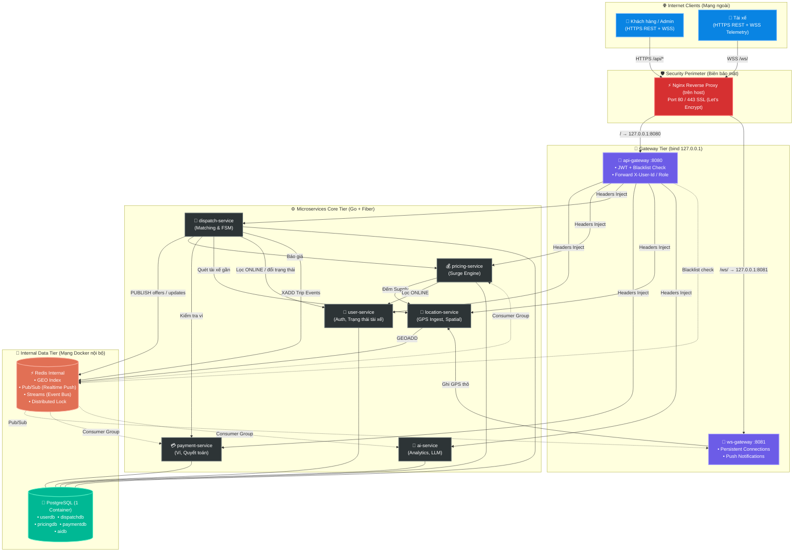
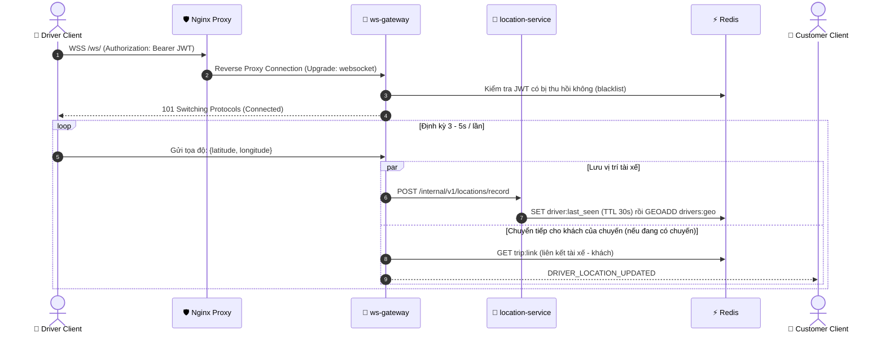
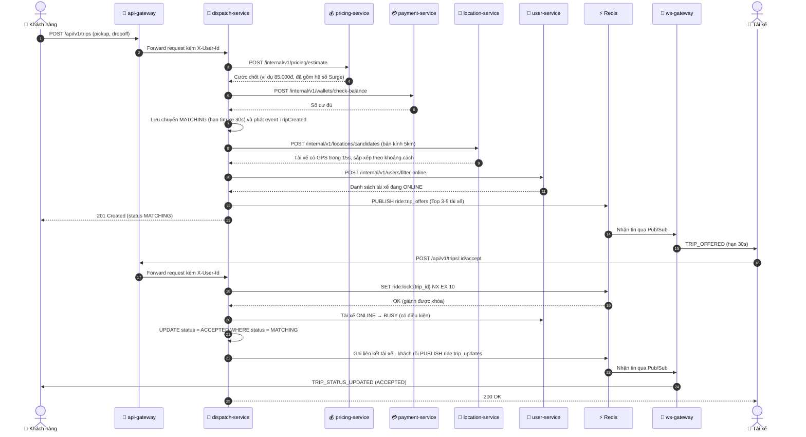
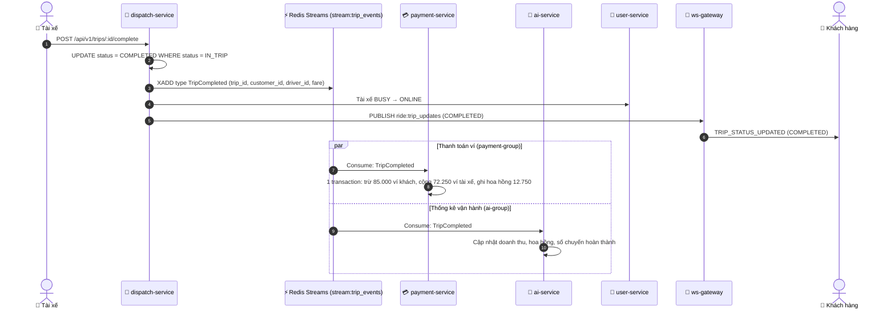
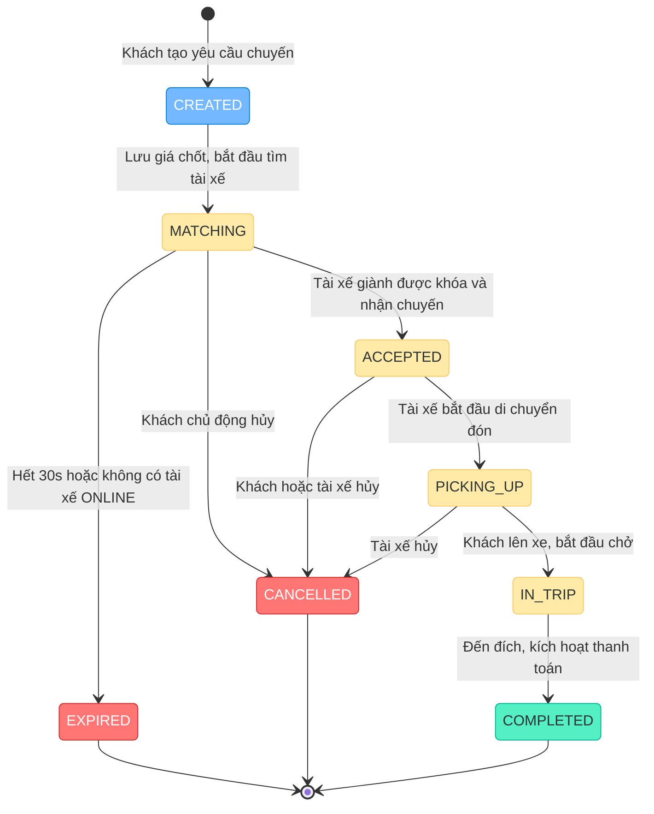

<div align="center">

# 🚗 Ride-Hailing & Real-Time Logistics Platform
### *Enterprise Microservices Architecture on Ultra-Lean Cloud Infrastructure*

<p align="center">
  <b>Hệ thống Đặt xe & Giao vận Công nghệ Thời gian thực — Thiết kế hướng sự kiện (EDA) và tối ưu hóa hạ tầng trên VPS 1GB RAM</b>
</p>

<!-- Tech Badges -->
<p align="center">
  
  
  
  
  
  
  
</p>

<!-- Quick Navigation -->
<p align="center">
  <a href="#-tổng-quan-hệ-thống"><b>Tổng quan</b></a> •
  <a href="#-kiến-trúc-hệ-thống-architecture"><b>Kiến trúc</b></a> •
  <a href="#-danh-sách-microservices"><b>Microservices</b></a> •
  <a href="#-luồng-nghiệp-vụ--sequence-diagrams"><b>Luồng nghiệp vụ</b></a> •
  <a href="#-trip-state-machine"><b>Máy trạng thái</b></a> •
  <a href="#-chiến-lược-devops-vps-1gb-ram"><b>Tối ưu VPS 1GB</b></a> •
  <a href="#-kịch-bản-kiểm-thử--demo"><b>Demo</b></a>
</p>

---

<!-- Key Performance Indicators Banner -->
| ⏱️ Độ trễ GPS tài xế → khách | 💾 Bộ nhớ toàn hệ thống | 🔒 Chống tranh chấp cuốc | ⚡ Event Streaming | 🛡️ Biên bảo mật Internet |
| :---: | :---: | :---: | :---: | :---: |
| **< 500 ms** (WebSocket) | **≤ 850 MB** / 1GB VPS | **Redis `SET NX` + UPDATE có điều kiện** | **Redis Streams** (Thay Kafka) | **Cổng duy nhất 80 / 443** |

---

</div>

<br/>

## 🎯 Tổng quan hệ thống

Dự án mô phỏng nền tảng gọi xe công nghệ (tương tự Grab / Gojek) xây dựng theo mô hình **Microservices & Event-Driven Architecture**. Hệ thống giải quyết đồng thời 2 bài toán:
1. **Bài toán Nghiệp vụ Phân tán:** Thu thập stream tọa độ GPS liên tục, tính cước động theo mật độ cung/cầu (Surge Pricing), ghép nối tài xế rảnh gần nhất mà không xảy ra tranh chấp cuốc, theo dõi vị trí tài xế theo thời gian thực và quyết toán ví điện tử tự động qua luồng sự kiện.
2. **Bài toán Kỹ thuật Hạ tầng (DevOps Challenge):** Vận hành trọn vẹn **8 Microservices + PostgreSQL + Redis + Nginx + Observability Stack** trên một máy chủ ảo **Cloud VPS 1 vCPU, 1GB RAM, 20GB Disk** mà không bị thiếu bộ nhớ (Out Of Memory), kèm quy trình CI/CD tự động bằng GitHub Actions.

### Chức năng theo vai trò

| Vai trò | Chức năng chính |
|---|---|
| 🧑 **Khách hàng** | Đăng ký / đăng nhập, nạp ví, xem giá ước tính (kèm hệ số Surge), đặt xe, theo dõi vị trí tài xế theo thời gian thực, hủy chuyến, xem số dư và lịch sử giao dịch. |
| 🚗 **Tài xế** | Bật / tắt trạng thái nhận chuyến, gửi GPS liên tục, nhận lời mời cuốc, cập nhật tiến trình chuyến (đón khách → chở → hoàn thành), xem thu nhập trong ví. |
| 🛠️ **Quản trị viên** | Xem danh sách người dùng và chuyến đi, theo dõi tài xế đang hoạt động, hủy cưỡng bức chuyến, điều chỉnh bảng giá và ngưỡng Surge, xem báo cáo vận hành kèm nhận xét phân tích do LLM (Google Gemini) sinh ra. |

> [!NOTE]
> **Trạng thái dự án:** Bộ tài liệu thiết kế (đề bài, SRS, Use Case và thiết kế chi tiết LLD của từng service) nằm trong thư mục [`docs/`](./docs). Mã nguồn các service đang được triển khai theo đúng các tài liệu này.

<br/>

---

## 🏛️ Kiến trúc hệ thống (Architecture)

Hệ thống giao tiếp với client qua 2 kênh độc lập: **REST API** (tác vụ nghiệp vụ) và **WebSocket (WSS)** (truyền phát dữ liệu thời gian thực). Nginx chạy trực tiếp trên VPS là cổng duy nhất ra Internet. `api-gateway` và `ws-gateway` chỉ lắng nghe trên `127.0.0.1`; các service còn lại, PostgreSQL và Redis chỉ tồn tại trong mạng Docker nội bộ, không publish cổng.



**Ba kiểu giao tiếp giữa các thành phần:**

| Kiểu | Công nghệ | Dùng cho |
|---|---|---|
| **Đồng bộ** | REST nội bộ `/internal/v1/*` (không bao giờ được route ra Internet) | Báo giá, kiểm tra ví, quét tài xế gần, đổi trạng thái tài xế. |
| **Đẩy thời gian thực** | Redis Pub/Sub | Mời cuốc, thông báo đổi trạng thái chuyến, ngắt kết nối khi đăng xuất. |
| **Sự kiện vòng đời chuyến** | Redis Streams + Consumer Group | `TripCreated`, `TripCompleted`, `TripCancelled`, `TripExpired` được tiêu thụ độc lập bởi payment, pricing và ai-service. |

<br/>

---

## 📦 Danh sách Microservices

Áp dụng chuẩn kiến trúc **Database-per-Service**: dù gom chung vào 1 container PostgreSQL để tiết kiệm RAM, mỗi service có cơ sở dữ liệu riêng (`userdb`, `dispatchdb`, `pricingdb`, `paymentdb`, `aidb`), user/password riêng và **tuyệt đối không query chéo**. Service cần dữ liệu của service khác phải gọi REST nội bộ hoặc nhận sự kiện. `location-service` không dùng PostgreSQL, toàn bộ dữ liệu vị trí nằm trên Redis.

| Service & Trách nhiệm | Ngôn ngữ / Lib | Storage Model | Cách thức giao tiếp | Điểm cốt lõi |
|---|---|---|---|---|
| **`api-gateway`** `:8080`<br>• Cổng đón request HTTP<br>• Xác thực JWT trung tâm | Go + Fiber | Không lưu DB<br>(Redis: đọc blacklist) | • HTTP Reverse Proxy<br>• Header Injection | Kiểm tra chữ ký JWT (HS256), hạn dùng và danh sách thu hồi ở mọi request; xóa mọi header `X-User-*` do client gửi rồi tự gắn `X-User-Id`, `X-User-Role`. Chặn `/internal/*`, chỉ cho role `ADMIN` vào `/api/v1/admin/*`. Redis lỗi thì từ chối request (fail-closed). |
| **`ws-gateway`** `:8081`<br>• Quản lý kết nối WebSocket<br>• Đẩy thông báo thời gian thực | Go + Fiber WebSocket | Không lưu DB<br>(Redis Pub/Sub) | • WebSocket hai chiều<br>• Redis Pub/Sub | Xác thực ngay lúc bắt tay bằng header `Authorization`. Nhận GPS của tài xế, chuyển sang `location-service` và chuyển tiếp thẳng cho khách của chuyến đang chạy. Đẩy lời mời cuốc và thay đổi trạng thái chuyến; hỗ trợ nhiều kết nối trên mỗi người dùng. |
| **`user-service`** `:8001`<br>• Tài khoản, hồ sơ, xe<br>• Trạng thái tài xế | Go + GORM | Postgres (`userdb`)<br>Redis (refresh token, blacklist) | • HTTP REST<br>• Redis Pub/Sub Publisher | Đăng ký / đăng nhập, access token JWT 1 giờ, refresh token dùng một lần (xoay vòng), đăng xuất thu hồi token. Trạng thái tài xế `ONLINE` / `OFFLINE` / `BUSY` được đổi bằng thao tác có điều kiện nên không thể xung đột. |
| **`location-service`** `:8002`<br>• Tiếp nhận GPS tọa độ<br>• Tìm kiếm bán kính không gian | Go + Fiber | Redis GEO<br>(không dùng Postgres) | • HTTP nội bộ<br>• Redis GEO Commands | Lưu tọa độ bằng `GEOADD` kèm mốc `last_seen` (TTL 30 giây); tìm tài xế lân cận bằng `GEOSEARCH`, chỉ tính tài xế có tín hiệu GPS trong vòng 15 giây. |
| **`pricing-service`** `:8004`<br>• Tính giá cước di chuyển<br>• Tính hệ số tăng giá Surge | Go + GORM | Postgres (`pricingdb`)<br>Redis (cache giá, đếm Demand) | • HTTP REST<br>• Redis Streams Consumer | `Giá = (Cước mở cửa + Khoảng cách × Đơn giá/km) × Surge`, làm tròn đến nghìn đồng. Khoảng cách lấy từ OSRM (timeout 400 ms), lỗi thì dùng Haversine × 1.35. Surge tính theo tỷ lệ Demand / Supply trong ô lưới địa lý (Geohash 5), giới hạn từ 1.0 đến 1.5. |
| **`dispatch-service`** `:8003`<br>• Bộ điều phối trung tâm<br>• Máy trạng thái chuyến đi | Go + GORM | Postgres (`dispatchdb`)<br>Redis (Lock, Streams, Pub/Sub) | • HTTP REST<br>• Redis Streams Producer<br>• Redis Pub/Sub Publisher | Báo giá, kiểm tra ví, mời Top 3–5 tài xế gần nhất; tài xế nhận trước thắng **Redis Distributed Lock**, người sau nhận lỗi `TRIP_ALREADY_TAKEN`. Mọi chuyển trạng thái là `UPDATE` có điều kiện; tiến trình nền tự đóng các chuyến quá hạn tìm xe. |
| **`payment-service`** `:8005`<br>• Quản lý số dư ví<br>• Trừ tiền khách, cộng tiền tài xế | Go + GORM | Postgres (`paymentdb`) | • HTTP REST<br>• Redis Streams Consumer | Ví tạo khi dùng lần đầu. Nghe sự kiện `TripCompleted`, trong **một transaction** trừ ví khách, cộng ví tài xế và ghi sổ giao dịch; hoa hồng nền tảng 15% (cấu hình được). Xử lý lặp sự kiện không bao giờ trừ tiền hai lần, số dư không bao giờ âm. |
| **`ai-service`** `:8006`<br>• Thống kê vận hành<br>• Báo cáo thông minh qua LLM | Go + GORM | Postgres (`aidb`) | • HTTP REST<br>• Redis Streams Consumer | Tổng hợp số chuyến theo trạng thái, doanh thu, hoa hồng, tỷ lệ hủy / hết giờ và giờ cao điểm. Nhận xét phân tích do Google Gemini sinh ra; nếu thiếu API key hoặc LLM lỗi / quá 10 giây thì tự chuyển sang nhận xét theo luật (`RULE_BASED`), Admin không bao giờ nhận lỗi 500. |

<br/>

---

## 🔄 Luồng nghiệp vụ & Sequence Diagrams

### 1. Luồng Streaming GPS Tài xế (< 500ms)
> Tài xế gửi tọa độ GPS định kỳ 3–5 giây một lần qua kênh WebSocket liên tục. Hệ thống vừa cập nhật Redis GEO Index để phục vụ tìm kiếm, vừa chuyển tiếp ngay tọa độ tới khách của chuyến đang chạy.



<details>
<summary><b>🔍 Xem cấu trúc các frame WebSocket</b></summary>

**Tài xế → Server** (gửi định kỳ):
```json
{
  "latitude": 10.776889,
  "longitude": 106.700806
}
```

**Server → Khách** (vị trí tài xế của chuyến đang chạy):
```json
{
  "event": "DRIVER_LOCATION_UPDATED",
  "trip_id": "7c0f2b1e-3a41-4f6d-9d6e-1b2f0a9c5e11",
  "driver_id": "c2d4a6f8-91b3-4e57-8a10-5f6e7d8c9b01",
  "latitude": 10.776889,
  "longitude": 106.700806,
  "timestamp": "2026-10-09T08:00:12Z"
}
```

**Server → Tài xế** (lời mời cuốc, `distance_m` là khoảng cách riêng của từng tài xế):
```json
{
  "event": "TRIP_OFFERED",
  "trip_id": "7c0f2b1e-3a41-4f6d-9d6e-1b2f0a9c5e11",
  "pickup_lat": 10.776889,
  "pickup_lng": 106.700806,
  "fare": 85000,
  "driver_fare": 72250,
  "distance_m": 850,
  "expire_at": "2026-10-09T08:00:30Z"
}
```

**Server → Khách / Tài xế** (đổi trạng thái chuyến):
```json
{
  "event": "TRIP_STATUS_UPDATED",
  "trip_id": "7c0f2b1e-3a41-4f6d-9d6e-1b2f0a9c5e11",
  "status": "ACCEPTED",
  "updated_at": "2026-10-09T08:00:15Z"
}
```
</details>

---

### 2. Luồng Đặt xe, Tính giá động & Ghép chuyến (Atomic Lock)
> Lời mời cuốc được gửi tới **Top 3–5 tài xế rảnh gần nhất**. Khi nhiều tài xế cùng bấm nhận, cơ chế **Distributed Lock (`SET ride:lock:{trip_id} NX EX 10`)** kết hợp `UPDATE ... WHERE status = 'MATCHING'` bảo đảm đúng một tài xế nhận được chuyến, những người còn lại nhận lỗi `TRIP_ALREADY_TAKEN`.



---

### 3. Luồng Hoàn thành chuyến & Event-Driven Settlement
> Khi tài xế kết thúc chuyến, `dispatch-service` không gọi đồng bộ sang các service phụ mà phát sự kiện `TripCompleted` vào **Redis Streams** (`stream:trip_events`, giới hạn độ dài `MAXLEN ~ 5000`). Mỗi service tiêu thụ sự kiện độc lập qua Consumer Group riêng.



> [!NOTE]
> **Công thức hoa hồng (số nguyên VND):** `commission = (fare × 15 + 50) / 100` (chia lấy phần nguyên), `thu nhập tài xế = fare − commission`. Ví dụ cước 85.000đ → hoa hồng 12.750đ, tài xế nhận 72.250đ. Sổ giao dịch ghi 3 dòng `TRIP_PAYMENT`, `TRIP_INCOME`, `COMMISSION`, mỗi dòng duy nhất theo `(trip_id, loại dòng)` nên sự kiện bị giao lặp không gây trừ tiền hai lần.

<br/>

---

## 🚥 Trip State Machine

Mô hình máy trạng thái hữu hạn (FSM) bảo đảm chuyến đi chỉ di chuyển qua các bước hợp lệ, bảo vệ toàn vẹn dữ liệu:



| Trạng thái hiện tại | Sự kiện kích hoạt | Trạng thái kế tiếp | Tác động phụ (Side Effects) |
|---|---|---|---|
| `CREATED` | Tạo chuyến (cùng một transaction) | `MATCHING` | Lưu giá chốt và hạn tìm xe 30 giây; quét tài xế gần, mời Top 3–5; phát `TripCreated`. |
| `MATCHING` | Tài xế bấm nhận | `ACCEPTED` | Tài xế giành `ride:lock`, chuyển `ONLINE → BUSY`; ghi liên kết tài xế–khách để chuyển tiếp GPS. |
| `MATCHING` | Hết hạn 30 giây / không có tài xế ONLINE | `EXPIRED` | Phát `TripExpired` (lý do `TIMEOUT_30S` hoặc `NO_DRIVERS_AVAILABLE`), thông báo khách. |
| `ACCEPTED` | Bắt đầu đi đón | `PICKING_UP` | Khách tiếp tục nhận vị trí tài xế theo thời gian thực. |
| `PICKING_UP` | Khách lên xe | `IN_TRIP` | Từ thời điểm này không bên nào được hủy chuyến. |
| `IN_TRIP` | Đến đích | `COMPLETED` | Phát `TripCompleted` vào Redis Streams; tài xế `BUSY → ONLINE`; xóa liên kết GPS. |
| `MATCHING` / `ACCEPTED` (khách)<br>`ACCEPTED` / `PICKING_UP` (tài xế)<br>Mọi trạng thái chưa kết thúc (Admin) | Hủy chuyến | `CANCELLED` | Tài xế (nếu có) về `ONLINE`; không phát sinh phí phạt; phát `TripCancelled`. |

**Bảo đảm nhất quán dữ liệu:**
- Mọi chuyển trạng thái là câu `UPDATE ... WHERE status = <trạng thái nguồn>`: không nhảy cóc trạng thái, không ghi đè lẫn nhau khi nhiều request đến cùng lúc.
- Mỗi khách chỉ có tối đa 1 chuyến đang hoạt động (ràng buộc bằng partial unique index trong PostgreSQL).
- Chuyến quá hạn tìm xe được đóng bởi tiến trình nền quét mỗi 2 giây dựa trên mốc hạn lưu trong database (không dùng bộ đếm trong RAM), nên restart service không làm chuyến bị kẹt.
- Các consumer sự kiện đều idempotent; lỗi DB tạm thời thì message được đọc lại, message hỏng bị loại bỏ kèm log lỗi.

<br/>

---

## ⚡ Chiến lược DevOps: VPS 1GB RAM

Triển khai một cụm microservices hoàn chỉnh trên máy chủ **1 vCPU / 1GB RAM / 20GB SSD** đòi hỏi tối ưu hóa tài nguyên chặt chẽ:

### 1. Bảng ngân sách bộ nhớ (Memory Allocation Budget)
```text
┌────────────────────────────────────────────────────────────────────────┐
│                        TỔNG DUNG LƯỢNG RAM: 1024 MB                    │
├────────────────────────────┬─────────────────────────────┬─────────────┤
│ Nhóm Dịch Vụ               │ Cấu hình Giới hạn (Limit)   │ Ước tính    │
├────────────────────────────┼─────────────────────────────┼─────────────┤
│ 🐘 PostgreSQL Alpine       │ mem_limit: 180MB            │ ~ 150 MB    │
│ ⚡ Redis Alpine (In-memory)│ mem_limit: 60MB (maxmem 50) │ ~  50 MB    │
│ 🛡️ Nginx (cài trên host)   │ Không chạy trong Docker     │ ~  20 MB    │
│ 🚪 Gateway Layer (2 Svcs)  │ mem_limit: 25 - 30MB / svc  │ ~  45 MB    │
│ ⚙️ Core Services (6 Svcs)  │ mem_limit: 25 - 30MB / svc  │ ~ 150 MB    │
│ 🐧 OS Kernel & Base System │ Không giới hạn              │ ~ 200 MB    │
├────────────────────────────┼─────────────────────────────┼─────────────┤
│ 📊 TỔNG MỨC CHIẾM DỤNG     │ TRẦN THIẾT KẾ ≤ 850 MB      │ ~ 615 MB    │
└────────────────────────────┴─────────────────────────────┴─────────────┘
```
*Con số "Ước tính" là giá trị thiết kế. `mem_limit` của từng service Go được đo thực tế khi triển khai rồi điều chỉnh (khoảng 25–40MB), kèm `GOMEMLIMIT` ở mức 85–90% giới hạn để Go chủ động thu gom bộ nhớ trước khi chạm trần.*

> [!TIP]
> **Hệ thống phòng hộ chống OOM (Out Of Memory):**
> Kích hoạt phân vùng **2GB Swap Memory** (`/swapfile`) giúp hệ điều hành có vùng đệm khi có spike đột ngột, triệt tiêu nguy cơ kernel tự động kích hoạt `OOM Killer` làm sập database. Mỗi container đều có `mem_limit`, PostgreSQL giới hạn `max_connections = 50` và mỗi service có connection pool riêng với tổng chỉ 35 kết nối.

### 2. Các quyết định thiết kế hạ tầng then chốt (Architectural Decisions)

> [!IMPORTANT]
> **Vì sao loại bỏ Apache Kafka?**
> Kafka yêu cầu Java Runtime (JVM) và ZooKeeper/KRaft tiêu thụ từ **1.5GB đến 2GB RAM** ngay khi khởi động. Dự án sử dụng **Redis Streams**: có sẵn consumer groups, hỗ trợ ACK / `XREADGROUP`, độ bền dữ liệu đủ dùng mà chỉ tốn thêm **< 10MB RAM**.

> [!IMPORTANT]
> **Vì sao không dùng Elasticsearch / Kibana (ELK)?**
> Elasticsearch yêu cầu tối thiểu **2GB JVM Heap**. Toàn bộ nhật ký được cấu hình qua Docker JSON Logging (`max-size: 10m, max-file: 3`) kết hợp trình xem log nhẹ **Dozzle** (chỉ tốn ~15MB RAM).

> [!IMPORTANT]
> **Vì sao Nginx chạy trên host thay vì trong Docker Compose?**
> Nginx (kèm Certbot, chứng chỉ Let's Encrypt cho domain DuckDNS) được cài trực tiếp trên VPS và là **cổng duy nhất** mở ra Internet (UFW chỉ cho phép OpenSSH và Nginx Full). Cách này tiết kiệm RAM và giữ việc cấp / gia hạn chứng chỉ tách khỏi vòng đời container. Nginx chuyển `/` tới `127.0.0.1:8080` (api-gateway) và `/ws/` tới `127.0.0.1:8081` (ws-gateway, có header `Upgrade`).

> [!IMPORTANT]
> **Cấu hình Redis:**
> `maxmemory 50mb` với chính sách `noeviction`: Redis không tự xóa dữ liệu khi đầy nên không làm mất refresh token, blacklist hay sự kiện chưa xử lý. Stream được giới hạn độ dài bằng `MAXLEN ~ 5000` để không phình RAM. Yêu cầu Redis phiên bản 6.2 trở lên (lệnh `GEOSEARCH`).

> [!TIP]
> **Docker Compose Profiles:**
> Cụm giám sát tài nguyên (Prometheus + node_exporter + cAdvisor) được gán vào profile `monitoring`. Bình thường tắt đi để giữ RAM ở mức thấp; chỉ kích hoạt khi cần đo lường hoặc nghiệm thu demo. Dozzle và Prometheus chỉ bind `127.0.0.1`.
> ```bash
> docker compose --profile monitoring up -d
> ```

### 3. CI/CD & Triển khai
Mỗi microservice có một pipeline GitHub Actions độc lập (`ci-<tên-service>.yml`): chạy kiểm tra → build Docker image đa tầng (multi-stage) → đẩy lên **GitHub Container Registry (GHCR)** → SSH vào VPS thực thi cập nhật cuốn chiếu chỉ cho service vừa đổi:

```bash
docker compose pull <service>
docker compose up -d --no-deps <service>
```

> [!NOTE]
> `ws-gateway` chạy 1 instance nên khi cập nhật, các kết nối WebSocket đang mở sẽ bị ngắt trong vài giây. Client (kể cả script tài xế ảo) tự kết nối lại theo cơ chế exponential backoff có jitter.

<br/>

---

## 📂 Cấu trúc thư mục dự án

```text
ride-hailing-devops/
├── .github/
│   └── workflows/              # 8 pipeline CI/CD độc lập cho từng microservice
│       ├── ci-api-gateway.yml
│       ├── ci-dispatch-service.yml
│       └── ...
├── docs/                       # Quy chuẩn tài liệu kỹ thuật
│   ├── 00-brainstorm/          # Đề bài & phân tích bài toán
│   ├── 01-srs/                 # Đặc tả yêu cầu phần mềm (FR-01, FR-02...)
│   ├── 02-use-cases/           # Tài liệu chi tiết các ca sử dụng
│   ├── 03-lld/                 # Thiết kế chi tiết (LLD) của từng service + hợp đồng liên service
│   ├── 04-api-test/            # Kịch bản kiểm thử API (cURL / Postman)
│   └── 05-deploy/              # Hướng dẫn chi tiết setup VPS & Nginx SSL
├── infra/                      # Cơ sở hạ tầng dưới dạng mã (IaC)
│   ├── docker-compose.yml      # Tệp Compose chính (có cấu hình profile monitoring)
│   ├── .env.example            # Biến môi trường mẫu
│   ├── nginx/                  # Cấu hình Nginx mẫu (Nginx cài trên host)
│   │   └── ride-hailing.conf
│   ├── postgres/               # Script tạo nhiều database độc lập trong 1 container
│   │   └── init-multi-db.sh
│   └── scripts/                # Kịch bản hỗ trợ kiểm thử & vận hành
│       ├── setup-vps.sh        # Tự động hóa cài đặt swap, docker trên VPS
│       └── simulate_drivers.py # Script giả lập 100 tài xế ảo di chuyển liên tục
├── services/                   # Source code 8 microservices độc lập
│   ├── api-gateway/            # Go + Fiber (Routing & JWT Auth)
│   ├── ws-gateway/             # Go + Fiber (WebSocket Engine)
│   ├── user-service/           # Go + GORM (User/Driver Data)
│   ├── location-service/       # Go + Fiber + Redis GEO (Spatial Queries)
│   ├── pricing-service/        # Go + GORM (Surge Pricing Engine)
│   ├── dispatch-service/       # Go + GORM + Redis Lock (Matching Core)
│   ├── payment-service/        # Go + GORM (Wallet & Transactions)
│   └── ai-service/             # Go + GORM (Analytics & Smart Insights)
├── AGENTS.md                   # Quy tắc phát triển và vận hành AI Agent
└── README.md                   # Trang thông tin chính của dự án
```

<br/>

---

## 🚀 Kịch bản kiểm thử & Demo

### 1. Khởi chạy nhanh môi trường Local
```bash
# 1. Clone mã nguồn
git clone https://github.com/HaiTrieu186/JB-IOC-PTHB251125_BE105_Devops_Ride_Hailling.git
cd JB-IOC-PTHB251125_BE105_Devops_Ride_Hailling/infra

# 2. Khởi tạo biến môi trường mẫu (đổi JWT_SECRET, mật khẩu Redis, tài khoản Admin...)
cp .env.example .env

# 3. Khởi chạy toàn bộ hệ thống bằng Docker Compose
docker compose up -d

# 4. Kiểm tra sức khỏe toàn bộ các microservices
docker compose ps
```

> Khi chạy local, gọi trực tiếp `api-gateway` tại `http://localhost:8080` và `ws-gateway` tại `ws://localhost:8081/ws/`. Trên VPS, các request đi qua `https://<domain-duckdns>` và `wss://<domain-duckdns>/ws/`.

### 2. Kịch bản kiểm thử tải với 100 tài xế ảo
Hệ thống đi kèm script Python giả lập 100 tài xế ảo: tự đăng ký, đăng nhập, chuyển sang `ONLINE`, kết nối WebSocket, di chuyển ngẫu nhiên trên bản đồ (tọa độ TP. Hồ Chí Minh) và đẩy tọa độ GPS lên mỗi 3 giây. Script tự kết nối lại khi mất WebSocket (exponential backoff có jitter) và tự nhận các cuốc được mời.

```bash
# Chạy script giả lập 100 tài xế
python infra/scripts/simulate_drivers.py --drivers 100 --interval 3
```

**Các bước nghiệm thu luồng nghiệp vụ:**
1. **Kiểm tra GPS:** quan sát 100 tài xế đang di chuyển trực tiếp trên Redis GEO.
   ```bash
   docker compose exec redis redis-cli -a "$REDIS_PASSWORD" \
     GEOSEARCH drivers:geo FROMLONLAT 106.700 10.776 BYRADIUS 5 km WITHDIST COUNT 10 ASC
   ```
2. **Chuẩn bị khách hàng:** đăng ký, đăng nhập, nạp ví.
   ```bash
   BASE=http://localhost:8080

   curl -X POST $BASE/api/v1/auth/register -H "Content-Type: application/json" \
     -d '{"phone_number":"0900000001","password":"123456","full_name":"Khach A","role":"CUSTOMER"}'

   curl -X POST $BASE/api/v1/auth/login -H "Content-Type: application/json" \
     -d '{"phone_or_email":"0900000001","password":"123456"}'      # lấy access_token → CUSTOMER_TOKEN

   curl -X POST $BASE/api/v1/wallets/top-up -H "Authorization: Bearer $CUSTOMER_TOKEN" \
     -H "Content-Type: application/json" -d '{"amount":500000}'
   ```
3. **Ước tính cước & đặt xe:**
   ```bash
   curl -X POST $BASE/api/v1/pricing/estimate -H "Authorization: Bearer $CUSTOMER_TOKEN" \
     -H "Content-Type: application/json" \
     -d '{"pickup_lat":10.776,"pickup_lng":106.700,"dropoff_lat":10.800,"dropoff_lng":106.720}'

   curl -X POST $BASE/api/v1/trips -H "Authorization: Bearer $CUSTOMER_TOKEN" \
     -H "Content-Type: application/json" \
     -d '{"pickup_lat":10.776,"pickup_lng":106.700,"pickup_address":"Quận 1",
          "dropoff_lat":10.800,"dropoff_lng":106.720,"dropoff_address":"Bình Thạnh"}'
   ```
4. **Quan sát ghép cuốc:** `dispatch-service` mời Top 3–5 tài xế ảo gần nhất; tài xế ảo nhận trước thắng khóa, các tài xế còn lại nhận `TRIP_ALREADY_TAKEN`. Kiểm tra bằng `GET /api/v1/trips/current`.
5. **Theo dõi chuyến đi:** tài xế cập nhật tiến trình bằng token của chính mình.
   ```bash
   curl -X POST $BASE/api/v1/trips/$TRIP_ID/picking-up -H "Authorization: Bearer $DRIVER_TOKEN"
   curl -X POST $BASE/api/v1/trips/$TRIP_ID/start-trip  -H "Authorization: Bearer $DRIVER_TOKEN"
   curl -X POST $BASE/api/v1/trips/$TRIP_ID/complete    -H "Authorization: Bearer $DRIVER_TOKEN"
   ```
6. **Xác nhận thanh toán:** gọi `GET /api/v1/wallets/me` và `GET /api/v1/wallets/transactions` bằng token khách và token tài xế để thấy số dư biến động (khách bị trừ cước, tài xế được cộng phần sau hoa hồng). Chờ ví cập nhật xong rồi mới đặt chuyến tiếp theo vì thanh toán xử lý bất đồng bộ.
7. **Quan sát Surge (tùy chọn):** đăng nhập tài khoản Admin (khởi tạo từ biến môi trường `ADMIN_EMAIL` / `ADMIN_PASSWORD`), hạ ngưỡng `surge_threshold` xuống 0.05 qua `PUT /api/v1/admin/pricing/config`, đặt vài chuyến cùng khu vực rồi gọi lại `pricing/estimate` để thấy `surge_multiplier` tăng.

<br/>

---

## 📋 Chuẩn định dạng API Response

Mọi dịch vụ trong hệ thống đều tuân thủ chuẩn JSON payload đồng nhất. API công khai có tiền tố `/api/v1/*`, thời gian theo ISO 8601 UTC, tiền tệ là số nguyên VND.

#### Phản hồi thành công (`200 OK` / `201 Created`):
```json
{
  "success": true,
  "data": {
    "id": "7c0f2b1e-3a41-4f6d-9d6e-1b2f0a9c5e11",
    "status": "MATCHING",
    "fare": 85000,
    "pickup_address": "Quận 1",
    "dropoff_address": "Bình Thạnh",
    "matching_expires_at": "2026-10-09T08:00:30Z"
  },
  "error": null
}
```

#### Phản hồi thất bại (`4xx` / `5xx`):
```json
{
  "success": false,
  "data": null,
  "error": {
    "code": "INSUFFICIENT_BALANCE",
    "message": "Số dư ví không đủ cho chuyến đi này"
  }
}
```

#### Danh mục mã lỗi

| HTTP | Mã lỗi |
|:---:|---|
| `400` | `VALIDATION_ERROR` • `INSUFFICIENT_BALANCE` • `DRIVER_NOT_AVAILABLE` • `DRIVER_BUSY` • `DRIVER_CANNOT_LOGOUT` • `INVALID_TRIP_STATUS` |
| `401` | `UNAUTHORIZED` • `INVALID_REFRESH_TOKEN` |
| `403` | `FORBIDDEN` • `NOT_OFFERED` |
| `404` | `TRIP_NOT_FOUND` • `NOT_FOUND` |
| `409` | `USER_ALREADY_EXISTS` • `ACTIVE_TRIP_EXISTS` • `TRIP_ALREADY_TAKEN` |
| `503` | `SERVICE_UNAVAILABLE` |

<br/>

---

<div align="center">

### 🎓 Thông tin Đồ án & Đóng góp
Dự án được xây dựng trong khuôn khổ học phần **DevOps & Microservices BE105**.  
*Mọi ý kiến đóng góp hoặc thắc mắc, vui lòng mở Issue hoặc gửi Pull Request.*

<p align="center">
  <a href="#-ride-hailing--real-time-logistics-platform"><b>⬆ Về đầu trang</b></a>
</p>

</div>