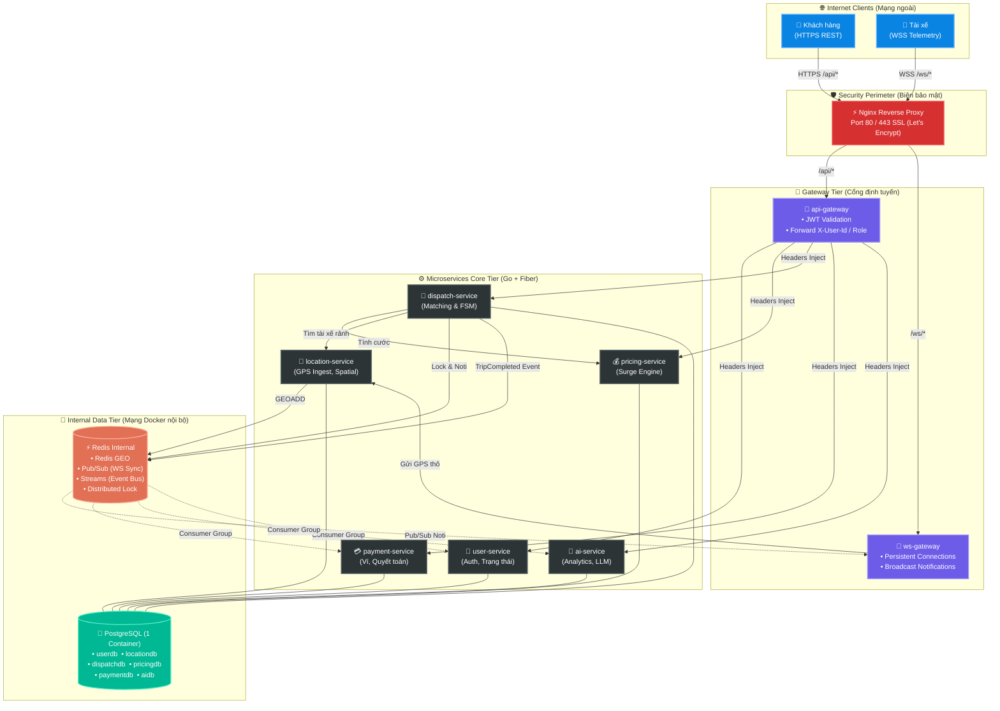
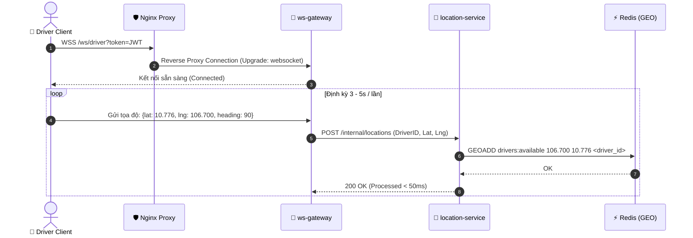
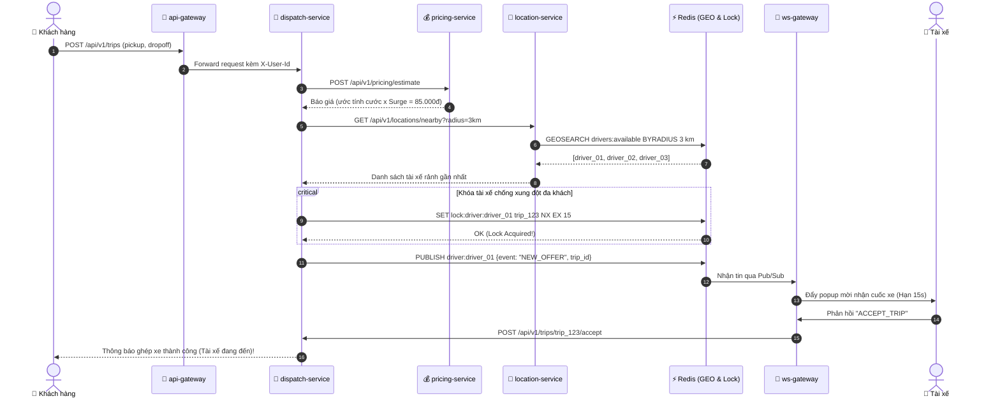
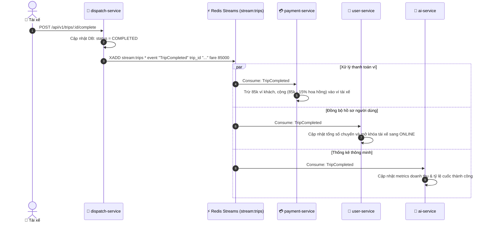
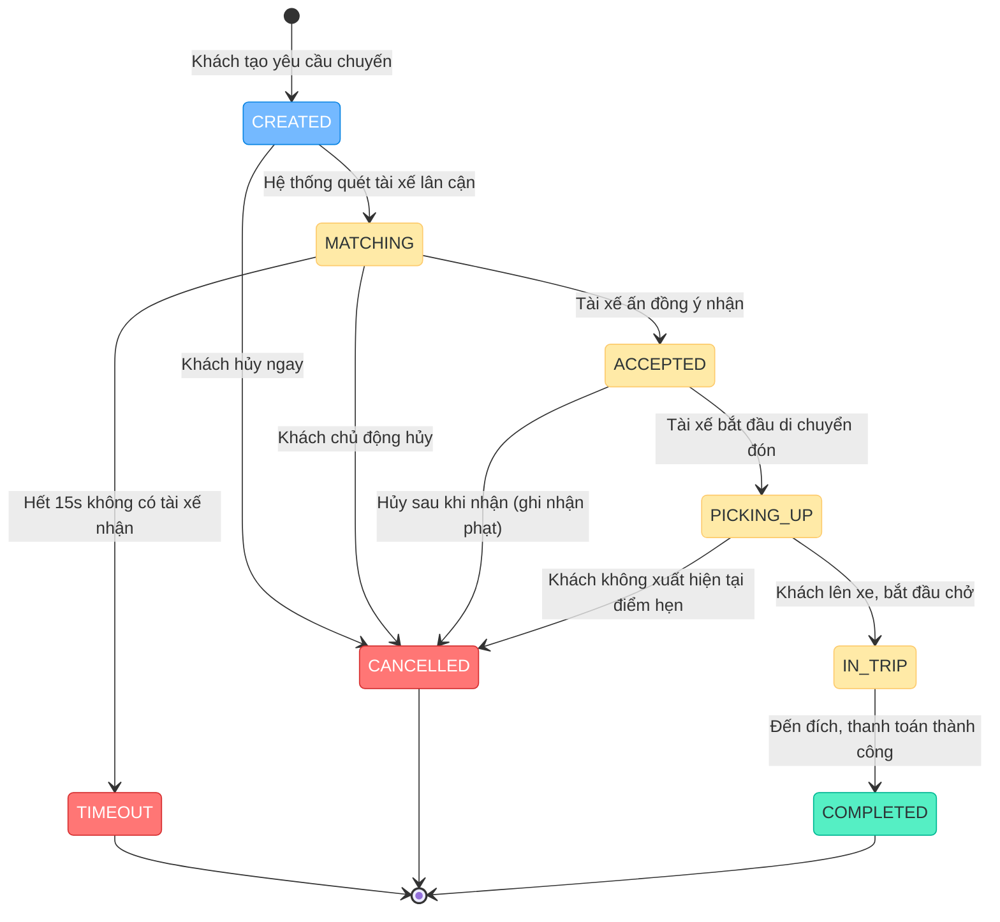

<div align="center">

# 🚗 Ride-Hailing & Real-Time Logistics Platform
### *Enterprise Microservices Architecture on Ultra-Lean Cloud Infrastructure*

<p align="center">
  <b>Hệ thống Đặt xe & Giao vận Công nghệ Thời gian thực — Thiết kế hướng sự kiện (EDA) và tối ưu hóa hạ tầng trên VPS 1GB RAM</b>
</p>

<!-- Tech Badges -->
<p align="center">
  
  
  
  
  
  
  
</p>

<!-- Quick Navigation -->
<p align="center">
  <a href="#-tổng-quan-hệ-thống"><b>Tổng quan</b></a> •
  <a href="#-kiến-trúc-hệ-thống-architecture"><b>Kiến trúc</b></a> •
  <a href="#-danh-sách-microservices"><b>Microservices</b></a> •
  <a href="#-luồng-nghiệp-vụ--sequence-diagrams"><b>Luồng nghiệp vụ</b></a> •
  <a href="#-trip-state-machine"><b>Máy trạng thái</b></a> •
  <a href="#-chiến-lược-devops-vps-1gb-ram"><b>Tối ưu VPS 1GB</b></a> •
  <a href="#-kịch-bản-kiểm-thử--demo"><b>Demo</b></a>
</p>

---

<!-- Key Performance Indicators Banner -->
| ⏱️ Độ trễ Ingestion GPS | 💾 Bộ nhớ toàn hệ thống | 🔒 Khóa chống Race Condition | ⚡ Event Streaming | 🛡️ Biên bảo mật Internet |
| :---: | :---: | :---: | :---: | :---: |
| **< 500 ms** (Redis GEO) | **~600 - 800 MB** / 1GB VPS | **Redis `SET NX` TTL** | **Redis Streams** (Thay Kafka) | **Cổng duy nhất 80 / 443** |

---

</div>

<br/>

## 🎯 Tổng quan hệ thống

Dự án mô phỏng trọn vẹn nền tảng gọi xe công nghệ thế hệ mới (tương tự Grab / Gojek) xây dựng theo mô hình **Microservices & Event-Driven Architecture**. Hệ thống được thiết kế hướng tới giải quyết đồng thời 2 bài toán lớn:
1. **Bài toán Nghiệp vụ Phân tán:** Thu thập stream tọa độ GPS liên tục, tính cước động theo mật độ cung/cầu (Surge Pricing), ghép nối tài xế rảnh gần nhất không bị tranh chấp, và quyết toán ví điện tử tự động qua luồng sự kiện.
2. **Bài toán Kỹ thuật Hạ tầng (DevOps Challenge):** Triển khai trọn vẹn **8 Microservices + PostgreSQL + Redis + Nginx + Observability Stack** vận hành bền bỉ trên một máy chủ ảo **Cloud VPS 1GB RAM, 1 vCPU, 20GB Disk** mà không bị sập hay dính lỗi thiếu bộ nhớ (Out Of Memory).

> [!NOTE]
> Hệ thống tuân thủ triệt để nguyên tắc **"Doc trước, Code sau"**: Toàn bộ luồng dữ liệu, API contract, cơ sở dữ liệu và chuyển dịch trạng thái đều được mô hình hóa trước khi viết mã nguồn.

<br/>

---

## 🏛️ Kiến trúc hệ thống (Architecture)

Toàn bộ hệ thống giao tiếp qua 2 kênh độc lập: **REST API** (cho tác vụ nghiệp vụ chuẩn) và **WebSocket (WSS)** (cho truyền phát dữ liệu thời gian thực). Mọi dịch vụ nội bộ được cách ly hoàn toàn phía sau **Nginx Edge Proxy**.



<br/>

---

## 📦 Danh sách Microservices

Áp dụng chuẩn kiến trúc **Database-per-Service**: Dù gom chung vào 1 container PostgreSQL để tiết kiệm RAM, mỗi microservice sở hữu một cơ sở dữ liệu riêng, user/password riêng và **tuyệt đối không được query chéo**.

| Service & Trách nhiệm | Ngôn ngữ / Lib | Storage Model | Cách thức giao tiếp | Điểm cốt lõi |
|---|---|---|---|---|
| **`api-gateway`**<br/>• Cổng đón request HTTP<br/>• Xác thực JWT trung tâm | Go + Fiber | Không lưu DB | • HTTP Proxy<br/>• Header Injection | Giải mã token JWT một lần duy nhất, gắn `X-User-Id` và `X-User-Role` vào header cho các service nội bộ. |
| **`ws-gateway`**<br/>• Quản lý socket kết nối<br/>• Đẩy thông báo thời gian thực | Go + Fiber WebSocket | Redis Pub/Sub | • WebSocket hai chiều<br/>• Redis Pub/Sub | Đồng bộ thông báo giữa nhiều instance WS Gateway thông qua kênh Redis Pub/Sub. |
| **`user-service`**<br/>• Quản lý người dùng, tài xế<br/>• Quản lý trạng thái Online/Offline | Go + GORM | Postgres (`userdb`) | • HTTP REST<br/>• Redis Streams Consumer | Lưu trữ hồ sơ, quản lý trạng thái tài xế (`ONLINE`, `OFFLINE`, `BUSY`). |
| **`location-service`**<br/>• Tiếp nhận GPS tọa độ<br/>• Tìm kiếm bán kính không gian | Go + GORM | Redis GEO + Postgres (`locationdb`) | • HTTP Ingestion<br/>• Redis GEO Commands | Sử dụng `GEOADD` để lưu tọa độ và `GEOSEARCH BYRADIUS` để tìm tài xế lân cận trong thời gian `< 2ms`. |
| **`pricing-service`**<br/>• Tính giá cước di chuyển<br/>• Tính hệ số tăng giá Surge | Go + GORM | Postgres (`pricingdb`) + Redis Cache | • HTTP REST | Công thức: `Giá = Khoảng cách × Đơn giá × Surge`. Surge tính toán tức thì theo tỷ lệ Demand/Supply địa phương. |
| **`dispatch-service`**<br/>• Bộ điều phối trung tâm<br/>• Máy trạng thái chuyến đi | Go + GORM | Postgres (`dispatchdb`) + Redis Lock | • HTTP REST<br/>• Redis Streams Producer | Điều phối tìm tài xế gần nhất, sử dụng **Redis Distributed Lock** để triệt tiêu Race Condition giữa các khách hàng. |
| **`payment-service`**<br/>• Quản lý số dư ví<br/>• Trừ tiền khách, cộng tiền tài xế | Go + GORM | Postgres (`paymentdb`) | • HTTP REST<br/>• Redis Streams Consumer | Lắng nghe sự kiện `TripCompleted` để trừ ví khách, khấu trừ 15% hoa hồng nền tảng và cộng tiền tài xế. |
| **`ai-service`**<br/>• Thống kê doanh thu & chuyến<br/>• Báo cáo thông minh qua LLM | Go + GORM | Postgres (`aidb`) | • HTTP REST<br/>• Redis Streams Consumer | Thu thập chỉ số vận hành, tích hợp LLM sinh báo cáo phân tích tự động (kèm fallback rule-based khi thiếu API key). |

<br/>

---

## 🔄 Luồng nghiệp vụ & Sequence Diagrams

### 1. Luồng Streaming GPS Tài xế (< 500ms)
> Tài xế gửi tọa độ GPS định kỳ 3–5 giây một lần qua kênh WebSocket liên tục. Hệ thống cập nhật thẳng vào Redis GEO Index để phục vụ việc tìm kiếm siêu tốc.



<details>
<summary><b>🔍 Xem cấu trúc Payload tin nhắn WebSocket GPS</b></summary>

```json
{
  "type": "DRIVER_LOCATION_UPDATE",
  "data": {
    "driver_id": "drv_88921a9c",
    "latitude": 10.776889,
    "longitude": 106.700806,
    "speed": 34.5,
    "heading": 180,
    "timestamp": 1728145200
  }
}
```
</details>

---

### 2. Luồng Đặt xe, Tính giá động & Ghép chuyến (Atomic Lock)
> Cơ chế **Distributed Lock (`SET lock:driver:<id> NX EX 15`)** bảo đảm nếu 2 khách hàng cùng đặt xe quanh một tài xế tại cùng 1 phần nghìn giây, chỉ duy nhất 1 khách ghép thành công, loại bỏ hoàn toàn lỗi tranh chấp cuốc.



---

### 3. Luồng Hoàn thành chuyến & Event-Driven Settlement
> Khi tài xế kết thúc chuyến, `dispatch-service` không gọi đồng bộ sang các service phụ mà phát sự kiện `TripCompleted` vào **Redis Streams**. Các service độc lập tự động tiêu thụ sự kiện theo cơ chế bất đồng bộ.



<br/>

---

## 🚥 Trip State Machine

Mô hình máy trạng thái hữu hạn (FSM) bảo đảm chuyến đi chỉ di chuyển qua các bước hợp lệ, bảo vệ toàn vẹn dữ liệu:



| Trạng thái hiện tại | Sự kiện kích hoạt | Trạng thái kế tiếp | Tác động phụ (Side Effects) |
|---|---|---|---|
| `CREATED` | Bắt đầu tìm tài xế | `MATCHING` | Quét bán kính Redis GEO, thiết lập timeout tìm kiếm. |
| `MATCHING` | Tài xế bấm nhận | `ACCEPTED` | Giữ Lock tài xế, chuyển trạng thái tài xế sang `BUSY`. |
| `MATCHING` | Hết thời gian chờ | `TIMEOUT` | Nhả Lock tài xế, gửi thông báo xin lỗi khách. |
| `ACCEPTED` | Bắt đầu đi đón | `PICKING_UP` | Cập nhật vị trí tài xế theo thời gian thực tới app khách. |
| `PICKING_UP` | Khách lên xe | `IN_TRIP` | Khóa chức năng hủy miễn phí, bắt đầu đo lường chuyến đi. |
| `IN_TRIP` | Đến đích | `COMPLETED` | Phát sự kiện `TripCompleted` vào Redis Streams. |
| Bất kỳ (trừ COMPLETED) | Khách / Tài xế hủy | `CANCELLED` | Nhả tài xế về trạng thái `ONLINE`, hoàn cước nếu đã cấn trừ. |

<br/>

---

## ⚡ Chiến lược DevOps: VPS 1GB RAM

Triển khai một cụm microservices hoàn chỉnh trên máy chủ **1GB RAM / 20GB SSD** là bài toán đòi hỏi kỹ thuật tối ưu hóa tài nguyên mức độ cao:

### 1. Bảng ngân sách bộ nhớ (Memory Allocation Budget)
```text
┌────────────────────────────────────────────────────────────────────────┐
│                        TỔNG DUNG LƯỢNG RAM: 1024 MB                    │
├────────────────────────────┬─────────────────────────────┬─────────────┤
│ Nhóm Dịch Vụ               │ Cấu hình Giới hạn (Limit)   │ Ước tính    │
├────────────────────────────┼─────────────────────────────┼─────────────┤
│ 🐘 PostgreSQL Alpine       │ mem_limit: 180MB            │ ~ 150 MB    │
│ ⚡ Redis Alpine (In-memory)│ mem_limit: 80MB             │ ~  60 MB    │
│ 🛡️ Nginx Reverse Proxy     │ mem_limit: 30MB             │ ~  20 MB    │
│ 🚪 Gateway Layer (2 Svcs)  │ mem_limit: 35MB x 2 = 70MB  │ ~  50 MB    │
│ ⚙️ Core Services (6 Svcs)  │ mem_limit: 35MB x 6 = 210MB │ ~ 180 MB    │
│ 🐧 OS Kernel & Base System │ Không giới hạn              │ ~ 200 MB    │
├────────────────────────────┼─────────────────────────────┼─────────────┤
│ 📊 TỔNG MỨC CHIẾM DỤNG     │ AN TOÀN TRONG 1GB           │ ~ 660 MB    │
└────────────────────────────┴─────────────────────────────┴─────────────┘
```

> [!TIP]
> **Hệ thống phòng hộ chống OOM (Out Of Memory):**
> Kích hoạt phân vùng **2GB Swap Memory** (`/swapfile`) giúp hệ điều hành có vùng đệm khi có spike đột ngột, triệt tiêu nguy cơ kernel tự động kích hoạt `OOM Killer` làm sập database.

### 2. Các quyết định thiết kế hạ tầng then chốt (Architectural Decisions)

> [!IMPORTANT]
> **Vì sao loại bỏ Apache Kafka?**
> Kafka yêu cầu Java Runtime (JVM) và ZooKeeper/KRaft tiêu thụ từ **1.5GB đến 2GB RAM** ngay khi khởi động. Dự án sử dụng **Redis Streams**: Có sẵn consumer groups, hỗ trợ ACK/XREADGROUP, độ bền dữ liệu cao mà chỉ tốn thêm **< 10MB RAM**.

> [!IMPORTANT]
> **Vì sao không dùng Elasticsearch / Kibana (ELK)?**
> Elasticsearch yêu cầu tối thiểu **2GB JVM Heap**. Toàn bộ nhật ký được cấu hình qua Docker JSON Logging (`max-size: 10m, max-file: 3`) kết hợp trình xem log nhẹ **Dozzle** (chỉ tốn ~15MB RAM).

> [!TIP]
> **Docker Compose Profiles:**
> Cụm giám sát tài nguyên (Prometheus + node_exporter + cAdvisor) được gán vào profile `monitoring`. Bình thường tắt đi để giữ RAM ở mức 600MB; chỉ kích hoạt khi cần đo lường hoặc nghiệm thu demo:
> ```bash
> docker compose --profile monitoring up -d
> ```

<br/>

---

## 📂 Cấu trúc thư mục dự án

```text
ride-hailing-devops/
├── .github/
│   └── workflows/              # 8 pipeline CI/CD độc lập cho từng microservice
│       ├── ci-api-gateway.yml
│       ├── ci-dispatch-service.yml
│       └── ...
├── docs/                       # Quy chuẩn tài liệu kỹ thuật
│   ├── 00-brainstorm/          # Đề bài & phân tích bài toán
│   ├── 01-srs/                 # Đặc tả yêu cầu phần mềm (FR-01, FR-02...)
│   ├── 02-use-cases/           # Tài liệu chi tiết các ca sử dụng
│   ├── 03-lld/                 # Thiết kế chi tiết (LLD) của từng service
│   ├── 04-api-test/            # Kịch bản kiểm thử API (cURL / Postman)
│   └── 05-deploy/              # Hướng dẫn chi tiết setup VPS & Nginx SSL
├── infra/                      # Cơ sở hạ tầng dưới dạng mã (IaC)
│   ├── docker-compose.yml      # Tệp Compose chính (có cấu hình profile monitoring)
│   ├── nginx/                  # Cấu hình Nginx & SSL Certbot
│   │   ├── nginx.conf
│   │   └── conf.d/default.conf
│   ├── postgres/               # Script tạo nhiều database độc lập trong 1 container
│   │   └── init-multi-db.sh
│   └── scripts/                # Kịch bản hỗ trợ kiểm thử & vận hành
│       ├── setup-vps.sh        # Tự động hóa cài đặt swap, docker trên VPS
│       └── simulate_drivers.py # Script giả lập 100 tài xế ảo di chuyển liên tục
├── services/                   # Source code 8 microservices độc lập
│   ├── api-gateway/            # Go + Fiber (Routing & JWT Auth)
│   ├── ws-gateway/             # Go + Fiber (WebSocket Engine)
│   ├── user-service/           # Go + GORM (User/Driver Data)
│   ├── location-service/       # Go + GORM + Redis GEO (Spatial Queries)
│   ├── pricing-service/        # Go + GORM (Surge Pricing Engine)
│   ├── dispatch-service/       # Go + GORM + Redis Lock (Matching Core)
│   ├── payment-service/        # Go + GORM (Wallet & Transactions)
│   └── ai-service/             # Go + GORM (Analytics & Smart Insights)
├── AGENTS.md                   # Quy tắc phát triển và vận hành AI Agent
└── README.md                   # Trang thông tin chính của dự án
```

<br/>

---

## 🚀 Kịch bản kiểm thử & Demo

### 1. Khởi chạy nhanh môi trường Local
```bash
# 1. Clone mã nguồn
git clone https://github.com/HaiTrieu186/JB-IOC-PTHB251125_BE105_Devops_Ride_Hailling.git
cd ride-hailing-devops

# 2. Khởi tạo biến môi trường mẫu
cp .env.example .env

# 3. Khởi chạy toàn bộ hệ thống bằng Docker Compose
docker compose up -d

# 4. Kiểm tra sức khỏe toàn bộ các microservices
docker compose ps
```

### 2. Kịch bản kiểm thử tải với 100 tài xế ảo
Hệ thống đi kèm script Python giả lập 100 tài xế ảo di chuyển ngẫu nhiên trên bản đồ (tọa độ TP. Hồ Chí Minh) và đẩy tọa độ GPS lên WebSocket mỗi 3 giây:

```bash
# Chạy script giả lập 100 tài xế
python infra/scripts/simulate_drivers.py --drivers 100 --interval 3
```

**Các bước nghiệm thu luồng nghiệp vụ:**
1. **Kiểm tra GPS:** Dùng lệnh `redis-cli GEORADIUS drivers:available 106.700 10.776 5 km WITHDIST` để quan sát 100 tài xế đang di chuyển trực tiếp trên Redis GEO.
2. **Khách đặt xe:** Gửi request tạo cuốc xe qua `curl` hoặc Postman đến `POST https://<domain-duckdns>/api/v1/trips`.
3. **Quan sát Ghép cuốc:** `dispatch-service` quét và khóa tài xế ảo gần nhất. Tài xế ảo tự động phản hồi `ACCEPT` qua WebSocket.
4. **Theo dõi Chuyến đi:** Tài xế cập nhật trạng thái `PICKING_UP` -> `IN_TRIP` -> `COMPLETED`.
5. **Xác nhận Thanh toán:** Kiểm tra log `payment-service` tiêu thụ sự kiện từ Redis Streams và cập nhật biến động số dư ví.

<br/>

---

## 📋 Chuẩn định dạng API Response

Mọi dịch vụ trong hệ thống đều tuân thủ chuẩn JSON payload đồng nhất:

#### Phản hồi thành công (`200 OK` / `201 Created`):
```json
{
  "success": true,
  "data": {
    "trip_id": "trip_b9812df0",
    "status": "MATCHING",
    "estimated_fare": 85000,
    "surge_multiplier": 1.2
  },
  "error": null
}
```

#### Phản hồi thất bại (`4xx` / `5xx`):
```json
{
  "success": false,
  "data": null,
  "error": {
    "code": "DRIVER_NOT_FOUND",
    "message": "Không tìm thấy tài xế khả dụng trong bán kính 3km"
  }
}
```

<br/>

---

<div align="center">

### 🎓 Thông tin Đồ án & Đóng góp
Dự án được xây dựng trong khuôn khổ học phần **DevOps & Microservices Architecture**.  
*Mọi ý kiến đóng góp hoặc thắc mắc, vui lòng mở Issue hoặc gửi Pull Request.*

<p align="center">
  <a href="#-ride-hailing--real-time-logistics-platform"><b>⬆ Về đầu trang</b></a>
</p>

</div>
