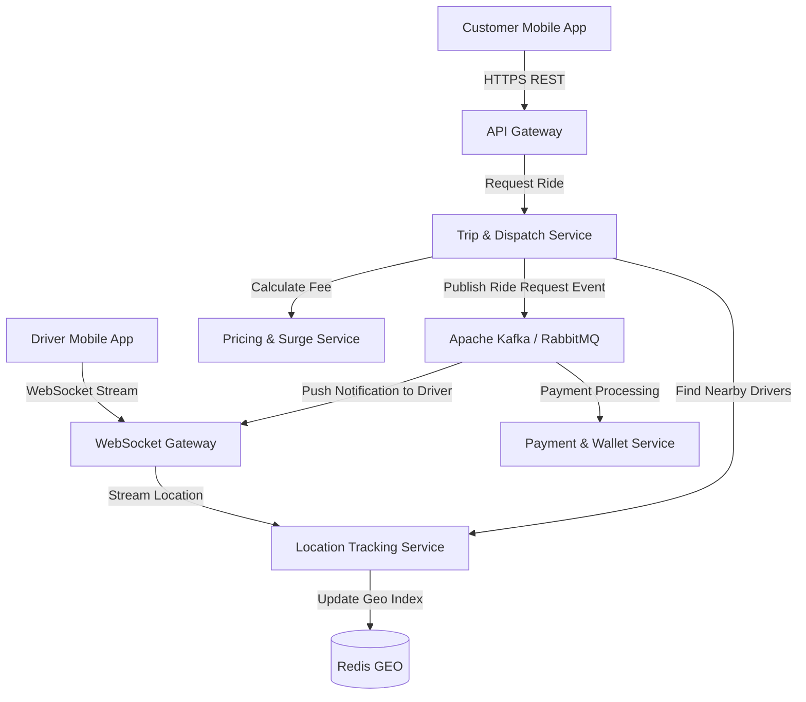

# ĐỀ TÀI 2: HỆ THỐNG ĐẶT XE VÀ GIAO HÀNG THEO YÊU CẦU THEO THỜI GIAN THỰC (RIDE-HAILING & LOGISTICS SYSTEM)

## 1. TỔNG QUAN VỀ ĐỀ TÀI
- **Tên đề tài:** Thiết kế và phát triển hệ thống Đặt xe & Giao hàng thời gian thực (mô hình Grab/Gojek) trên kiến trúc Microservices.
- **Mô tả:** Hệ thống quản lý kết nối giữa Khách hàng (Passenger/Customer) và Tài xế (Driver), định vị vị trí thời gian thực (Real-time GPS Tracking), tính toán cước phí linh hoạt (Surge Pricing) và ghép nối chuyến xe thông minh (Matching Engine).
- **Tính thực tế doanh nghiệp:**
  - Xử lý hàng trăm ngàn tọa độ GPS gửi lên mỗi giây từ ứng dụng của tài xế.
  - Đòi hỏi độ trễ cực thấp trong việc ghép nối tài xế gần nhất với khách hàng.
  - Phân tách service giúp đảm bảo nếu tính năng tính cước/khuyến mãi bị quá tải, hệ thống định vị tài xế vẫn hoạt động ổn định.

---

## 2. PHÂN TÍCH KIẾN TRÚC MICROSERVICES

### 2.1. Danh sách các Microservices chính
1. **API Gateway & WebSocket Gateway:**
   - Quản lý kết nối HTTP REST và kết nối WebSocket persistent hai chiều với ứng dụng tài xế & khách hàng.
   - *Công cụ:* Nginx / Envoy / Node.js WebSocket Gateway.
2. **User & Driver Profile Service:**
   - Quản lý tài khoản khách hàng, hồ sơ tài xế, thông tin xe, bằng lái, trạng thái hoạt động (Online/Offline/Busy).
   - *Database:* PostgreSQL (hoặc MySQL).
3. **Location & Telemetry Tracking Service (High Throughput Service):**
   - Tiếp nhận stream tọa độ GPS từ ứng dụng tài xế gửi lên theo chu kỳ 3-5 giây/lần.
   - Lưu trữ và cập nhật vị trí mới nhất của tài xế để hỗ trợ truy vấn không gian (Spatial Queries).
   - *Database:* Redis (Redis GEO Data Structure) + PostGIS (PostgreSQL Extension cho Spatial Data).
4. **Trip & Dispatching Matching Service (Core Engine):**
   - Nhận yêu cầu đặt xe từ khách hàng -> Tìm kiếm tài xế phù hợp xung quanh bán kính X km -> Gửi đề nghị nhận chuyến tới tài xế.
   - Quản lý trạng thái chuyến đi (Requested, Accepted, Arrived, In-Progress, Completed, Cancelled).
   - *Database:* MongoDB hoặc PostgreSQL.
5. **Dynamic Pricing & Surge Fee Service:**
   - Tính toán giá tiền dựa trên khoảng cách (Google Maps / OpenStreetMap API), thời gian dự kiến và hệ số nhân nhu cầu (Surge Pricing dựa trên mật độ tài xế vs khách hàng tại khu vực).
   - *Database:* Redis (Lưu cache quy tắc bảng giá).
6. **Payment & Wallet Service:**
   - Quản lý ví điện tử tài xế, trừ hoa hồng chuyến đi, thanh toán qua thẻ/ví điện tử cho khách hàng.
   - *Database:* PostgreSQL.

### 2.2. Sơ đồ kiến trúc & Cơ chế giao tiếp (Inter-Service Communication)


- **Truyền nhận dữ liệu thời gian thực (Real-time Streaming):** 
  - **WebSocket / gRPC Streams:** Giữ kết nối liên tục giữa Driver App và `Location Service`.
- **Event-Driven Architecture:**
  - Khi chuyến đi hoàn thành -> `Dispatch Service` bắn event `TripCompletedEvent`.
  - `Payment Service` tự động trừ tiền ví/thẻ của khách và cộng tiền vào ví tài xế.
  - `User Service` cập nhật lịch sử chuyến đi.

---

## 3. HƯỚNG DẪN TÌM HIỂU VÀ PHÂN TÍCH HỆ THỐNG CHO SINH VIÊN

### Giai đoạn 1: Phân tích Kỹ thuật Xử lý Dữ liệu Không gian (Spatial Indexing)
1. **Nghiên cứu Redis GEO & H3 Spatial Index (Uber H3 Index):**
   - Học cách sử dụng lệnh `GEOADD`, `GEORADIUS` / `GEOSEARCH` trong Redis để tìm kiếm tài xế trong bán kính 2km với thời gian phản hồi < 2ms.
2. **Quản lý trạng thái kết nối WebSocket:**
   - Giải bài toán khi server WebSocket bị rớt mạng hoặc khi chạy nhiều instance WebSocket Gateway (dùng Redis Pub/Sub để broadcast tin nhắn giữa các instance WebSocket).

### Giai đoạn 2: Thiết kế Matching Engine & State Machine
1. **Thiết kế Máy trạng thái Chuyến xe (State Machine):**
   - Vẽ và cài đặt luồng chuyển trạng thái nghiêm ngặt cho chuyến xe: `CREATED` -> `MATCHING` -> `ACCEPTED` -> `PICKING_UP` -> `IN_TRIP` -> `COMPLETED`.
   - Đảm bảo tránh tình trạng 2 khách hàng đặt cùng 1 tài xế tại 1 thời điểm (Concurrency Control / Atomic Lock).

### Giai đoạn 3: Phân tích Tính toán cước giá động (Surge Pricing)
1. **Thu thập Metrics:**
   - Đếm số lượng yêu cầu tạo chuyến (Supply) vs số tài xế rảnh (Demand) trong cùng một geohash (ô lưới địa lý) theo từng khung giờ.

---

## 4. HƯỚNG DẪN TRIỂN KHAI LÊN SERVER VPS THỰC TẾ

### Step 1: Chuẩn bị Hạ tầng VPS
- **Cấu hình tối thiểu đề xuất:** Cloud VPS (Ubuntu 22.04 LTS, 4 vCPU, 8GB RAM, SSD 60GB).
- **Yêu cầu kết nối mạng:** VPS cần có IP Tĩnh Public (Elastic IP) và độ trễ thấp.

### Step 2: Cấu hình Containerization & Networks
Tạo file `docker-compose.yml`:
- Khởi chạy các container: `ws-gateway`, `api-gateway`, `user-service`, `location-service`, `dispatch-service`, `pricing-service`, `payment-service`.
- Khởi chạy Infra containers: `Redis (Geo enabled)`, `PostgreSQL with PostGIS`, `Apache Kafka + Zookeeper`.

### Step 3: Cấu hình Nginx Reverse Proxy cho WebSocket
Cấu hình Nginx trên VPS để proxy cả HTTP REST và WebSocket (Upgrade HTTP header):
```nginx
server {
    server_name ride-api.yourdomain.com;

    # HTTP REST APIs
    location /api/v1/ {
        proxy_pass http://localhost:8000;
        proxy_set_header Host $host;
        proxy_set_header X-Real-IP $remote_addr;
    }

    # Real-time WebSocket connection
    location /ws/ {
        proxy_pass http://localhost:8001;
        proxy_http_version 1.1;
        proxy_set_header Upgrade $http_upgrade;
        proxy_set_header Connection "Upgrade";
        proxy_set_header Host $host;
        proxy_read_timeout 86400s; # Giữ kết nối lâu dài không bị timeout
    }
}
```

### Step 4: Triển khai SSL & HTTPS với Certbot
Cấp chứng chỉ WSS (Secure WebSocket) và HTTPS giúp ứng dụng di động / web kết nối an toàn mà không bị trình duyệt chặn tin cậy.

### Step 5: Tự động hóa CI/CD
Tự động build Docker Image trên GitHub Actions, push lên Registry và SSH vào VPS thực thi câu lệnh:
```bash
docker compose pull ws-gateway location-service dispatch-service
docker compose up -d --no-deps ws-gateway location-service dispatch-service
```
*(Chiến lược Rolling Update đảm bảo ứng dụng không bị gián đoạn kết nối thời gian thực).*

---

## 5. TIÊU CHÍ ĐÁNH GIÁ & YÊU CẦU BÀI LÀM CHO SINH VIÊN
1. **Tính thời gian thực (Real-time Performance):** Vị trí tài xế cập nhật liên tục và hiển thị mượt mà trên bản đồ khách hàng qua WebSocket với độ trễ < 500ms.
2. **Khả năng ghép chuyến (Matching Accuracy):** Hệ thống gửi tín hiệu đặt xe đến đúng tài xế đang rảnh và ở gần nhất.
3. **Triển khai VPS thực tế:** Chạy hệ thống trên VPS thực, kiểm tra kết nối SSL/WSS từ mạng ngoài thành công.
4. **Kịch bản Demo & Chịu tải:**
   - Viết script Python / Node.js giả lập 100 tài xế di chuyển ảo và gửi tọa độ GPS liên tục lên VPS.
   - Thực hiện thao tác đặt xe từ ứng dụng khách hàng thực tế và kiểm tra tài xế ảo nhận được chuyến.
