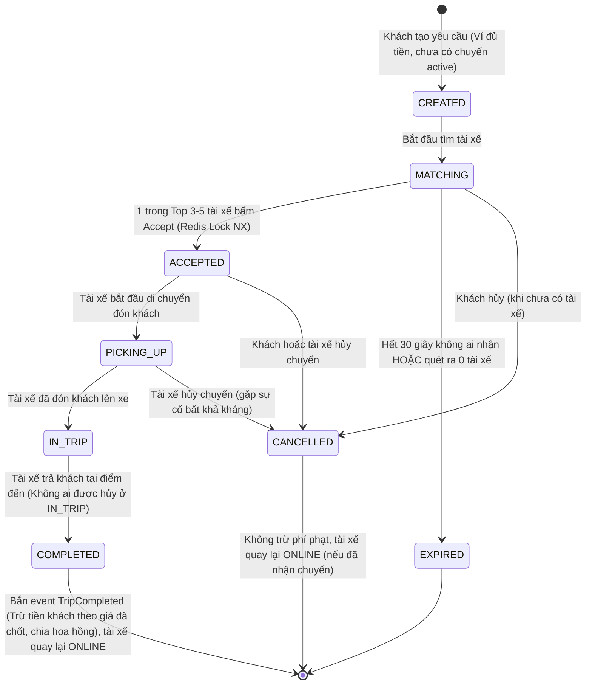

# ĐẶC TẢ YÊU CẦU PHẦN MỀM (SRS) - HỆ THỐNG RIDE-HAILING & LOGISTICS

> **Dự án:** Hệ thống Đặt xe & Điều phối Thời gian thực (Ride-Hailing & Logistics System)  
> **Môn học:** DevOps  
> **Phiên bản:** 1.4  
> **Tài liệu căn cứ:** [AGENTS.md](../../AGENTS.md), [de-bai-goc.md](../00-brainstorm/de-bai-goc.md), [quyet-dinh.md](../00-brainstorm/quyet-dinh.md)

---

## 1. MỤC TIÊU DỰ ÁN

1. **Mục tiêu chính:** Xây dựng hệ thống backend microservices mô phỏng dịch vụ gọi xe công nghệ (mô hình Grab/Gojek), đóng gói container hóa Docker, thiết lập CI/CD tự động bằng GitHub Actions và triển khai (deploy) vận hành ổn định trên hạ tầng Cloud VPS thực tế.
2. **Phạm vi triển khai:** Hệ thống tập trung hoàn toàn vào **Backend và DevOps**. Toàn bộ các luồng nghiệp vụ cốt lõi được kiểm thử và nghiệm thu qua **cURL / Postman** và **Script giả lập 100 tài xế ảo**. **Không phát triển giao diện người dùng (UI Web/Mobile/Admin)**.
3. **Môi trường hạ tầng:** Vận hành tối ưu trên môi trường VPS hạn chế tài nguyên: **1 vCPU, 1 GB RAM, 20 GB Disk (Ubuntu 22.04 LTS)**, có cấu hình Swap 2 GB.

---

## 2. TÁC NHÂN HỆ THỐNG (ACTORS)

* **Khách hàng (Passenger / Customer):**
  * Đăng ký, đăng nhập tài khoản khách hàng; làm mới token phiên truy cập và đăng xuất thu hồi token (tự động đóng kết nối WebSocket).
  * Tra cứu ước tính cước phí và khoảng cách giữa điểm đón và điểm trả (xem chi tiết khoảng cách, ETA, BaseFare, PricePerKm, hệ số surge và nguồn OSRM/HAVERSINE).
  * Quản lý ví cá nhân (kiểm tra số dư, nạp tiền demo, xem lịch sử giao dịch chi tiết theo dòng và trạng thái).
  * Tạo yêu cầu đặt xe (mỗi thời điểm chỉ có tối đa 1 chuyến đang hoạt động).
  * Xem chuyến xe đang hoạt động (`active trip`) và xem chi tiết chuyến của chính mình (kèm lịch sử mốc thời gian chuyển trạng thái).
  * Kết nối WebSocket (`/ws/`) để nhận thông báo đẩy khi chuyến xe thay đổi trạng thái theo thời gian thực.
  * Hủy chuyến khi chuyến đang ở trạng thái `MATCHING` hoặc `ACCEPTED` (không được hủy khi tài xế đang đến đón `PICKING_UP` hoặc xe đang chạy `IN_TRIP`).
* **Tài xế (Driver):**
  * Đăng ký, đăng nhập tài khoản tài xế; làm mới token phiên truy cập và đăng xuất thu hồi token (đăng xuất thành công sẽ tự chuyển `OFFLINE` và đóng kết nối WebSocket).
  * Bật/tắt trạng thái hoạt động (`ONLINE`, `OFFLINE`). Tự động sang `BUSY` khi nhận chuyến và quay lại `ONLINE` khi chuyến kết thúc (`COMPLETED`) hoặc bị hủy (`CANCELLED`).
  * Tài xế đang `BUSY` không được tự ý chuyển sang `OFFLINE` và bị từ chối đăng xuất cho đến khi hết chuyến.
  * Kết nối WebSocket (`/ws/`) để phát stream tọa độ GPS liên tục (chu kỳ 3–5 giây), nhận tín hiệu mời chuyến mới (Broadcast Notification), và nhận thông báo đổi trạng thái chuyến.
  * Chấp nhận chuyến (`ACCEPT`) theo cơ chế cạnh tranh khóa nguyên tử (chỉ chấp nhận khi đang `ONLINE`).
  * Xem chuyến xe đang hoạt động (`active trip`) và xem chi tiết chuyến của chính mình (kèm lịch sử mốc thời gian chuyển trạng thái).
  * Cập nhật tiến trình chuyến: Đang đón khách (`PICKING_UP`) $\rightarrow$ Đang chở khách (`IN_TRIP`) $\rightarrow$ Hoàn thành (`COMPLETED`).
  * Hủy chuyến khi chuyến đang ở trạng thái `ACCEPTED` hoặc `PICKING_UP` (gặp sự cố hợp lệ; không được hủy khi chuyến đang `IN_TRIP`).
  * Nhận tiền cước sau khi hệ thống tự động trừ hoa hồng.
* **Quản trị viên (Admin):**
  * Đăng nhập tài khoản Quản trị viên (được khởi tạo sẵn từ biến môi trường - ENV khi khởi động, không cho đăng ký tự do); làm mới phiên và đăng xuất.
  * Xem và cập nhật cấu hình bảng giá (`BaseFare`, `PricePerKm`, ngưỡng surge) áp dụng cho các chuyến tạo mới.
  * Xem dữ liệu vận hành toàn hệ thống ở chế độ **chỉ đọc** (danh sách chuyến từ `dispatch-service`, danh sách người dùng từ `user-service`, báo cáo từ `ai-service`, danh sách tài xế đang hoạt động và vị trí GPS mới nhất từ `location-service`).
  * **Quyền ghi duy nhất (Ngoại lệ):** Thực hiện lệnh hủy cưỡng bức chuyến kẹt (FR-37) ở bất kỳ trạng thái chưa kết thúc nào để giải phóng tài nguyên.
  * Gọi API sinh nhận xét và báo cáo tổng kết tình hình kinh doanh (AI / Heuristic) có cơ chế tự động fallback sang Rule-based khi LLM lỗi/timeout.

---

## 3. DANH SÁCH YÊU CẦU CHỨC NĂNG (FUNCTIONAL REQUIREMENTS)

> **Quy ước mức độ ưu tiên:**
> * **Bắt buộc (Must-Have):** Nghiệp vụ sống còn của đồ án và bắt buộc để vượt qua kịch bản demo.
> * **Nên có (Should-Have):** Tăng cường tính hoàn thiện của hệ thống nhưng có thể tinh giản.
> * **Bỏ qua (Out of Scope):** Không thực hiện để đảm bảo tiết kiệm RAM và tập trung cho DevOps.

### 3.1. Phân hệ Tài khoản & Xác thực (`user-service`, `api-gateway`)

| Mã FR | Tên chức năng | Mô tả chi tiết | Mức ưu tiên |
| :--- | :--- | :--- | :--- |
| **FR-01** | Đăng ký tài khoản | Hỗ trợ người dùng đăng ký tài khoản với vai trò Khách hàng (`CUSTOMER`) hoặc Tài xế (`DRIVER`). Mật khẩu được băm an toàn (bcrypt). | **Bắt buộc** |
| **FR-02** | Đăng nhập & Cấp JWT | Xác thực thông tin đăng nhập, sinh access token (JWT) và refresh token. JWT được ký bằng secret trong ENV (dùng chung cho `api-gateway` và `ws-gateway`), chứa `user_id`, `role`, `exp`, và `jti` (JWT ID). TTL của access token mặc định là 1 giờ (cấu hình qua ENV). | **Bắt buộc** |
| **FR-03** | Xác thực & Phân quyền Gateway | `api-gateway` kiểm tra chữ ký JWT, thời hạn `exp`, và kiểm tra blacklist trong Redis (tra `blacklist:<jti>`) cho mỗi request. Nếu hợp lệ, gắn `X-User-Id` và `X-User-Role` trước khi forward request vào microservice nội bộ. Token nằm trong blacklist bị từ chối 401. | **Bắt buộc** |
| **FR-04** | Quản lý trạng thái Tài xế | Tài xế chuyển đổi trạng thái làm việc: `ONLINE` (sẵn sàng đón khách), `OFFLINE` (nghỉ ngơi), hoặc tự động sang `BUSY` khi đã nhận chuyến. **Tài xế `BUSY` tự động quay lại `ONLINE` khi chuyến `COMPLETED` hoặc `CANCELLED`.** **Ràng buộc:** Tài xế đang `BUSY` không được phép tự chuyển sang `OFFLINE` và bị từ chối đăng xuất cho đến khi hết chuyến. Tài xế `ONLINE` khi đăng xuất (FR-34) sẽ tự động chuyển sang `OFFLINE` và đóng kết nối WebSocket. | **Bắt buộc** |
| **FR-05** | Xem thông tin hồ sơ | Lấy thông tin cá nhân cơ bản (họ tên, email/số điện thoại, vai trò, trạng thái). | **Nên có** |
| **FR-06** | Quản lý phương tiện tài xế | Lưu trữ thông tin xe (biển số, loại xe máy/ô tô) đơn giản hóa trong bảng tài xế. | **Nên có** |
| **FR-30** | Tài khoản Admin | Tài khoản mang vai trò `ADMIN`, được tạo sẵn tự động khi khởi động service từ biến môi trường (ENV), không cho phép đăng ký tự do qua API. | **Nên có** |
| **FR-33** | Làm mới phiên (Token Refresh) | Refresh token là chuỗi ngẫu nhiên (opaque string), lưu server-side trong Redis (key kèm TTL, mặc định 7 ngày, ENV). Endpoint làm mới: đổi refresh token hợp lệ lấy access token mới và refresh token mới (cơ chế Rotation), token cũ bị xóa ngay khỏi Redis. Nếu refresh token đã dùng hoặc đã thu hồi thì trả mã lỗi 401. Refresh token chỉ trả trong body JSON (không dùng cookie vì không có UI). | **Bắt buộc** |
| **FR-34** | Đăng xuất & Thu hồi token | Endpoint đăng xuất: xóa refresh token khỏi Redis và đưa `jti` của access token đang dùng vào blacklist Redis (key `blacklist:<jti>`, TTL bằng thời gian còn lại của token, tự xóa khi hết hạn). Token đã blacklist bị từ chối. **Quy tắc kết nối & trạng thái:** Đăng xuất thành công sẽ **đóng kết nối WebSocket của mọi vai trò (cả Khách hàng và Tài xế)**. Đối với tài xế: nếu đang `BUSY` thì bị từ chối đăng xuất cho đến khi hết chuyến; nếu đang `ONLINE` thì khi đăng xuất thành công sẽ tự động chuyển sang trạng thái `OFFLINE`. | **Nên có** |

### 3.2. Phân hệ Định vị & Vị trí Thời gian thực (`ws-gateway`, `location-service`)

| Mã FR | Tên chức năng | Mô tả chi tiết | Mức ưu tiên |
| :--- | :--- | :--- | :--- |
| **FR-07** | Kết nối WebSocket thời gian thực | `ws-gateway` duy trì kết nối WebSocket hai chiều persistent (`/ws/`). Xác thực access token (gồm kiểm tra chữ ký, hạn `exp` và blacklist trên Redis) lúc handshake. Kết nối WebSocket đang mở không bị ngắt khi access token hết hạn sau đó. | **Bắt buộc** |
| **FR-08** | Tiếp nhận & Lưu tọa độ GPS | Tiếp nhận stream tọa độ `(lat, lng)` từ tài xế gửi lên mỗi 3–5 giây qua WebSocket, đẩy vào `location-service` để cập nhật vào `Redis GEO` (`GEOADD`). | **Bắt buộc** |
| **FR-09** | Quét tài xế lân cận | Cung cấp API nội bộ tìm kiếm Top 3–5 tài xế gần tọa độ điểm đón nhất trong bán kính $R$ km (mặc định $R = 5\text{ km}$) bằng `Redis GEOSEARCH`. **Chỉ tài xế `ONLINE` mới được trả về trong kết quả quét; tài xế `BUSY` và `OFFLINE` tuyệt đối không được xuất hiện.** **Đặc biệt:** Tài xế mất kết nối WebSocket quá 15 giây thì không được trả về khi quét tìm xe (trạng thái `ONLINE` trong DB giữ nguyên). (Không quy định cách cài đặt, để tài liệu LLD quyết định). | **Bắt buộc** |
| **FR-10** | Lưu lịch sử tọa độ vào DB | Ghi toàn bộ vết di chuyển GPS vào PostgreSQL (`locationdb`). | **Bỏ qua** *(Tiết kiệm I/O đĩa và RAM VPS, chỉ lưu tọa độ mới nhất trong Redis; không tạo `locationdb`)* |
| **FR-35** | Đẩy thông báo trạng thái chuyến | Khách hàng và tài xế đều kết nối tới `/ws/` qua `ws-gateway` (xác thực token lúc handshake như FR-07). Mỗi lần chuyến xe thay đổi trạng thái, `dispatch-service` phát event qua Redis Pub/Sub, `ws-gateway` đẩy thông báo cập nhật trạng thái thời gian thực tới kết nối WebSocket của khách hàng và tài xế của chuyến đó. | **Nên có** |

### 3.3. Phân hệ Tính giá & Định tuyến (`pricing-service`)

| Mã FR | Tên chức năng | Mô tả chi tiết | Mức ưu tiên |
| :--- | :--- | :--- | :--- |
| **FR-11** | Tính khoảng cách & ETA có Fallback | **Cơ chế cốt lõi:** Gọi OSRM Public API với timeout **400 ms** để lấy khoảng cách thực tế và thời gian di chuyển. Nếu OSRM bị lỗi/timeout $\rightarrow$ **Tự động Fallback sang công thức Haversine $\times 1.35$** (hệ số uốn khúc đô thị). | **Bắt buộc** |
| **FR-12** | Ước tính cước phí chuyến xe | Tính giá cước chuyến theo công thức: $\text{Fare} = (\text{BaseFare} + \text{Distance} \times \text{PricePerKm}) \times \text{SurgeMultiplier}$. **Dữ liệu trả về:** Response của API ước tính cước trả về đầy đủ các trường: khoảng cách (`distance`), thời gian dự kiến (`eta`), nguồn tính khoảng cách (`source`: `OSRM` hoặc `HAVERSINE`), hệ số nhu cầu (`surge_multiplier`), `base_fare`, `price_per_km` và tổng cước phí (`total_fare`). | **Bắt buộc** |
| **FR-13** | Tính hệ số Surge Pricing | Tính toán hệ số nhân nhu cầu cao điểm đơn giản: $\text{SurgeMultiplier} = f(\text{Demand} / \text{Supply})$ tại khu vực/ô lưới. Mặc định $= 1.0$ khi tải bình thường, tăng lên $1.2 - 1.5$ khi thiếu xe. | **Bắt buộc** |
| **FR-14** | Áp dụng Voucher / Khuyến mãi | Trừ tiền voucher giảm giá, mã khuyến mãi đa tầng. | **Bỏ qua** *(Đơn giản hóa cho demo)* |
| **FR-31** | Quản lý bảng giá (Admin) | Admin xem và cập nhật `BaseFare`, `PricePerKm`, ngưỡng surge. Dữ liệu lưu trong `pricingdb` và cache Redis. Giá mới chỉ áp dụng cho các chuyến đi được tạo sau thời điểm cập nhật. | **Nên có** |

### 3.4. Phân hệ Điều phối & Khớp chuyến (`dispatch-service`)

| Mã FR | Tên chức năng | Mô tả chi tiết | Mức ưu tiên |
| :--- | :--- | :--- | :--- |
| **FR-15** | Kiểm tra số dư ví & Chặn đa chuyến | **(Quyết định đã chốt):** Kiểm tra số dư ví của khách qua `payment-service`. Nếu số dư ví nhỏ hơn giá tạm tính $\rightarrow$ **Chặn không cho đặt xe**, trả về mã lỗi `INSUFFICIENT_BALANCE`. **Bổ sung:** Mỗi khách hàng chỉ được có duy nhất 1 chuyến đang hoạt động (trạng thái `CREATED`, `MATCHING`, `ACCEPTED`, `PICKING_UP`, `IN_TRIP`). Nếu đã có thì chặn, trả mã lỗi `ACTIVE_TRIP_EXISTS`. Nhờ vậy việc kiểm tra số dư lúc đặt xe là đủ chính xác, không cần cơ chế giữ tiền (hold). | **Bắt buộc** |
| **FR-16** | Tạo yêu cầu đặt xe & Chốt giá | Khách hàng gửi điểm đón, điểm trả $\rightarrow$ hệ thống gọi `pricing-service` lấy giá, tạo bản ghi chuyến với trạng thái ban đầu `CREATED` $\rightarrow$ chuyển sang `MATCHING`. **Giá chốt lúc tạo chuyến được lưu cố định vào bản ghi chuyến đi và là giá cuối cùng, không tính lại khi hoàn thành.** | **Bắt buộc** |
| **FR-17** | Broadcast đề nghị nhận chuyến | **(Quyết định đã chốt):** `dispatch-service` gọi `location-service` lấy Top 3–5 tài xế rảnh gần nhất, phát thông báo chuyến qua Redis Pub/Sub $\rightarrow$ `ws-gateway` đẩy xuống WebSocket của các tài xế này. **Đặc biệt:** Nếu quét ra 0 tài xế phù hợp, chuyến xe chuyển ngay sang trạng thái `EXPIRED` mà không cần chờ hết 30 giây. | **Bắt buộc** |
| **FR-18** | Nhận chuyến cạnh tranh (Atomic Lock) | **(Quyết định đã chốt):** Tài xế gửi request nhận cuốc. **Quy tắc kiểm tra:** Chỉ tài xế đang ở trạng thái `ONLINE` mới nhận được chuyến; tài xế đang `BUSY` hoặc `OFFLINE` bấm nhận sẽ bị từ chối với mã lỗi `DRIVER_NOT_AVAILABLE`. Hệ thống dùng Redis Atomic Lock: `SET ride:lock:<trip_id> <driver_id> NX EX 10`. Tài xế đầu tiên nhận thành công; các tài xế đến sau nhận lỗi `TRIP_ALREADY_TAKEN`. | **Bắt buộc** |
| **FR-19** | Quản lý Máy trạng thái Chuyến | Đảm bảo chuyển trạng thái nghiêm ngặt: $\text{CREATED} \rightarrow \text{MATCHING} \rightarrow \text{ACCEPTED} \rightarrow \text{PICKING\_UP} \rightarrow \text{IN\_TRIP} \rightarrow \text{COMPLETED}$. | **Bắt buộc** |
| **FR-20** | Hủy chuyến xe | Quy định quyền hủy chuyến theo trạng thái: - Khách hàng chỉ được hủy khi chuyến đang ở trạng thái `MATCHING` hoặc `ACCEPTED`. - Tài xế chỉ được hủy khi chuyến đang ở trạng thái `ACCEPTED` hoặc `PICKING_UP` (gặp sự cố bất khả kháng). - Khi chuyến đã chuyển sang `IN_TRIP`, **cả khách hàng và tài xế đều không được phép hủy**. Khi hủy hợp lệ, trạng thái chuyến chuyển sang `CANCELLED`. | **Bắt buộc** |
| **FR-21** | Hết giờ tìm tài xế (Timeout) | Sau 30 giây phát broadcast nếu không có tài xế nào bấm nhận, chuyến xe tự động chuyển sang trạng thái: `EXPIRED`. | **Bắt buộc** |
| **FR-36** | Xem chuyến hiện tại & Chi tiết chuyến | Cung cấp API cho phép Khách hàng hoặc Tài xế xem thông tin chuyến đang hoạt động (`active trip`) và xem chi tiết một chuyến (`trip details`). Người dùng chỉ xem được chuyến của chính mình. **Chi tiết chuyến:** Bao gồm đầy đủ thông tin chuyến và mảng lịch sử chuyển trạng thái (`status_timeline`) có ghi nhận thời gian (timestamp) của từng lần đổi trạng thái. | **Nên có** |

### 3.5. Phân hệ Ví & Thanh toán (`payment-service`)

| Mã FR | Tên chức năng | Mô tả chi tiết | Mức ưu tiên |
| :--- | :--- | :--- | :--- |
| **FR-22** | Quản lý ví cá nhân | Tự động tạo ví khi người dùng đăng ký. Cung cấp API xem số dư và lịch sử giao dịch. **Ghi nhận giao dịch chi tiết:** Lịch sử giao dịch ví được ghi riêng từng dòng (dòng trừ ví khách, dòng cộng 85% ví tài xế, dòng hoa hồng 15% hệ thống). Mỗi dòng giao dịch bắt buộc có mã chuyến tham chiếu (`trip_id`) và trạng thái `SUCCESS` hoặc `FAILED`. | **Bắt buộc** |
| **FR-23** | Nạp tiền ví ảo (Top-up API) | Cung cấp API nạp tiền trực tiếp vào ví để phục vụ kịch bản test API demo. | **Bắt buộc** |
| **FR-24** | Thanh toán chuyến đi tự động | Lắng nghe sự kiện `TripCompleted` từ Redis Streams: Trừ đúng giá cước đã chốt lúc tạo chuyến (lấy từ event `TripCompleted`) từ ví khách; trừ hoa hồng hệ thống **15%** (cố định trong cấu hình ENV, không có API sửa đổi); cộng $85\%$ tiền cước còn lại vào ví tài xế. Đảm bảo Idempotency (chống trừ tiền 2 lần). Ghi nhận các dòng giao dịch riêng biệt kèm mã `trip_id` và trạng thái. **Quy tắc số dư:** Không bao giờ để số dư ví âm. Nếu vì lý do bất thường mà ví không đủ lúc trừ, không trừ, đánh dấu giao dịch `FAILED` và ghi log lỗi để xử lý thủ công (lưu ý: đây là tình huống không mong đợi vì FR-15 đã chặn từ lúc đặt xe). | **Bắt buộc** |
| **FR-25** | Miễn phí phạt hủy chuyến | **(Quyết định đã chốt):** Khi chuyến chuyển sang `CANCELLED` (kể cả do Khách, Tài xế hay Admin hủy cưỡng bức), hệ thống không trừ bất kỳ phí phạt nào từ tài khoản khách hoặc tài xế. | **Bắt buộc** |
| **FR-26** | Cổng thanh toán thẻ thực tế | Tích hợp cổng thanh toán thực tế (VNPAY, Momo, Stripe). | **Bỏ qua** |

### 3.6. Phân hệ Phân tích & Báo cáo (`ai-service`)

| Mã FR | Tên chức năng | Mô tả chi tiết | Mức ưu tiên |
| :--- | :--- | :--- | :--- |
| **FR-27** | Thu thập số liệu vận hành | Lắng nghe sự kiện từ Redis Streams (`TripCreated`, `TripCompleted`, `TripCancelled`, và `TripExpired`) để tổng hợp số liệu vào `aidb`: - Số chuyến theo trạng thái (`COMPLETED`, `CANCELLED`, `EXPIRED`). - Tổng doanh thu và tổng hoa hồng hệ thống thu được. - Tỷ lệ hủy (`cancellation_rate`), tỷ lệ hết giờ (`expiration_rate`), và các khung giờ cao điểm. - Hỗ trợ lọc số liệu theo khoảng thời gian (`start_time`, `end_time`). **Tính lũy thừa:** Xử lý sự kiện idempotent theo `trip_id` (nếu event bị giao lại thì không đếm trùng lặp). | **Bắt buộc** |
| **FR-28** | Sinh nhận xét vận hành (AI/Rule) | Cung cấp endpoint báo cáo tổng kết (**chỉ tài khoản role `ADMIN` mới được gọi**): Response bao gồm số liệu và nhận xét phân tích, kèm trường `insight_source` nhận giá trị `LLM` hoặc `RULE_BASED`. **Cơ chế Chịu lỗi:** Nếu gọi mô hình LLM gặp lỗi hoặc timeout (mặc định 10 giây, cấu hình ENV) thì hệ thống tự động fallback sang cơ chế `RULE_BASED` theo tập luật, đảm bảo không bao giờ trả lỗi 500 cho Admin. Tỷ lệ hoa hồng 15% giữ cố định ở ENV, không có API đổi. | **Bắt buộc** |
| **FR-29** | Dự đoán nhu cầu di chuyển sâu | Huấn luyện mạng nơ-ron Deep Learning (LSTM/GRU) dự báo mật độ chuyến xe. | **Bỏ qua** *(Không phù hợp trên VPS 1 GB RAM)* |

### 3.7. Phân hệ Quản trị (Admin)

| Mã FR | Tên chức năng | Mô tả chi tiết | Mức ưu tiên |
| :--- | :--- | :--- | :--- |
| **FR-32** | Xem dữ liệu vận hành (Admin) | Tuân thủ kiến trúc Database-per-Service: Admin chỉ đọc dữ liệu vận hành (read-only), mỗi loại dữ liệu do service sở hữu trực tiếp trả về qua endpoint dành cho role `ADMIN` (ngoại lệ duy nhất cho phép quyền ghi là FR-37): 1. Danh sách người dùng do `user-service` quản lý và trả về. 2. Danh sách chuyến do `dispatch-service` quản lý và trả về. 3. Báo cáo vận hành do `ai-service` quản lý và trả về. 4. Danh sách tài xế đang hoạt động và vị trí GPS mới nhất do `location-service` trả về. Tất cả request đều đi qua `api-gateway` và chỉ tài khoản có role `ADMIN` mới được phép gọi. | **Nên có** |
| **FR-37** | Admin hủy cưỡng bức chuyến kẹt | Cho phép Admin hủy cưỡng bức bất kỳ chuyến đi nào chưa kết thúc (đang ở trạng thái `CREATED`, `MATCHING`, `ACCEPTED`, `PICKING_UP`, hoặc `IN_TRIP`) để giải phóng tài nguyên hệ thống khi phát hiện chuyến bị kẹt hoặc sự cố. Chuyến xe chuyển sang trạng thái `CANCELLED`, tài xế (nếu đã nhận chuyến) tự động quay lại trạng thái `ONLINE`, không trừ bất kỳ phí phạt nào (tuân thủ FR-25). Request đi qua `api-gateway`, chỉ tài khoản có role `ADMIN` mới có quyền thực hiện. | **Nên có** |

---

## 4. MÁY TRẠNG THÁI CHUYẾN XE (TRIP STATE MACHINE)

Sơ đồ chuyển trạng thái nghiêm ngặt trong `dispatch-service`:

> **Ghi chú về Admin hủy cưỡng bức (FR-37):**  
> Admin có đặc quyền thực hiện lệnh hủy cưỡng bức tại **mọi trạng thái chưa kết thúc** (`CREATED`, `MATCHING`, `ACCEPTED`, `PICKING_UP`, `IN_TRIP`). Khi Admin gửi lệnh hủy, chuyến đi lập tức chuyển sang trạng thái `CANCELLED`, tài xế (nếu đã được gán) tự động quay lại `ONLINE`, và không áp dụng bất kỳ khoản phí phạt nào (nhằm giữ cho sơ đồ trực quan và dễ theo dõi, nhánh hủy cưỡng bức từ Admin không vẽ thêm các đường mũi tên trùng lặp).

---

## 5. YÊU CẦU PHI CHỨC NĂNG (NON-FUNCTIONAL REQUIREMENTS - NFR)

### NFR-01: Hiệu năng & Độ trễ (Performance & Latency)
* Độ trễ cập nhật GPS từ tài xế qua WebSocket đến Redis GEO đạt $< 500\text{ ms}$.
* Thời gian phản hồi các REST API nội bộ đạt $< 100\text{ ms}$ ở điều kiện bình thường.
* OSRM API có timeout ngắt nghiêm ngặt tại **$400\text{ ms}$** để không làm nghẽn request của khách.
* Fallback nội bộ bằng Haversine $\times 1.35$ phản hồi tức thì $< 1\text{ ms}$.

### NFR-02: Ràng buộc tài nguyên (VPS Constraints - Tối hậu)
* Toàn bộ hệ thống chạy trên **1 VPS duy nhất: 1 vCPU, 1 GB RAM, 20 GB Disk, Ubuntu 22.04 LTS**.
* Sử dụng 1 container PostgreSQL duy nhất, chia **5 Database logic riêng biệt** (`userdb`, `dispatchdb`, `pricingdb`, `paymentdb`, `aidb`) theo mô hình Database-per-Service. `locationdb` không sử dụng do FR-10 đã bỏ qua (chỉ lưu tọa độ mới nhất trong Redis GEO để tối ưu RAM và I/O).
* Sử dụng 1 container Redis duy nhất đảm nhận cả 3 vai trò: GEO, Pub/Sub, Streams (thay thế Kafka).
* Tất cả container trong `docker-compose.yml` đều được gán `mem_limit` cụ thể (từ 15 MB – 60 MB cho mỗi Go service; Postgres tối đa 150 MB; Redis tối đa 60 MB) kèm bật 2 GB Swap để chống OOM (Out-Of-Memory) Killer.

### NFR-03: Tính sẵn sàng & Khả năng chịu lỗi (Resilience & Fault Tolerance)
* Khi server OSRM bên ngoài gặp sự cố, hệ thống tự động fallback tính khoảng cách qua Haversine mà không gây lỗi cho người dùng.
* Khi gọi LLM cho báo cáo thông minh tại `ai-service` bị lỗi hoặc timeout quá 10 giây, hệ thống tự động chuyển sang chế độ phân tích dựa trên tập luật (Rule-based) với `insight_source: RULE_BASED` mà không trả lỗi cho Admin.
* Xử lý sự kiện bất đồng bộ qua Redis Streams có cơ chế Consumer Group + `ACK` rõ ràng. Đảm bảo tính lũy thừa (Idempotency) theo `trip_id` khi xử lý sự kiện `TripCompleted` tại `payment-service` và thu thập số liệu tại `ai-service` để tránh xử lý trùng lặp.
* Khóa phân tán Redis `SET NX` có TTL 10 giây để chống rò rỉ khóa (Deadlock) nếu tài xế ngắt mạng giữa chừng.

### NFR-04: An toàn & Phân vùng mạng (Security & Network Isolation)
* **Nginx chạy trực tiếp trên Host VPS** là cổng DUY NHẤT mở kết nối ra Internet qua cổng 80 (HTTP redirect) và 443 (HTTPS/WSS có chứng chỉ Let's Encrypt / DuckDNS).
* Hai gateway publish dạng cục bộ `127.0.0.1:8080` (`api-gateway`) và `127.0.0.1:8081` (`ws-gateway`), tuyệt đối không mở `0.0.0.0` để bảo vệ qua UFW.
* Toàn bộ các service nghiệp vụ, PostgreSQL, và Redis chỉ giao tiếp qua mạng nội bộ Docker (`backend-net`), không mở bất kỳ cổng nào ra máy chủ hay Internet.
* **Cơ chế xác thực & thu hồi:** JWT ký bằng secret chung qua ENV. Access token mang `jti` được kiểm tra blacklist tức thời qua Redis để hỗ trợ thu hồi token khi đăng xuất. Refresh token áp dụng Rotation và lưu server-side trong Redis với TTL 7 ngày.

### NFR-05: Khả năng tải Demo (Scalability & Simulation Load)
* Hệ thống chịu tải mượt mà kịch bản giả lập **100 tài xế ảo** kết nối WebSocket đồng thời và gửi tọa độ GPS liên tục mỗi 3 giây mà mức sử dụng RAM toàn hệ thống không vượt quá 850 MB.

### NFR-06: Giám sát & Quản trị (Observability)
* Log chuẩn xuất ra `stdout`/`stderr` dưới định dạng JSON có cấu trúc.
* Xem log trực tiếp qua Dozzle (bind `127.0.0.1`, truy cập qua SSH Tunnel hoặc Nginx Basic Auth).
* Bộ giám sát Prometheus + node_exporter + cAdvisor được cấu hình theo docker profile riêng (`--profile monitoring`) để bật/tắt linh hoạt khi cần đo đạc tài nguyên.

---

## 6. NGOÀI PHẠM VI (OUT OF SCOPE)

Nhằm đảm bảo dự án tập trung cao độ vào tiêu chí DevOps, Microservices và giới hạn 1 GB RAM của VPS, các tính năng sau đây được **loại bỏ hoàn toàn khỏi phạm vi thực hiện**:
1. **Giao diện người dùng (Frontend UI):** Không viết ứng dụng Mobile (Android/iOS) hay Web React/Vue. Toàn bộ thao tác (kể cả Admin) thực hiện qua cURL / Postman.
2. **Cổng thanh toán thật:** Không tích hợp các cổng thanh toán ngân hàng/ví điện tử thương mại (VNPAY, Momo, ZaloPay, Stripe). Sử dụng ví nội bộ và API nạp tiền ảo.
3. **Engine định tuyến nặng nội bộ:** Không tự cài đặt OSRM C++ hay GraphHopper Java trên VPS do thiếu hụt RAM nghiêm ngặt.
4. **Hệ thống hạ tầng nặng:** Không sử dụng Apache Kafka, Zookeeper, Elasticsearch, Logstash, Kibana (EFK stack).
5. **Tính năng tiện ích mở rộng:** Đánh giá sao (Rating/Review), Chat realtime giữa khách và tài xế, quản lý mã voucher giảm giá phức tạp, đặt trước lịch hẹn chuyến đi, **truyền stream vị trí di chuyển xe của tài xế theo thời gian thực cho khách hàng xem trên bản đồ** (chỉ đẩy thông báo đổi trạng thái chuyến qua WebSocket theo FR-35).
6. **Đăng ký Admin tự do & Thay đổi hoa hồng động:** Không cho phép đăng ký tài khoản Admin tự do (khởi tạo qua ENV). Không có API thay đổi tỷ lệ hoa hồng (cố định 15% trong ENV).
7. **Cơ chế xác thực nâng cao:** Không lưu refresh token bằng cookie `httpOnly` (do không làm UI), không hỗ trợ quản lý đăng nhập đa thiết bị nâng cao hay cơ chế thu hồi toàn bộ phiên (single sign-out toàn bộ thiết bị) của một người dùng.
