# TỔNG QUAN HỆ THỐNG USE CASE - RIDE-HAILING & LOGISTICS

> **Dự án:** Hệ thống Đặt xe & Điều phối Thời gian thực (Ride-Hailing & Logistics System)  
> **Tài liệu tham chiếu:** [SRS v1.4](../01-srs/srs.md), [AGENTS.md](../../AGENTS.md), [quyet-dinh.md](../00-brainstorm/quyet-dinh.md)  
> **Phiên bản:** 1.0

---

## 1. SƠ ĐỒ USE CASE TỔNG QUÁT (ACTOR-BASED USE CASE DIAGRAM)

```mermaid
flowchart LR
    subgraph Actors
        Customer["🧑 Khách hàng<br>(Customer)"]
        Driver["🚗 Tài xế<br>(Driver)"]
        Admin["👨‍💼 Quản trị viên<br>(Admin)"]
        System["⚙️ Hệ thống ngầm<br>(System Background)"]
    end

    subgraph "Phân hệ Tài khoản & Xác thực (user-service, api-gateway)"
        UC01["UC-01: Đăng ký tài khoản"]
        UC02["UC-02: Đăng nhập & Nhận Token"]
        UC03["UC-03: Xác thực & Phân quyền Gateway"]
        UC04["UC-04: Cập nhật trạng thái làm việc"]
        UC05["UC-05: Xem hồ sơ cá nhân"]
        UC06["UC-06: Quản lý phương tiện xe"]
        UC07["UC-07: Khởi tạo tài khoản Admin"]
        UC08["UC-08: Làm mới phiên truy cập (Refresh)"]
        UC09["UC-09: Đăng xuất & Thu hồi Token"]
    end

    subgraph "Phân hệ Định vị & WebSocket (ws-gateway, location-service)"
        UC10["UC-10: Bắt tay kết nối WebSocket"]
        UC11["UC-11: Gửi tọa độ GPS thời gian thực"]
        UC12["UC-12: Quét tìm tài xế lân cận"]
        UC13["UC-13: Đẩy thông báo trạng thái chuyến"]
    end

    subgraph "Phân hệ Tính giá & Bảng giá (pricing-service)"
        UC14["UC-14: Ước tính cước phí & khoảng cách"]
        UC15["UC-15: Tính toán hệ số Surge Pricing"]
        UC16["UC-16: Quản lý bảng giá cước"]
    end

    subgraph "Phân hệ Điều phối & Chuyến đi (dispatch-service)"
        UC17["UC-17: Đặt xe & Chốt giá cước"]
        UC18["UC-18: Broadcast tìm kiếm tài xế"]
        UC19["UC-19: Nhận chuyến cạnh tranh (Atomic Lock)"]
        UC20["UC-20: Cập nhật tiến trình chuyến đi"]
        UC21["UC-21: Hủy chuyến xe"]
        UC22["UC-22: Xử lý hết giờ tìm xe (Expired)"]
        UC23["UC-23: Xem chuyến hiện tại & Chi tiết"]
    end

    subgraph "Phân hệ Ví & Thanh toán (payment-service)"
        UC24["UC-24: Xem ví & Lịch sử giao dịch"]
        UC25["UC-25: Nạp tiền ví ảo (Top-up)"]
        UC26["UC-26: Thanh toán tự động & Chiết khấu"]
    end

    subgraph "Phân hệ Phân tích & Quản trị (ai-service)"
        UC27["UC-27: Thu thập số liệu vận hành"]
        UC28["UC-28: Sinh nhận xét tổng kết (AI/Rule)"]
        UC29["UC-29: Xem dữ liệu vận hành tổng thể"]
        UC30["UC-30: Hủy cưỡng bức chuyến kẹt"]
    end

    %% Customer Links
    Customer --> UC01
    Customer --> UC02
    Customer --> UC05
    Customer --> UC08
    Customer --> UC09
    Customer --> UC10
    Customer --> UC13
    Customer --> UC14
    Customer --> UC17
    Customer --> UC21
    Customer --> UC23
    Customer --> UC24
    Customer --> UC25

    %% Driver Links
    Driver --> UC01
    Driver --> UC02
    Driver --> UC04
    Driver --> UC05
    Driver --> UC06
    Driver --> UC08
    Driver --> UC09
    Driver --> UC10
    Driver --> UC11
    Driver --> UC13
    Driver --> UC19
    Driver --> UC20
    Driver --> UC21
    Driver --> UC23
    Driver --> UC24

    %% Admin Links
    Admin --> UC02
    Admin --> UC08
    Admin --> UC09
    Admin --> UC16
    Admin --> UC28
    Admin --> UC29
    Admin --> UC30

    %% System Links
    System --> UC03
    System --> UC07
    System --> UC12
    System --> UC15
    System --> UC18
    System --> UC22
    System --> UC26
    System --> UC27
```

---

## 2. DANH SÁCH USE CASE TOÀN HỆ THỐNG

| Mã UC | Tên Use Case | Actor chính | Phân hệ liên quan | FR liên quan |
| :--- | :--- | :--- | :--- | :--- |
| **UC-01** | Đăng ký tài khoản mới | Khách hàng, Tài xế | Tài khoản (`user-service`) | FR-01 |
| **UC-02** | Đăng nhập & Nhận cặp Token | Khách, Tài xế, Admin | Tài khoản (`user-service`) | FR-02 |
| **UC-03** | Xác thực & Phân quyền Gateway | Hệ thống | Cổng vào (`api-gateway`) | FR-03 |
| **UC-04** | Cập nhật trạng thái làm việc | Tài xế | Tài khoản (`user-service`) | FR-04 |
| **UC-05** | Xem thông tin hồ sơ cá nhân | Khách hàng, Tài xế | Tài khoản (`user-service`) | FR-05 |
| **UC-06** | Cập nhật phương tiện di chuyển | Tài xế | Tài khoản (`user-service`) | FR-06 |
| **UC-07** | Khởi tạo tài khoản Admin từ ENV | Hệ thống (Khởi động) | Tài khoản (`user-service`) | FR-30 |
| **UC-08** | Làm mới phiên truy cập (Token Rotation) | Khách, Tài xế, Admin | Tài khoản (`user-service`) | FR-33 |
| **UC-09** | Đăng xuất & Thu hồi phiên truy cập | Khách, Tài xế, Admin | Tài khoản (`user-service`) | FR-34 |
| **UC-10** | Bắt tay kết nối WebSocket thời gian thực | Khách hàng, Tài xế | Kết nối (`ws-gateway`) | FR-07 |
| **UC-11** | Gửi tọa độ GPS thời gian thực | Tài xế | Định vị (`location-service`) | FR-08 |
| **UC-12** | Quét tìm Top tài xế rảnh lân cận | Hệ thống (`dispatch`) | Định vị (`location-service`) | FR-09 |
| **UC-13** | Đẩy thông báo đổi trạng thái chuyến | Hệ thống (`dispatch`) | Kết nối (`ws-gateway`) | FR-35 |
| **UC-14** | Ước tính cước phí & khoảng cách (Fallback) | Khách hàng | Tính giá (`pricing-service`) | FR-11, FR-12 |
| **UC-15** | Tính toán hệ số nhu cầu Surge Pricing | Hệ thống (`pricing`) | Tính giá (`pricing-service`) | FR-13 |
| **UC-16** | Xem và cập nhật bảng giá cước | Quản trị viên (Admin) | Tính giá (`pricing-service`) | FR-31 |
| **UC-17** | Đặt xe, kiểm tra ví & Chặn đa chuyến | Khách hàng | Điều phối (`dispatch-service`) | FR-15, FR-16 |
| **UC-18** | Broadcast đề nghị chuyến xe cho tài xế | Hệ thống (`dispatch`) | Điều phối (`dispatch-service`) | FR-17 |
| **UC-19** | Nhận chuyến cạnh tranh (Redis Atomic Lock) | Tài xế | Điều phối (`dispatch-service`) | FR-18 |
| **UC-20** | Cập nhật tiến trình chuyến đi | Tài xế | Điều phối (`dispatch-service`) | FR-19 |
| **UC-21** | Hủy chuyến xe hợp lệ | Khách hàng, Tài xế | Điều phối (`dispatch-service`) | FR-20, FR-25 |
| **UC-22** | Xử lý hết giờ tìm xe / Không có tài xế | Hệ thống (`dispatch`) | Điều phối (`dispatch-service`) | FR-17, FR-21 |
| **UC-23** | Xem chuyến hiện tại & Chi tiết lịch sử | Khách hàng, Tài xế | Điều phối (`dispatch-service`) | FR-36 |
| **UC-24** | Xem số dư ví & Lịch sử giao dịch | Khách hàng, Tài xế | Thanh toán (`payment-service`) | FR-22 |
| **UC-25** | Nạp tiền vào ví ảo (Top-up Demo) | Khách hàng, Tài xế | Thanh toán (`payment-service`) | FR-23 |
| **UC-26** | Thanh toán tự động & Trích khấu hao hồng | Hệ thống (`payment`) | Thanh toán (`payment-service`) | FR-24 |
| **UC-27** | Thu thập số liệu vận hành (Streams) | Hệ thống (`ai`) | Phân tích (`ai-service`) | FR-27 |
| **UC-28** | Báo cáo vận hành & Nhận xét AI / Heuristic | Quản trị viên (Admin) | Phân tích (`ai-service`) | FR-28 |
| **UC-29** | Xem dữ liệu vận hành tổng thể (Read-only) | Quản trị viên (Admin) | Quản trị (`admin`) | FR-32 |
| **UC-30** | Admin hủy cưỡng bức chuyến kẹt | Quản trị viên (Admin) | Quản trị (`dispatch-service`) | FR-37 |

---

## 3. BẢNG ĐỐI CHIẾU YÊU CẦU CHỨC NĂNG (FR MAPPING MATRIX)

| Mã FR | Tên chức năng | Mức ưu tiên | Use Case hiện thực hóa | Ghi chú |
| :--- | :--- | :--- | :--- | :--- |
| **FR-01** | Đăng ký tài khoản | Bắt buộc | **UC-01** | Khách & Tài xế |
| **FR-02** | Đăng nhập & Cấp JWT | Bắt buộc | **UC-02** | Sinh access token + refresh token |
| **FR-03** | Xác thực & Phân quyền Gateway | Bắt buộc | **UC-03** | Header X-User-Id, X-User-Role, check blacklist |
| **FR-04** | Quản lý trạng thái Tài xế | Bắt buộc | **UC-04**, UC-09, UC-19, UC-20, UC-21, UC-30 | ONLINE, OFFLINE, BUSY |
| **FR-05** | Xem thông tin hồ sơ | Nên có | **UC-05** | |
| **FR-06** | Quản lý phương tiện tài xế | Nên có | **UC-06** | |
| **FR-07** | Kết nối WebSocket thời gian thực | Bắt buộc | **UC-10** | Handshake kiểm tra access token |
| **FR-08** | Tiếp nhận & Lưu tọa độ GPS | Bắt buộc | **UC-11** | Bắn 3-5s/lần vào Redis GEO |
| **FR-09** | Quét tài xế lân cận | Bắt buộc | **UC-12** | Redis GEOSEARCH, loại BUSY/OFFLINE/mất mạng >15s |
| **FR-10** | Lưu lịch sử tọa độ vào DB | *Bỏ qua* | *(Không có)* | *Tiết kiệm tài nguyên VPS 1 GB RAM* |
| **FR-11** | Tính khoảng cách & ETA có Fallback | Bắt buộc | **UC-14** | OSRM (400ms timeout) -> Haversine x 1.35 |
| **FR-12** | Ước tính cước phí chuyến xe | Bắt buộc | **UC-14** | Trả đủ các trường chi tiết |
| **FR-13** | Tính hệ số Surge Pricing | Bắt buộc | **UC-15** | Tỷ lệ Cung/Cầu |
| **FR-14** | Áp dụng Voucher / Khuyến mãi | *Bỏ qua* | *(Không có)* | *Đơn giản hóa cho demo* |
| **FR-15** | Kiểm tra ví & Chặn đa chuyến | Bắt buộc | **UC-17** | Chặn nếu ví < giá cước, chặn nếu đã có active trip |
| **FR-16** | Tạo yêu cầu đặt xe & Chốt giá | Bắt buộc | **UC-17** | Chốt giá cố định vào bản ghi chuyến |
| **FR-17** | Broadcast đề nghị nhận chuyến | Bắt buộc | **UC-18**, **UC-22** | Quét ra 0 tài xế -> EXPIRED ngay |
| **FR-18** | Nhận chuyến cạnh tranh (Atomic Lock) | Bắt buộc | **UC-19** | Redis SET NX, chỉ tài xế ONLINE |
| **FR-19** | Quản lý Máy trạng thái Chuyến | Bắt buộc | **UC-20** | CREATED -> MATCHING -> ACCEPTED -> PICKING_UP -> IN_TRIP -> COMPLETED |
| **FR-20** | Hủy chuyến xe | Bắt buộc | **UC-21** | Đúng trạng thái hợp lệ |
| **FR-21** | Hết giờ tìm tài xế (Timeout) | Bắt buộc | **UC-22** | 30 giây không ai nhận -> EXPIRED |
| **FR-22** | Quản lý ví cá nhân | Bắt buộc | **UC-24** | Ghi nhận chi tiết từng dòng có trip_id |
| **FR-23** | Nạp tiền ví ảo (Top-up API) | Bắt buộc | **UC-25** | Phục vụ test Postman |
| **FR-24** | Thanh toán chuyến đi tự động | Bắt buộc | **UC-26** | Sự kiện TripCompleted, hoa hồng 15%, không âm ví |
| **FR-25** | Miễn phí phạt hủy chuyến | Bắt buộc | **UC-21**, **UC-30** | Hủy chuyến không trừ phạt |
| **FR-26** | Cổng thanh toán thẻ thực tế | *Bỏ qua* | *(Không có)* | *Dùng ví nội bộ* |
| **FR-27** | Thu thập số liệu vận hành | Bắt buộc | **UC-27** | Lắng nghe Streams, Idempotent theo trip_id |
| **FR-28** | Sinh nhận xét vận hành (AI/Rule) | Bắt buộc | **UC-28** | Chỉ ADMIN, fallback RULE_BASED |
| **FR-29** | Dự đoán nhu cầu di chuyển sâu | *Bỏ qua* | *(Không có)* | *Không dùng mạng nơ-ron* |
| **FR-30** | Tài khoản Admin | Nên có | **UC-07** | Tạo từ ENV khi khởi động |
| **FR-31** | Quản lý bảng giá (Admin) | Nên có | **UC-16** | BaseFare, PricePerKm, Surge |
| **FR-32** | Xem dữ liệu vận hành (Admin) | Nên có | **UC-29** | Read-only từ 4 service |
| **FR-33** | Làm mới phiên (Token Refresh) | Bắt buộc | **UC-08** | Token Rotation qua Redis |
| **FR-34** | Đăng xuất & Thu hồi token | Nên có | **UC-09** | Blacklist Redis, đóng WS |
| **FR-35** | Đẩy thông báo trạng thái chuyến | Nên có | **UC-13** | Pub/Sub -> WS Gateway |
| **FR-36** | Xem chuyến hiện tại & Chi tiết | Nên có | **UC-23** | Active trip, chi tiết có timeline |
| **FR-37** | Admin hủy cưỡng bức chuyến kẹt | Nên có | **UC-30** | Quyền ghi duy nhất của Admin |

---

## 4. TỔNG HỢP CÁC MÃ LỖI NGHIỆP VỤ (BUSINESS ERROR CODES)

| Mã lỗi (Error Code) | HTTP Status | Ý nghĩa nghiệp vụ & Ngữ cảnh phát sinh |
| :--- | :---: | :--- |
| `UNAUTHORIZED` | 401 | Thiếu token, token không hợp lệ, token đã hết hạn hoặc đã bị đưa vào Blacklist. |
| `FORBIDDEN` | 403 | Người dùng không đủ quyền truy cập (ví dụ: Customer gọi API của Admin hoặc Driver). |
| `INVALID_REFRESH_TOKEN` | 401 | Refresh token không tồn tại trong Redis, đã bị thu hồi hoặc đã qua sử dụng. |
| `USER_ALREADY_EXISTS` | 409 | Số điện thoại/email đăng ký đã tồn tại trong hệ thống. |
| `INSUFFICIENT_BALANCE` | 400 | Số dư ví của khách hàng không đủ để thanh toán giá cước tạm tính khi đặt xe. |
| `ACTIVE_TRIP_EXISTS` | 409 | Khách hàng đã có một chuyến xe khác đang hoạt động (`CREATED`, `MATCHING`, `ACCEPTED`, `PICKING_UP`, `IN_TRIP`). |
| `DRIVER_NOT_AVAILABLE` | 400 | Tài xế bấm nhận chuyến nhưng hiện không ở trạng thái `ONLINE` (đang `BUSY` hoặc `OFFLINE`). |
| `TRIP_ALREADY_TAKEN` | 409 | Tài xế bấm nhận chuyến nhưng đã có tài xế khác nhanh tay nhận trước (thua cuộc đua Redis lock). |
| `TRIP_NOT_FOUND` | 404 | Mã chuyến xe (`trip_id`) không tồn tại trong hệ thống. |
| `INVALID_TRIP_STATUS` | 400 | Yêu cầu chuyển trạng thái hoặc hủy chuyến không hợp lệ so với State Machine hiện tại. |
| `DRIVER_CANNOT_LOGOUT` | 400 | Tài xế đang trong trạng thái `BUSY` (chưa hoàn thành chuyến) yêu cầu đăng xuất hoặc chuyển `OFFLINE`. |
| `PAYMENT_FAILED` | 500 / 400 | Xử lý thanh toán ví thất bại (ví dụ: bất thường không đủ số dư lúc trừ tiền). |

---

## 5. CÂU HỎI CẦN CHỐT & CÁC ĐIỂM LIÊN SERVICE CẦN LLD QUYẾT ĐỊNH

> **Lưu ý:** Dưới đây là danh sách tổng hợp các vấn đề nghiệp vụ liên service quan trọng phát hiện được trong quá trình xây dựng Use Case, cần được xem xét và chốt cụ thể ở giai đoạn thiết kế chi tiết (LLD) hoặc cần bạn định hướng thêm:

1. **Ai cập nhật trạng thái `BUSY` / `ONLINE` cho Tài xế?**
   - Khi tài xế nhận cuốc thành công: `dispatch-service` gọi REST trực tiếp sang `user-service` hay phát event Redis để `user-service` cập nhật?
   - Khi chuyến hoàn thành / bị hủy / Admin hủy cưỡng bức: Service nào có trách nhiệm trả tài xế về `ONLINE`? (Đề xuất: `dispatch-service` phát event chuyến kết thúc qua Redis Stream/PubSub, `user-service` lắng nghe và cập nhật DB).
2. **Ai tạo ví khi người dùng đăng ký tài khoản?**
   - Khi khách/tài xế đăng ký ở `user-service`: `user-service` gọi đồng bộ REST sang `payment-service` tạo ví, hay `payment-service` lắng nghe event `UserCreated` từ Redis Streams?
3. **Dòng hoa hồng 15% của hệ thống ghi vào đâu?**
   - Ghi vào một ví riêng của hệ thống (`system_wallet` do Admin sở hữu trong `paymentdb`) hay chỉ cần ghi nhận một dòng log giao dịch mang loại `COMMISSION` trong bảng giao dịch (`transactions`)?
4. **Quy tắc làm tròn tiền VNĐ:**
   - Khi tính cước: $(\text{BaseFare} + \text{Distance} \times \text{PricePerKm}) \times \text{Surge}$ và hoa hồng $15\%$, số tiền lẻ làm tròn như thế nào? (Đề xuất: Làm tròn đến hàng nghìn gần nhất hoặc làm tròn nguyên số tự nhiên `math.Round`).
5. **Cách chặn 2 request đặt xe đồng thời của cùng 1 khách (Race condition đặt xe):**
   - Nếu khách gửi 2 request đặt xe trong cùng 1 tích tắc: Cần khóa phân tán Redis `SET lock:customer:<user_id> NX EX 5` tại `dispatch-service` để chặn request thứ 2 trước khi kịp kiểm tra DB.
6. **Lưu trạng thái `ACCEPTED` vào DB ngay lập tức:**
   - Do khóa Redis `SET ride:lock:<trip_id> <driver_id> NX EX 10` chỉ sống 10 giây để chống giữ khóa chết, `dispatch-service` phải ghi nhận ngay lập tức trạng thái `ACCEPTED` và `driver_id` vào cơ sở dữ liệu `dispatchdb` để chuyến đi được xác lập vĩnh viễn.
7. **Race condition giữa việc Tài xế bấm Accept và Hết giờ 30 giây (Timeout):**
   - Nếu tài xế bấm Accept đúng giây thứ 29.9 trong khi timer 30s đang kích hoạt: Cơ chế kiểm tra trạng thái trong DB bằng transaction nguyên tử (`UPDATE trips SET status = 'ACCEPTED' WHERE id = ? AND status = 'MATCHING'`) để phân định bên nào thành công trước.
8. **Nguồn số liệu Cung/Cầu (Demand / Supply) cho Surge Pricing:**
   - Ai cung cấp số lượng xe rảnh (`Supply`) và số yêu cầu (`Demand`) cho `pricing-service`? Có cần `pricing-service` gọi `location-service` lấy số xe và đếm số trip gần nhất trong Redis không?
9. **Dữ liệu "Tài xế đang hoạt động" của FR-32 (Admin) lấy từ đâu?**
   - `location-service` sở hữu tọa độ GPS và Redis GEO, nhưng không sở hữu trạng thái `ONLINE`/`BUSY` (thuộc về `user-service`). LLD cần quyết định: Khi admin xem danh sách, `location-service` trả về các tài xế có cập nhật GPS gần nhất, hay kết hợp gọi dữ liệu từ `user-service`?
10. **Thông tin gửi kèm khi Đăng xuất (Logout):**
    - Client gọi logout cần gửi cả Access Token (qua header `Authorization`) và Refresh Token (trong body JSON) để server xóa refresh token trong Redis và đưa `jti` vào blacklist.
11. **Danh sách Endpoint công khai (Public APIs):**
    - `api-gateway` cho phép đi qua không cần JWT gồm: Đăng ký (`POST /api/v1/auth/register`), Đăng nhập (`POST /api/v1/auth/login`), Làm mới phiên (`POST /api/v1/auth/refresh`), và Tra cước tham khảo (`POST /api/v1/pricing/estimate`).
12. **Cách `ws-gateway` nhận Token lúc handshake:**
    - Giao thức WebSocket chuẩn không hỗ trợ gửi custom header trong trình duyệt: Nhận token qua Query Parameter (ví dụ: `/ws/?token=...`) hay qua header? (Đề xuất: hỗ trợ Query Param `token` lúc handshake để thuận tiện cho cả web/script giả lập).
13. **Ứng xử của Gateway khi Redis gặp sự cố (Fail-open hay Fail-closed):**
    - Khi Redis bị nghẽn hoặc ngắt kết nối: Việc kiểm tra blacklist của token tại Gateway sẽ từ chối tất cả (Fail-closed) để an toàn, hay tạm thời cho qua nếu chữ ký JWT còn hạn (Fail-open)? (Đề xuất: Fail-closed để đảm bảo tính bảo mật).
