# TỔNG QUAN HỆ THỐNG USE CASE - RIDE-HAILING & LOGISTICS

> **Dự án:** Hệ thống Đặt xe & Điều phối Thời gian thực (Ride-Hailing & Logistics System)  
> **Tài liệu tham chiếu:** [SRS v1.5](../01-srs/srs.md), [AGENTS.md](../../AGENTS.md), [quyet-dinh.md](../00-brainstorm/quyet-dinh.md)  
> **Phiên bản:** 1.1

---

## 1. SƠ ĐỒ USE CASE TỔNG QUÁT (ACTOR-BASED USE CASE DIAGRAM)

```mermaid
flowchart LR
    subgraph Actors
        Customer["🧑 Khách hàng<br>(Customer)"]
        Driver["🚗 Tài xế<br>(Driver)"]
        Admin["👨‍💼 Quản trị viên<br>(Admin)"]
        System["⚙️ Hệ thống ngầm<br>(System Background)"]
    end

    subgraph "Phân hệ Tài khoản & Xác thực (user-service, api-gateway)"
        UC01["UC-01: Đăng ký tài khoản"]
        UC02["UC-02: Đăng nhập & Nhận Token"]
        UC03["UC-03: Xác thực & Phân quyền Gateway"]
        UC04["UC-04: Cập nhật trạng thái làm việc"]
        UC05["UC-05: Xem hồ sơ cá nhân"]
        UC06["UC-06: Quản lý phương tiện xe"]
        UC07["UC-07: Khởi tạo tài khoản Admin"]
        UC08["UC-08: Làm mới phiên truy cập (Refresh)"]
        UC09["UC-09: Đăng xuất & Thu hồi Token"]
    end

    subgraph "Phân hệ Định vị & WebSocket (ws-gateway, location-service)"
        UC10["UC-10: Bắt tay kết nối WebSocket"]
        UC11["UC-11: Gửi tọa độ GPS thời gian thực"]
        UC12["UC-12: Quét tìm ứng viên tài xế lân cận"]
        UC13["UC-13: Đẩy thông báo trạng thái chuyến"]
        UC31["UC-31: Khách nhận tọa độ tài xế thời gian thực"]
    end

    subgraph "Phân hệ Tính giá & Bảng giá (pricing-service)"
        UC14["UC-14: Ước tính cước phí & khoảng cách"]
        UC15["UC-15: Tính toán hệ số Surge Pricing"]
        UC16["UC-16: Quản lý bảng giá cước"]
    end

    subgraph "Phân hệ Điều phối & Chuyến đi (dispatch-service)"
        UC17["UC-17: Đặt xe & Chốt giá cước"]
        UC18["UC-18: Broadcast tìm kiếm tài xế"]
        UC19["UC-19: Nhận chuyến cạnh tranh (Atomic Lock)"]
        UC20["UC-20: Cập nhật tiến trình chuyến đi"]
        UC21["UC-21: Hủy chuyến xe"]
        UC22["UC-22: Xử lý hết giờ tìm xe (Expired)"]
        UC23["UC-23: Xem chuyến hiện tại & Chi tiết"]
    end

    subgraph "Phân hệ Ví & Thanh toán (payment-service)"
        UC24["UC-24: Xem ví & Lịch sử giao dịch"]
        UC25["UC-25: Nạp tiền ví ảo (Top-up)"]
        UC26["UC-26: Thanh toán tự động & Chiết khấu"]
    end

    subgraph "Phân hệ Phân tích & Quản trị (ai-service)"
        UC27["UC-27: Thu thập số liệu vận hành"]
        UC28["UC-28: Sinh nhận xét tổng kết (AI/Rule)"]
        UC29["UC-29: Xem dữ liệu vận hành tổng thể"]
        UC30["UC-30: Hủy cưỡng bức chuyến kẹt"]
    end

    %% Customer Links
    Customer --> UC01
    Customer --> UC02
    Customer --> UC05
    Customer --> UC08
    Customer --> UC09
    Customer --> UC10
    Customer --> UC13
    Customer --> UC14
    Customer --> UC17
    Customer --> UC21
    Customer --> UC23
    Customer --> UC24
    Customer --> UC25
    Customer --> UC31

    %% Driver Links
    Driver --> UC01
    Driver --> UC02
    Driver --> UC04
    Driver --> UC05
    Driver --> UC06
    Driver --> UC08
    Driver --> UC09
    Driver --> UC10
    Driver --> UC11
    Driver --> UC13
    Driver --> UC19
    Driver --> UC20
    Driver --> UC21
    Driver --> UC23
    Driver --> UC24

    %% Admin Links
    Admin --> UC02
    Admin --> UC08
    Admin --> UC09
    Admin --> UC16
    Admin --> UC28
    Admin --> UC29
    Admin --> UC30

    %% System Links
    System --> UC03
    System --> UC07
    System --> UC12
    System --> UC15
    System --> UC18
    System --> UC22
    System --> UC26
    System --> UC27
```

---

## 2. DANH SÁCH USE CASE TOÀN HỆ THỐNG

| Mã UC | Tên Use Case | Actor chính | Phân hệ liên quan | FR liên quan |
| :--- | :--- | :--- | :--- | :--- |
| **UC-01** | Đăng ký tài khoản mới | Khách hàng, Tài xế | Tài khoản (`user-service`) | FR-01 |
| **UC-02** | Đăng nhập & Nhận cặp Token | Khách, Tài xế, Admin | Tài khoản (`user-service`) | FR-02 |
| **UC-03** | Xác thực & Phân quyền Gateway | Hệ thống | Cổng vào (`api-gateway`) | FR-03 |
| **UC-04** | Cập nhật trạng thái làm việc | Tài xế | Tài khoản (`user-service`) | FR-04 |
| **UC-05** | Xem thông tin hồ sơ cá nhân | Khách hàng, Tài xế | Tài khoản (`user-service`) | FR-05 |
| **UC-06** | Cập nhật phương tiện di chuyển | Tài xế | Tài khoản (`user-service`) | FR-06 |
| **UC-07** | Khởi tạo tài khoản Admin từ ENV | Hệ thống (Khởi động) | Tài khoản (`user-service`) | FR-30 |
| **UC-08** | Làm mới phiên truy cập (Token Rotation) | Khách, Tài xế, Admin | Tài khoản (`user-service`) | FR-33 |
| **UC-09** | Đăng xuất & Thu hồi phiên truy cập | Khách, Tài xế, Admin | Tài khoản (`user-service`) | FR-34 |
| **UC-10** | Bắt tay kết nối WebSocket thời gian thực | Khách hàng, Tài xế | Kết nối (`ws-gateway`) | FR-07 |
| **UC-11** | Gửi tọa độ GPS thời gian thực | Tài xế | Định vị (`location-service`) | FR-08 |
| **UC-12** | Quét tìm ứng viên tài xế lân cận | Hệ thống (`dispatch`) | Định vị (`location-service`) | FR-09 |
| **UC-13** | Đẩy thông báo đổi trạng thái chuyến | Hệ thống (`dispatch`) | Kết nối (`ws-gateway`) | FR-35 |
| **UC-14** | Ước tính cước phí & khoảng cách (Fallback) | Khách hàng | Tính giá (`pricing-service`) | FR-11, FR-12 |
| **UC-15** | Tính toán hệ số nhu cầu Surge Pricing | Hệ thống (`pricing`) | Tính giá (`pricing-service`) | FR-13 |
| **UC-16** | Xem và cập nhật bảng giá cước | Quản trị viên (Admin) | Tính giá (`pricing-service`) | FR-31 |
| **UC-17** | Đặt xe, kiểm tra ví & Chặn đa chuyến | Khách hàng | Điều phối (`dispatch-service`) | FR-15, FR-16 |
| **UC-18** | Broadcast đề nghị chuyến xe cho tài xế | Hệ thống (`dispatch`) | Điều phối (`dispatch-service`) | FR-17 |
| **UC-19** | Nhận chuyến cạnh tranh (Redis Atomic Lock) | Tài xế | Điều phối (`dispatch-service`) | FR-18 |
| **UC-20** | Cập nhật tiến trình chuyến đi | Tài xế | Điều phối (`dispatch-service`) | FR-19 |
| **UC-21** | Hủy chuyến xe hợp lệ | Khách hàng, Tài xế | Điều phối (`dispatch-service`) | FR-20, FR-25 |
| **UC-22** | Xử lý hết giờ tìm xe / Không có tài xế | Hệ thống (`dispatch`) | Điều phối (`dispatch-service`) | FR-17, FR-21 |
| **UC-23** | Xem chuyến hiện tại & Chi tiết lịch sử | Khách hàng, Tài xế | Điều phối (`dispatch-service`) | FR-36 |
| **UC-24** | Xem số dư ví & Lịch sử giao dịch | Khách hàng, Tài xế | Thanh toán (`payment-service`) | FR-22 |
| **UC-25** | Nạp tiền vào ví ảo (Top-up Demo) | Khách hàng, Tài xế | Thanh toán (`payment-service`) | FR-23 |
| **UC-26** | Thanh toán tự động & Trích khấu hoa hồng | Hệ thống (`payment`) | Thanh toán (`payment-service`) | FR-24 |
| **UC-27** | Thu thập số liệu vận hành (Streams) | Hệ thống (`ai`) | Phân tích (`ai-service`) | FR-27 |
| **UC-28** | Báo cáo vận hành & Nhận xét AI / Heuristic | Quản trị viên (Admin) | Phân tích (`ai-service`) | FR-28 |
| **UC-29** | Xem dữ liệu vận hành tổng thể (Read-only) | Quản trị viên (Admin) | api-gateway và các service sở hữu dữ liệu | FR-32 |
| **UC-30** | Admin hủy cưỡng bức chuyến kẹt | Quản trị viên (Admin) | Quản trị (`dispatch-service`) | FR-37 |
| **UC-31** | Khách nhận tọa độ tài xế thời gian thực | Khách hàng | Định vị (`location-service`, `ws-gateway`) | FR-38 |

---

## 3. BẢNG ĐỐI CHIẾU YÊU CẦU CHỨC NĂNG (FR MAPPING MATRIX)

| Mã FR | Tên chức năng | Mức ưu tiên | Use Case hiện thực hóa | Ghi chú |
| :--- | :--- | :--- | :--- | :--- |
| **FR-01** | Đăng ký tài khoản | Bắt buộc | **UC-01** | Khách & Tài xế |
| **FR-02** | Đăng nhập & Cấp JWT | Bắt buộc | **UC-02** | Sinh access token + refresh token |
| **FR-03** | Xác thực & Phân quyền Gateway | Bắt buộc | **UC-03** | Header X-User-Id, X-User-Role, chặn /internal/*, fail-closed khi lỗi Redis |
| **FR-04** | Quản lý trạng thái Tài xế | Bắt buộc | **UC-04**, UC-09, UC-19, UC-20, UC-21, UC-30 | ONLINE, OFFLINE, BUSY |
| **FR-05** | Xem thông tin hồ sơ | Nên có | **UC-05** | |
| **FR-06** | Quản lý phương tiện tài xế | Nên có | **UC-06** | |
| **FR-07** | Kết nối WebSocket thời gian thực | Bắt buộc | **UC-10** | Handshake kiểm tra access token |
| **FR-08** | Tiếp nhận & Lưu tọa độ GPS | Bắt buộc | **UC-11** | Bắn 3-5s/lần vào Redis GEO, cập nhật driver:last_seen |
| **FR-09** | Quét tài xế lân cận | Bắt buộc | **UC-12** | location-service trả ứng viên có GPS ≤ 15 giây; dispatch lọc ONLINE và cắt Top 3-5 |
| **FR-10** | Lưu lịch sử tọa độ vào DB | *Bỏ qua* | *(Không có)* | *Tiết kiệm tài nguyên VPS 1 GB RAM* |
| **FR-11** | Tính khoảng cách & ETA có Fallback | Bắt buộc | **UC-14** | OSRM (400ms timeout) -> Haversine x 1.35 |
| **FR-12** | Ước tính cước phí chuyến xe | Bắt buộc | **UC-14** | Trả đủ các trường chi tiết, làm tròn VND hàng nghìn |
| **FR-13** | Tính hệ số Surge Pricing | Bắt buộc | **UC-15** | Tỷ lệ Cung/Cầu; nhận event TripCreated từ Redis Streams |
| **FR-14** | Áp dụng Voucher / Khuyến mãi | *Bỏ qua* | *(Không có)* | *Đơn giản hóa cho demo* |
| **FR-15** | Kiểm tra ví & Chặn đa chuyến | Bắt buộc | **UC-17** | Chặn nếu ví < giá cước, chặn nếu đã có active trip |
| **FR-16** | Tạo yêu cầu đặt xe & Chốt giá | Bắt buộc | **UC-17** | Chốt giá cố định vào bản ghi chuyến |
| **FR-17** | Broadcast đề nghị nhận chuyến | Bắt buộc | **UC-18**, **UC-22** | Quét ra 0 tài xế -> EXPIRED ngay |
| **FR-18** | Nhận chuyến cạnh tranh (Atomic Lock) | Bắt buộc | **UC-19** | Redis SET NX, chỉ tài xế ONLINE và thuộc danh sách được mời |
| **FR-19** | Quản lý Máy trạng thái Chuyến | Bắt buộc | **UC-20** | CREATED -> MATCHING -> ACCEPTED -> PICKING_UP -> IN_TRIP -> COMPLETED |
| **FR-20** | Hủy chuyến xe | Bắt buộc | **UC-21** | Đúng trạng thái hợp lệ, cập nhật có điều kiện |
| **FR-21** | Hết giờ tìm tài xế (Timeout) | Bắt buộc | **UC-22** | Quét nền 30 giây quá hạn không ai nhận -> EXPIRED |
| **FR-22** | Quản lý ví cá nhân | Bắt buộc | **UC-24** | Ví lazy tạo lúc chạm đầu, số dư ban đầu 0 VND |
| **FR-23** | Nạp tiền ví ảo (Top-up API) | Bắt buộc | **UC-25** | Phục vụ test Postman |
| **FR-24** | Thanh toán chuyến đi tự động | Bắt buộc | **UC-26** | Sự kiện TripCompleted, hoa hồng 15% dòng COMMISSION, không âm ví |
| **FR-25** | Miễn phí phạt hủy chuyến | Bắt buộc | **UC-21**, **UC-30** | Hủy chuyến không trừ phạt |
| **FR-26** | Cổng thanh toán thẻ thực tế | *Bỏ qua* | *(Không có)* | *Dùng ví nội bộ* |
| **FR-27** | Thu thập số liệu vận hành | Bắt buộc | **UC-27** | Lắng nghe Streams, Idempotent theo (trip_id, event_type) |
| **FR-28** | Sinh nhận xét vận hành (AI/Rule) | Bắt buộc | **UC-28** | Chỉ ADMIN, endpoint GET /api/v1/admin/reports |
| **FR-29** | Dự đoán nhu cầu di chuyển sâu | *Bỏ qua* | *(Không có)* | *Không dùng mạng nơ-ron* |
| **FR-30** | Tài khoản Admin | Nên có | **UC-07** | Tạo từ ENV khi khởi động |
| **FR-31** | Quản lý bảng giá (Admin) | Nên có | **UC-16** | BaseFare, PricePerKm, Surge; ưu tiên code Tầng 1 |
| **FR-32** | Xem dữ liệu vận hành (Admin) | Nên có | **UC-29** | Read-only từ các service qua GET /api/v1/admin/*; riêng GET /api/v1/admin/trips ưu tiên code Tầng 1 |
| **FR-33** | Làm mới phiên (Token Refresh) | Bắt buộc | **UC-08** | Token Rotation nguyên tử qua Redis |
| **FR-34** | Đăng xuất & Thu hồi token | Nên có | **UC-09** | Blacklist Redis, ngắt WS qua Redis Pub/Sub |
| **FR-35** | Đẩy thông báo trạng thái chuyến | Nên có | **UC-13** | Pub/Sub -> WS Gateway |
| **FR-36** | Xem chuyến hiện tại & Chi tiết | Nên có | **UC-23** | Active trip, chi tiết có timeline; ưu tiên code Tầng 1 |
| **FR-37** | Admin hủy cưỡng bức chuyến kẹt | Nên có | **UC-30** | Quyền ghi duy nhất của Admin, WHERE status chưa kết thúc; ưu tiên code Tầng 1 |
| **FR-38** | Khách nhận tọa độ tài xế thời gian thực | Bắt buộc | **UC-31** | Chuyển tiếp tọa độ tài xế sang WS khách khi ACCEPTED đến kết thúc (Tầng 1) |

---

## 4. TỔNG HỢP CÁC MÃ LỖI NGHIỆP VỤ (BUSINESS ERROR CODES)

| Mã lỗi (Error Code) | HTTP Status | Ý nghĩa nghiệp vụ & Ngữ cảnh phát sinh |
| :--- | :---: | :--- |
| `UNAUTHORIZED` | 401 | Thiếu token, token không hợp lệ, token đã hết hạn hoặc đã bị đưa vào Blacklist. |
| `FORBIDDEN` | 403 | Người dùng không đủ quyền truy cập (ví dụ: Customer gọi API của Admin hoặc Driver). |
| `NOT_OFFERED` | 403 | Tài xế không nằm trong danh sách được mời của chuyến xe khi bấm nhận chuyến. |
| `INVALID_REFRESH_TOKEN` | 401 | Refresh token không tồn tại trong Redis, đã bị thu hồi hoặc đã qua sử dụng (vi phạm xoay vòng token). |
| `USER_ALREADY_EXISTS` | 409 | Số điện thoại/email đăng ký đã tồn tại trong hệ thống. |
| `VALIDATION_ERROR` | 400 | Dữ liệu gửi lên không hợp lệ (tọa độ sai chuẩn, mật khẩu quá ngắn, số tiền nạp <= 0, giá trị tham số bất hợp lý...). |
| `INSUFFICIENT_BALANCE` | 400 | Số dư ví của khách hàng không đủ để thanh toán giá cước tạm tính khi đặt xe. |
| `ACTIVE_TRIP_EXISTS` | 409 | Khách hàng đã có một chuyến xe khác đang hoạt động (`CREATED`, `MATCHING`, `ACCEPTED`, `PICKING_UP`, `IN_TRIP`). |
| `DRIVER_NOT_AVAILABLE` | 400 | Tài xế bấm nhận chuyến nhưng hiện không ở trạng thái `ONLINE` (đang `BUSY` hoặc `OFFLINE`). |
| `DRIVER_BUSY` | 400 | Tài xế đang trong trạng thái `BUSY` (đang thực hiện chuyến) yêu cầu chuyển sang `OFFLINE`. |
| `DRIVER_CANNOT_LOGOUT` | 400 | Tài xế đang trong trạng thái `BUSY` (chưa hoàn thành chuyến) yêu cầu đăng xuất. |
| `TRIP_ALREADY_TAKEN` | 409 | Tài xế bấm nhận chuyến nhưng đã có tài xế khác nhanh tay nhận trước (thua cuộc đua Redis lock). |
| `TRIP_NOT_FOUND` | 404 | Mã chuyến xe (`trip_id`) không tồn tại trong hệ thống. |
| `INVALID_TRIP_STATUS` | 400 | Chuyến xe đã ở trạng thái kết thúc (`EXPIRED` hoặc `CANCELLED`), hoặc chuyển trạng thái không thỏa mãn điều kiện nguồn hợp lệ so với State Machine. |

---

## 5. CÂU HỎI CẦN CHỐT & CÁC ĐIỂM LIÊN SERVICE CẦN LLD QUYẾT ĐỊNH

> **Lưu ý:** Các câu hỏi nghiệp vụ nền tảng đã được thống nhất triệt để trong SRS v1.5 và tài liệu Use Case v1.1. Dưới đây là các chi tiết kỹ thuật chuyên sâu liên service còn để ngỏ cần giai đoạn thiết kế chi tiết (LLD) quyết định:

1. **Cơ chế lưu liên kết tài xế - khách của FR-38 và TTL:**
   - Khi chuyến chuyển sang `ACCEPTED`, liên kết ánh xạ `driver_id` → danh sách `customer_id` cần stream GPS được lưu ở đâu (bảng trong DB `dispatchdb`, Redis Hash/String, hay bộ nhớ in-memory của `ws-gateway`) và cài đặt TTL bao lâu để dọn dẹp khi chuyến kết thúc hoặc rớt mạng?
2. **Xử lý tài xế `BUSY` mồ côi (Orphaned BUSY Driver):**
   - Trường hợp hy hữu: `dispatch-service` gọi nội bộ sang `user-service` đổi tài xế thành `BUSY` thành công, nhưng ngay sau đó bị sập nguồn/crash trước khi kịp thực hiện lệnh `UPDATE trips SET status = 'ACCEPTED', driver_id = ...` trong DB. Lúc này tài xế bị kẹt `BUSY` vĩnh viễn, trong khi chuyến xe vẫn ở `MATCHING` (chưa có `driver_id`). Admin dùng FR-37 không thể tự động trả tài xế về `ONLINE` vì chuyến chưa gắn `driver_id`. Cần can thiệp sửa trực tiếp DB hay có cơ chế quét phục hồi tự động?
3. **Sai số ở mép ô geohash (Geohash Edge Effect):**
   - Khi tính toán Demand/Supply theo ô geohash độ dài 5: Nếu khách hàng đứng sát biên giới của 2 ô geohash và các tài xế rảnh tập trung ngay mép ô kế bên, việc chỉ đếm trong 1 ô geohash có thể phản ánh sai lệch cục bộ hệ số Surge Pricing. LLD sẽ giữ mô hình 1 ô cho tối giản hay quét thêm 8 ô lân cận (geohash neighbors)?
4. **Chu kỳ quét nền tìm chuyến quá hạn và thiết kế API lọc ONLINE hàng loạt:**
   - Worker chạy ngầm quét các chuyến `MATCHING` quá hạn 30 giây tại `dispatch-service` nên thiết lập chu kỳ quét là bao nhiêu giây (ví dụ: mỗi 1 - 2 giây một lần để đảm bảo tính thời gian thực)?
   - Thiết kế giao thức và payload của endpoint nội bộ lọc danh sách tài xế `ONLINE` hàng loạt giữa `dispatch-service` và `user-service` (mảng ID qua POST body hay query string).

---

## 6. LƯU Ý & HƯỚNG DẪN DÀNH CHO KỊCH BẢN DEMO THỰC TẾ

1. **Script tài xế ảo tự động kết nối lại (Auto-reconnect with Backoff):**
   - Script chạy 100 tài xế ảo cần hỗ trợ cơ chế tự động kết nối lại WebSocket có giãn cách lũy tiến (Exponential Backoff with Jitter) khi bị ngắt kết nối (do deploy rolling update container, mạng chập chờn hoặc khởi động lại dịch vụ `ws-gateway`), bảo đảm không làm gián đoạn luồng test kịch bản demo.
2. **Kích hoạt Surge Pricing trong môi trường Demo (UC-15):**
   - Cấu hình đặt tọa độ của 100 tài xế ảo tập trung trong cùng một ô geohash (độ dài 5 ký tự) với điểm đón của khách hàng.
   - Do số lượng chuyến xe demo ít, cấu hình hạ thấp ngưỡng surge $T$ (qua biến môi trường hoặc cấu hình bảng giá) xuống mức $0.01$ – $0.05$ để thấy rõ hệ số surge tăng lên khi có vài cuốc xe phát sinh (lưu ý Demand tính cả chuyến tạo mới rồi bị hủy).
3. **Kiểm tra ví lười tạo (Lazy Wallet) & Tính bất đồng bộ (UC-17, UC-26):**
   - Tài khoản khách mới đăng ký chưa được nạp tiền sẽ không thể đặt xe và nhận ngay lỗi `INSUFFICIENT_BALANCE` (do ví tạo kiểu lười có số dư ban đầu bằng 0 VND). Cần gọi API nạp tiền ảo (`UC-25`) trước khi đặt xe.
    - Do thanh toán chuyến đi xử lý bất đồng bộ qua Redis Streams (`UC-26`), khi demo đặt chuyến kế tiếp, cần kiểm tra hoặc chờ tiền được trừ hoàn tất từ chuyến trước để tránh vi phạm điều kiện số dư của `UC-17`.
