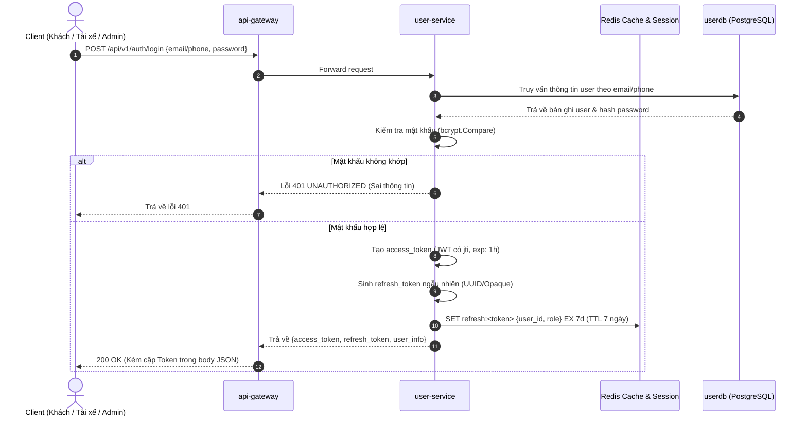
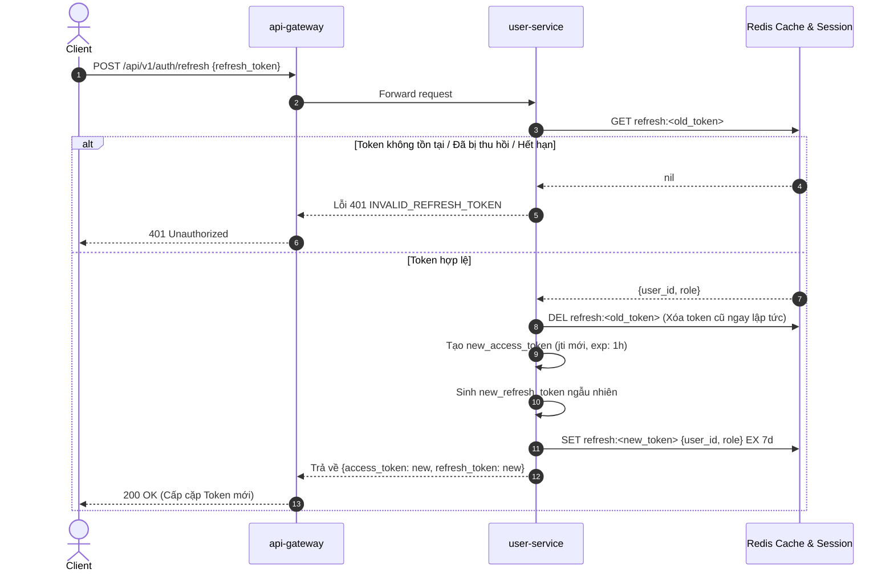
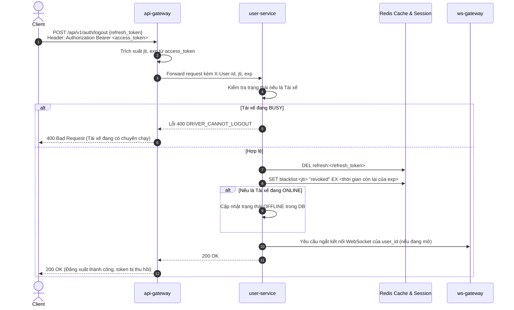

# PHÂN HỆ TÀI KHOẢN & XÁC THỰC - USE CASE ĐẶC TẢ

> **Mã tài liệu:** `UC-01` đến `UC-09`  
> **Dịch vụ chịu trách nhiệm:** `user-service`, `api-gateway`  
> **Tài liệu tham chiếu:** [SRS v1.4 (Mục 3.1)](../01-srs/srs.md)

---

## 1. SƠ ĐỒ TUẦN TỰ XÁC THỰC & QUẢN LÝ PHIÊN (SEQUENCE DIAGRAMS)

### 1.1. Luồng Đăng nhập & Cấp phát cặp Token

### 1.2. Luồng Làm mới phiên (Token Rotation)

### 1.3. Luồng Đăng xuất & Thu hồi Token (Blacklist)

---

## 2. CHI TIẾT TỪNG USE CASE

### UC-01: Đăng ký tài khoản mới
* **FR liên quan:** `FR-01`
* **Actor:** Khách hàng (Customer), Tài xế (Driver).
* **Tiền điều kiện:** Người dùng chưa đăng nhập hệ thống.
* **Luồng chính:**
  1. Người dùng gửi thông tin đăng ký: Số điện thoại/Email, Mật khẩu, Họ tên, Vai trò (`CUSTOMER` hoặc `DRIVER`).
  2. `user-service` kiểm tra số điện thoại/email chưa từng tồn tại trong hệ thống.
  3. Băm mật khẩu bằng thuật toán an toàn `bcrypt`.
  4. Lưu thông tin tài khoản vào `userdb` với trạng thái ban đầu:
     - Nếu là Khách hàng: Trạng thái `ACTIVE`.
     - Nếu là Tài xế: Trạng thái `ACTIVE`, trạng thái làm việc ban đầu là `OFFLINE`.
  5. Hệ thống kích hoạt tạo ví ban đầu tại `payment-service`.
  6. Trả về thông báo đăng ký thành công kèm thông tin hồ sơ cơ bản.
* **Luồng ngoại lệ:**
  - *Email hoặc số điện thoại đã tồn tại:* Trả về mã lỗi `USER_ALREADY_EXISTS` (HTTP 409).
  - *Dữ liệu không hợp lệ (mật khẩu quá ngắn, thiếu trường):* Trả về lỗi Validation (HTTP 400).
* **Hậu điều kiện:** Tài khoản mới được ghi nhận trong cơ sở dữ liệu.
* **Dữ liệu demo cần thấy trên Postman:** ID người dùng, email/phone, họ tên, vai trò đăng ký (`CUSTOMER`/`DRIVER`).

---

### UC-02: Đăng nhập & Nhận cặp Token
* **FR liên quan:** `FR-02`
* **Actor:** Khách hàng, Tài xế, Quản trị viên (Admin).
* **Tiền điều kiện:** Đã có tài khoản hợp lệ trong hệ thống.
* **Luồng chính:**
  1. Người dùng gửi số điện thoại/email và mật khẩu.
  2. `user-service` kiểm tra tài khoản và xác thực mật khẩu.
  3. Sinh `access_token` định dạng JWT chứa `user_id`, `role`, `jti`, thời hạn `exp` (1 giờ).
  4. Sinh `refresh_token` ngẫu nhiên và lưu trữ vào Redis với TTL 7 ngày: `refresh:<token>`.
  5. Trả về body JSON chứa cặp token và thông tin cá nhân.
* **Luồng ngoại lệ:**
  - *Sai tài khoản hoặc mật khẩu:* Trả về mã lỗi `UNAUTHORIZED` (HTTP 401).
* **Hậu điều kiện:** Phiên làm việc được tạo trên server Redis; Client nhận được JWT.
* **Dữ liệu demo cần thấy trên Postman:** `access_token`, `refresh_token`, thời hạn `expires_in: 3600`, mã `jti`.

---

### UC-03: Xác thực & Phân quyền tại API Gateway
* **FR liên quan:** `FR-03`
* **Actor:** Hệ thống (`api-gateway`).
* **Tiền điều kiện:** Request gửi tới Gateway có chứa header `Authorization: Bearer <token>`.
* **Luồng chính:**
  1. `api-gateway` nhận request từ client.
  2. Bỏ qua kiểm tra JWT nếu endpoint nằm trong danh sách Public (đăng ký, đăng nhập, làm mới token, ước tính cước).
  3. Giải mã JWT và xác thực chữ ký bằng Secret cấu hình trong ENV.
  4. Kiểm tra thời hạn hết hạn (`exp`) của token.
  5. Tra cứu khóa Redis `blacklist:<jti>`. Nếu không có trong blacklist:
  6. Trích xuất `user_id` và `role`, gắn vào HTTP header nội bộ `X-User-Id` và `X-User-Role`.
  7. Forward request an toàn sang microservice nghiệp vụ tương ứng.
* **Luồng ngoại lệ:**
  - *Thiếu token hoặc chữ ký không hợp lệ:* Trả về lỗi `UNAUTHORIZED` (HTTP 401).
  - *Token đã hết hạn:* Trả về lỗi `UNAUTHORIZED` (HTTP 401 - Token expired).
  - *Token đã bị đăng xuất (nằm trong Blacklist Redis):* Trả về lỗi `UNAUTHORIZED` (HTTP 401).
  - *Người dùng không đúng vai trò (ví dụ: Khách gọi API Admin):* Trả về lỗi `FORBIDDEN` (HTTP 403).
* **Hậu điều kiện:** Service nội bộ nhận được request với định danh người dùng đã xác thực.

---

### UC-04: Cập nhật trạng thái làm việc của Tài xế
* **FR liên quan:** `FR-04`
* **Actor:** Tài xế (Driver).
* **Tiền điều kiện:** Đã đăng nhập với vai trò `DRIVER`.
* **Luồng chính:**
  1. Tài xế gửi yêu cầu chuyển trạng thái làm việc sang `ONLINE` hoặc `OFFLINE`.
  2. `user-service` kiểm tra trạng thái hiện tại của tài xế trong `userdb`.
  3. Nếu tài xế muốn chuyển sang `ONLINE`: Cập nhật trạng thái `ONLINE` trong DB.
  4. Nếu tài xế muốn chuyển sang `OFFLINE`: Kiểm tra tài xế không ở trạng thái `BUSY`. Cập nhật trạng thái `OFFLINE` trong DB.
  5. Trả về trạng thái làm việc mới của tài xế.
* **Luồng ngoại lệ:**
  - *Tài xế đang `BUSY` (đang có chuyến nhận/chở khách) yêu cầu chuyển sang `OFFLINE`:* Hệ thống từ chối và trả về mã lỗi `DRIVER_CANNOT_LOGOUT` / `DRIVER_BUSY` (HTTP 400).
* **Hậu điều kiện:** Trạng thái tài xế được cập nhật; ảnh hưởng đến khả năng được quét tìm xe trong `location-service`.
* **Dữ liệu demo cần thấy trên Postman:** `driver_id`, trạng thái mới (`ONLINE` hoặc `OFFLINE`).

---

### UC-05: Xem thông tin hồ sơ cá nhân
* **FR liên quan:** `FR-05`
* **Actor:** Khách hàng, Tài xế.
* **Tiền điều kiện:** Người dùng đã đăng nhập (mang JWT hợp lệ).
* **Luồng chính:**
  1. Người dùng gửi request xem thông tin cá nhân.
  2. `user-service` dựa vào header `X-User-Id` truy vấn bản ghi trong `userdb`.
  3. Trả về thông tin: ID, họ tên, email/số điện thoại, vai trò, trạng thái làm việc (với tài xế).
* **Hậu điều kiện:** Dữ liệu hồ sơ được hiển thị ở chế độ đọc.
* **Dữ liệu demo cần thấy trên Postman:** Thông tin cá nhân, role, ngày tạo tài khoản.

---

### UC-06: Quản lý phương tiện di chuyển của Tài xế
* **FR liên quan:** `FR-06`
* **Actor:** Tài xế (Driver).
* **Tiền điều kiện:** Đã đăng nhập với vai trò `DRIVER`.
* **Luồng chính:**
  1. Tài xế gửi thông tin xe: Biển số xe, Loại xe (xe máy/ô tô 4 chỗ), Hãng xe, Màu xe.
  2. `user-service` lưu trữ thông tin phương tiện gắn liền với hồ sơ tài xế trong `userdb`.
  3. Trả về thông tin phương tiện đã cập nhật thành công.
* **Hậu điều kiện:** Thông tin xe được lưu để phục vụ hiển thị cho khách khi nhận cuốc.
* **Dữ liệu demo cần thấy trên Postman:** `license_plate`, `vehicle_type`, `model`.

---

### UC-07: Khởi tạo tài khoản Admin từ ENV khi khởi động
* **FR liên quan:** `FR-30`
* **Actor:** Hệ thống ngầm (`user-service`).
* **Tiền điều kiện:** `user-service` khởi động trong môi trường container.
* **Luồng chính:**
  1. Khi service khởi động, tiến trình đọc các biến môi trường cấu hình Admin: `ADMIN_EMAIL`, `ADMIN_PASSWORD`.
  2. Kiểm tra trong `userdb` xem tài khoản mang email này đã tồn tại hay chưa.
  3. Nếu chưa tồn tại: Băm mật khẩu và tự động chèn 1 bản ghi vào bảng users với role `ADMIN`.
  4. Nếu đã tồn tại: Bỏ qua bước tạo để tránh ghi đè.
* **Luồng ngoại lệ:**
  - *Người dùng thông thường gọi API đăng ký với role ADMIN:* Bị từ chối ngay lập tức vì API đăng ký chỉ chấp nhận `CUSTOMER` hoặc `DRIVER`.
* **Hậu điều kiện:** Hệ thống luôn có sẵn 1 tài khoản Admin để đăng nhập demo.

---

### UC-08: Làm mới phiên truy cập (Token Rotation)
* **FR liên quan:** `FR-33`
* **Actor:** Khách hàng, Tài xế, Quản trị viên (Admin).
* **Tiền điều kiện:** Client sở hữu `refresh_token` nhận được từ lần đăng nhập hoặc lần refresh trước đó.
* **Luồng chính:**
  1. Client gửi `refresh_token` trong body JSON lên Gateway (`POST /api/v1/auth/refresh`).
  2. `user-service` tra cứu khóa `refresh:<token>` trong Redis.
  3. Nếu tìm thấy và còn hạn:
     - Xóa ngay lập tức token cũ khỏi Redis: `DEL refresh:<old_token>`.
     - Sinh `new_access_token` mới (mang `jti` mới, hạn 1 giờ).
     - Sinh `new_refresh_token` mới và lưu vào Redis: `SET refresh:<new_token> ... EX 7d`.
  4. Trả về cặp Token mới cho Client.
* **Luồng ngoại lệ:**
  - *Refresh token không hợp lệ, không tìm thấy hoặc đã qua sử dụng:* Trả về mã lỗi `INVALID_REFRESH_TOKEN` (HTTP 401). Client bắt buộc phải đăng nhập lại.
* **Hậu điều kiện:** Token cũ bị hủy vĩnh viễn, phiên làm việc được gia hạn an toàn.
* **Dữ liệu demo cần thấy trên Postman:** Cặp token mới, `jti` mới khác hoàn toàn token cũ.

---

### UC-09: Đăng xuất & Thu hồi phiên truy cập (Logout & Blacklist)
* **FR liên quan:** `FR-34`
* **Actor:** Khách hàng, Tài xế, Quản trị viên (Admin).
* **Tiền điều kiện:** Đang có phiên đăng nhập hợp lệ.
* **Luồng chính:**
  1. Client gửi request đăng xuất kèm `access_token` trên header và `refresh_token` trong body JSON.
  2. Gateway/User Service kiểm tra:
     - Nếu là Tài xế: Kiểm tra trạng thái trong DB. Nếu tài xế đang `BUSY` (chưa xong chuyến) $\rightarrow$ Từ chối đăng xuất.
     - Nếu tài xế đang `ONLINE` $\rightarrow$ Tự động chuyển về `OFFLINE`.
  3. Xóa `refresh_token` khỏi Redis (`DEL refresh:<token>`).
  4. Lấy `jti` và thời gian còn lại của `access_token`, ghi vào Redis Blacklist: `SET blacklist:<jti> "revoked" EX <TTL_còn_lại>`.
  5. Đóng kết nối WebSocket của người dùng tương ứng (nếu đang kết nối).
  6. Trả về thông báo đăng xuất thành công (HTTP 200).
* **Luồng ngoại lệ:**
  - *Tài xế đang `BUSY` gọi đăng xuất:* Bị từ chối với mã lỗi `DRIVER_CANNOT_LOGOUT` (HTTP 400).
  - *Token mang đi đăng xuất đã bị blacklist trước đó:* Trả về `UNAUTHORIZED` (HTTP 401).
* **Hậu điều kiện:** Cả access token và refresh token đều bị vô hiệu hóa; WebSocket bị ngắt kết nối.
