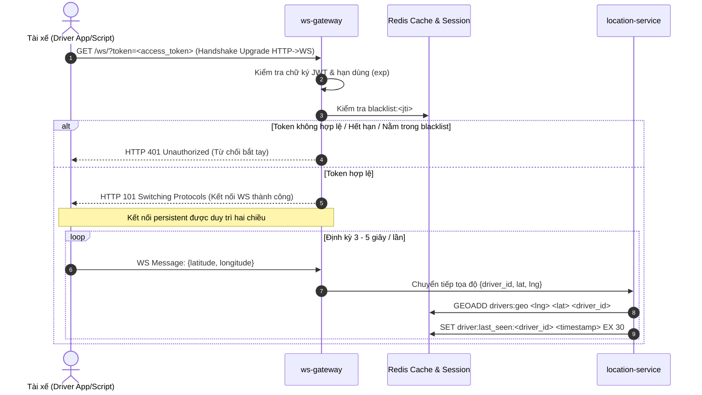
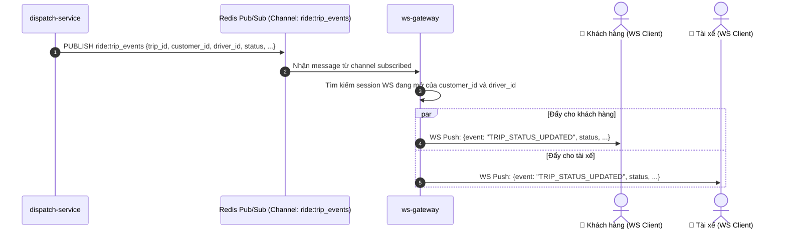

# PHÂN HỆ ĐỊNH VỊ & WEBSOCKET - USE CASE ĐẶC TẢ

> **Mã tài liệu:** `UC-10` đến `UC-13`  
> **Dịch vụ chịu trách nhiệm:** `ws-gateway`, `location-service`  
> **Tài liệu tham chiếu:** [SRS v1.4 (Mục 3.2)](../01-srs/srs.md)

---

## 1. SƠ ĐỒ TUẦN TỰ ĐỊNH VỊ & ĐẨY THÔNG BÁO REALTIME (SEQUENCE DIAGRAMS)

### 1.1. Luồng Bắt tay WebSocket & Stream tọa độ GPS

### 1.2. Luồng Đẩy thông báo đổi trạng thái chuyến xe (Pub/Sub)

---

## 2. CHI TIẾT TỪNG USE CASE

### UC-10: Bắt tay kết nối WebSocket thời gian thực
* **FR liên quan:** `FR-07`
* **Actor:** Khách hàng (Customer), Tài xế (Driver).
* **Tiền điều kiện:** Đã đăng nhập và sở hữu `access_token` còn hiệu lực.
* **Luồng chính:**
  1. Client gửi request HTTP Upgrade tới URL `/ws/?token=<access_token>`.
  2. `ws-gateway` trích xuất token từ Query Parameter.
  3. Kiểm tra tính toàn vẹn của chữ ký JWT và thời hạn `exp`.
  4. Tra cứu Redis kiểm tra token có nằm trong `blacklist:<jti>` hay không.
  5. Nếu hợp lệ: Chấp thuận Upgrade HTTP $\rightarrow$ WebSocket (HTTP 101 Switching Protocols), lưu trữ session kết nối vào bộ nhớ của `ws-gateway` gắn với `user_id` và `role`.
  6. Kết nối WebSocket được duy trì mở hai chiều. **Lưu ý nghiệp vụ:** Khi kết nối WebSocket đã mở thành công, dù sau đó `access_token` có hết hạn (quá 1 giờ) thì kết nối WebSocket vẫn tiếp tục được duy trì ổn định mà không bị ngắt giữa chừng.
* **Luồng ngoại lệ:**
  - *Thiếu token, token sai chữ ký, hết hạn lúc bắt tay hoặc nằm trong blacklist:* Gateway từ chối kết nối và trả về HTTP 401 Unauthorized.
* **Hậu điều kiện:** Đường truyền hai chiều realtime được thiết lập giữa Client và `ws-gateway`.

---

### UC-11: Gửi tọa độ GPS thời gian thực từ Tài xế
* **FR liên quan:** `FR-08`
* **Actor:** Tài xế (Driver).
* **Tiền điều kiện:** Tài xế đã kết nối WebSocket thành công và đang ở trạng thái hoạt động.
* **Luồng chính:**
  1. Ứng dụng tài xế (hoặc script giả lập) gửi bản tin JSON qua WebSocket định kỳ mỗi 3–5 giây: `{latitude, longitude}`.
  2. `ws-gateway` xác định danh tính `driver_id` từ kết nối WebSocket hiện tại.
  3. Chuyển tiếp tọa độ đến `location-service`.
  4. `location-service` ghi nhận tọa độ mới nhất vào cấu trúc `Redis GEO`:
     - Lệnh: `GEOADD drivers:geo <longitude> <latitude> <driver_id>`.
  5. Cập nhật mốc thời gian nhận tín hiệu gần nhất: `SET driver:last_seen:<driver_id> <timestamp> EX 30`.
* **Luồng ngoại lệ:**
  - *Tọa độ không hợp lệ (vĩ độ ngoài khoảng -90..90 hoặc kinh độ ngoài khoảng -180..180):* Bỏ qua bản tin lỗi, ghi log cảnh báo.
* **Hậu điều kiện:** Vị trí không gian của tài xế trong Redis GEO luôn là dữ liệu mới nhất.

---

### UC-12: Quét tìm Top tài xế rảnh lân cận
* **FR liên quan:** `FR-09`
* **Actor:** Hệ thống (`dispatch-service` gọi `location-service`).
* **Tiền điều kiện:** Chuyến xe cần tìm tài xế đón khách tại tọa độ `(pickup_lat, pickup_lng)`.
* **Luồng chính:**
  1. `dispatch-service` gọi API nội bộ của `location-service`: truyền vào tọa độ đón khách, bán kính quét $R = 5\text{ km}$, số lượng giới hạn (Top 3–5).
  2. `location-service` thực thi lệnh truy vấn không gian trên Redis:
     - `GEOSEARCH drivers:geo FROMLONLAT <pickup_lng> <pickup_lat> BYRADIUS 5 km WITHDIST ASC`.
  3. Lọc danh sách ứng viên trả về theo các điều kiện nghiêm ngặt:
     - **Điều kiện 1:** Tài xế phải đang ở trạng thái làm việc `ONLINE` (tài xế `BUSY` và `OFFLINE` tuyệt đối bị loại bỏ).
     - **Điều kiện 2 (Mất kết nối):** Kiểm tra mốc thời gian `driver:last_seen:<driver_id>`. Nếu tài xế mất kết nối WebSocket quá 15 giây (không có cập nhật GPS mới) $\rightarrow$ Loại bỏ khỏi kết quả quét (dù trạng thái trong DB vẫn là `ONLINE`).
  4. Trả về danh sách Top 3–5 tài xế rảnh gần nhất, sắp xếp theo khoảng cách tăng dần.
* **Luồng ngoại lệ:**
  - *Không có tài xế nào thỏa mãn trong bán kính 5km:* Trả về danh sách rỗng `[]` (dẫn tới kích hoạt chuyến xe chuyển sang `EXPIRED` ngay lập tức).
* **Hậu điều kiện:** Cung cấp danh sách tài xế tối ưu nhất cho bộ điều phối ghép xe.
* **Dữ liệu demo cần thấy trên Postman:** Danh sách tài xế gồm `driver_id`, khoảng cách cách điểm đón tính bằng mét (`distance_in_meters`).

---

### UC-13: Đẩy thông báo đổi trạng thái chuyến xe
* **FR liên quan:** `FR-35`
* **Actor:** Hệ thống (`dispatch-service` $\rightarrow$ `ws-gateway` $\rightarrow$ Khách hàng & Tài xế).
* **Tiền điều kiện:** Khách hàng và Tài xế liên quan đều đang duy trì kết nối WebSocket tới `ws-gateway`.
* **Luồng chính:**
  1. Bất cứ khi nào trạng thái chuyến xe thay đổi (`MATCHING`, `ACCEPTED`, `PICKING_UP`, `IN_TRIP`, `COMPLETED`, `CANCELLED`, `EXPIRED`), `dispatch-service` phát thông điệp vào Redis Pub/Sub trên kênh `ride:trip_updates`.
  2. Các instance của `ws-gateway` đăng ký lắng nghe kênh `ride:trip_updates` nhận được thông điệp.
  3. `ws-gateway` kiểm tra xem trong danh sách client WebSocket đang kết nối của mình có `customer_id` hoặc `driver_id` của chuyến xe hay không.
  4. Nếu có, đẩy bản tin thông báo xuống WebSocket của client tương ứng.
* **Luồng ngoại lệ:**
  - *Client bị mất kết nối mạng hoặc tắt ứng dụng:* Thông báo đẩy không thể gửi tới client; tuy nhiên trạng thái chuyến xe trong cơ sở dữ liệu vẫn được bảo toàn nguyên vẹn. Khi client mở lại, họ có thể gọi API xem chuyến hiện tại (UC-23) để đồng bộ lại trạng thái.
* **Hậu điều kiện:** Khách hàng và tài xế nhận được cập nhật tức thời về chuyến đi mà không cần gọi polling HTTP liên tục.
* **Dữ liệu demo cần thấy trên Postman/WS Client:** Bản tin WS chứa `event: "TRIP_STATUS_UPDATED"`, `trip_id`, `status`, `updated_at`.
