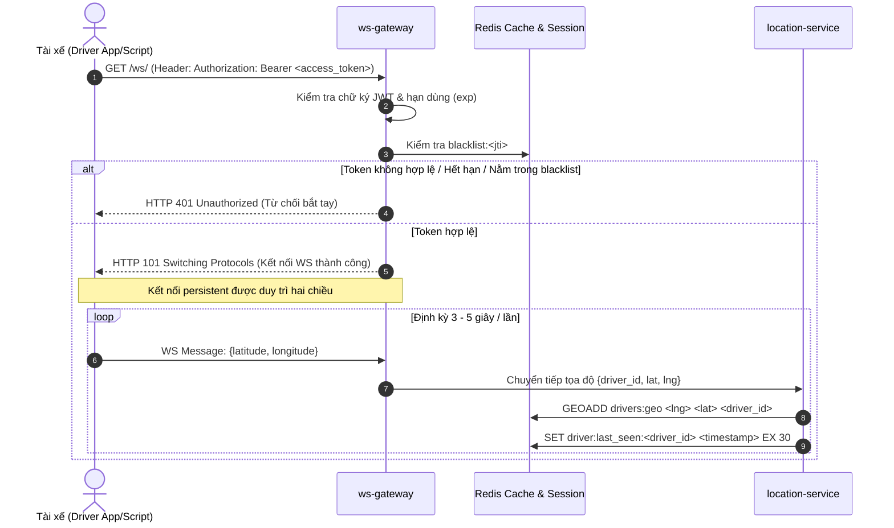
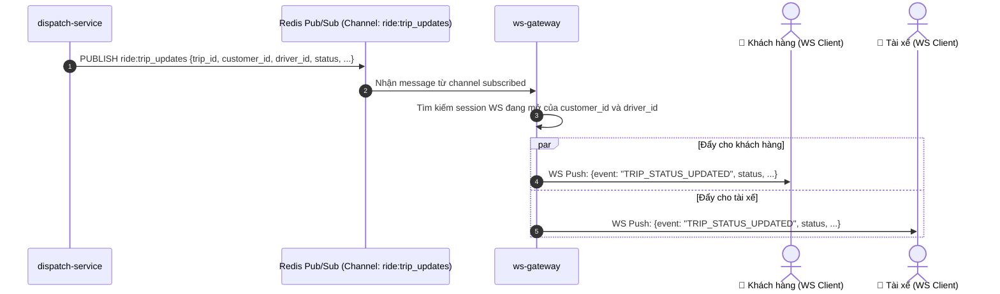
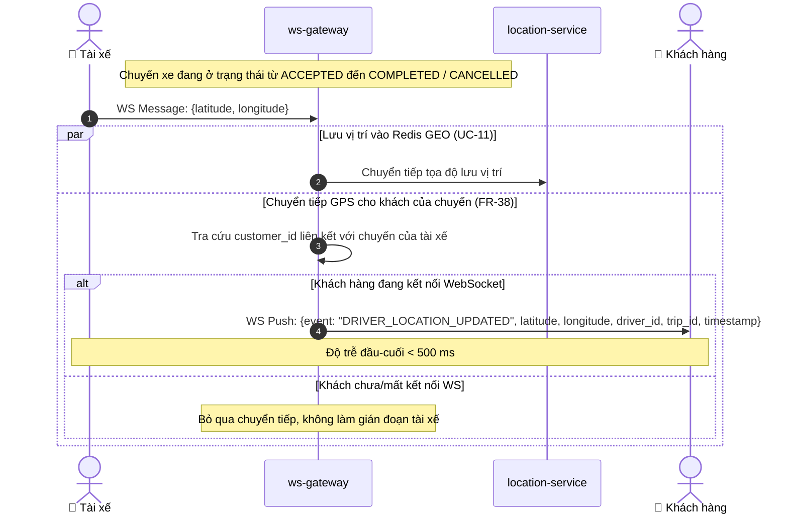

# PHÂN HỆ ĐỊNH VỊ & WEBSOCKET - USE CASE ĐẶC TẢ

> **Mã tài liệu:** `UC-10` đến `UC-13`, `UC-31`  
> **Dịch vụ chịu trách nhiệm:** `ws-gateway`, `location-service`  
> **Tài liệu tham chiếu:** [SRS v1.5 (Mục 3.2)](../01-srs/srs.md)  
> **Phiên bản:** 1.1

---

## 1. SƠ ĐỒ TUẦN TỰ ĐỊNH VỊ & ĐẨY THÔNG BÁO REALTIME (SEQUENCE DIAGRAMS)

### 1.1. Luồng Bắt tay WebSocket & Stream tọa độ GPS

### 1.2. Luồng Đẩy thông báo đổi trạng thái chuyến xe (Pub/Sub)

### 1.3. Luồng Chuyển tiếp tọa độ GPS của Tài xế cho Khách hàng (FR-38, UC-31)

---

## 2. CHI TIẾT TỪNG USE CASE

### UC-10: Bắt tay kết nối WebSocket thời gian thực
* **FR liên quan:** `FR-07`
* **Actor:** Khách hàng (Customer), Tài xế (Driver).
* **Tiền điều kiện:** Đã đăng nhập và sở hữu `access_token` còn hiệu lực.
* **Luồng chính:**
  1. Client gửi request HTTP Upgrade tới URL `/ws/` kèm header `Authorization: Bearer <access_token>`.
  2. `ws-gateway` trích xuất token từ header `Authorization` (không dùng query string).
  3. Kiểm tra tính toàn vẹn của chữ ký JWT và thời hạn `exp`.
  4. Tra cứu Redis kiểm tra token có nằm trong `blacklist:<jti>` hay không.
  5. Nếu hợp lệ: Chấp thuận Upgrade HTTP $\rightarrow$ WebSocket (HTTP 101 Switching Protocols), lưu trữ session kết nối vào bộ nhớ của `ws-gateway` gắn với `user_id` và `role`.
  6. Kết nối WebSocket được duy trì mở hai chiều. **Lưu ý nghiệp vụ:** Khi kết nối WebSocket đã mở thành công, dù sau đó `access_token` có hết hạn (quá 1 giờ) thì kết nối WebSocket vẫn tiếp tục được duy trì ổn định mà không bị ngắt giữa chừng.
* **Luồng ngoại lệ:**
  - *Thiếu token, token sai chữ ký, hết hạn lúc bắt tay hoặc nằm trong blacklist:* Gateway từ chối kết nối và trả về HTTP 401 Unauthorized.
* **Hậu điều kiện:** Đường truyền hai chiều realtime được thiết lập giữa Client và `ws-gateway`.

---

### UC-11: Gửi tọa độ GPS thời gian thực từ Tài xế
* **FR liên quan:** `FR-08`
* **Actor:** Tài xế (Driver).
* **Tiền điều kiện:** Tài xế đã kết nối WebSocket thành công. (Ghi chú: Nhận GPS từ mọi tài xế đang kết nối; việc lọc trạng thái `ONLINE` do `dispatch-service` đảm nhiệm).
* **Luồng chính:**
  1. Ứng dụng tài xế (hoặc script giả lập) gửi bản tin JSON qua WebSocket định kỳ mỗi 3–5 giây: `{latitude, longitude}`.
  2. `ws-gateway` xác định danh tính `driver_id` và vai trò từ kết nối WebSocket hiện tại.
  3. Chuyển tiếp tọa độ đến `location-service`.
  4. `location-service` ghi nhận tọa độ mới nhất vào cấu trúc `Redis GEO`:
     - Lệnh: `GEOADD drivers:geo <longitude> <latitude> <driver_id>`.
  5. Cập nhật mốc thời gian nhận tín hiệu gần nhất: `SET driver:last_seen:<driver_id> <timestamp> EX 30`.
* **Luồng ngoại lệ:**
  - *Bản tin GPS do người dùng không phải tài xế (vai trò khác DRIVER) gửi lên:* `ws-gateway` lập tức bỏ qua, không chuyển tiếp sang `location-service`.
  - *Tọa độ không hợp lệ (vĩ độ ngoài khoảng -90..90 hoặc kinh độ ngoài khoảng -180..180):* Bỏ qua bản tin lỗi, ghi log cảnh báo.
* **Hậu điều kiện:** Vị trí không gian của tài xế trong Redis GEO luôn là dữ liệu mới nhất.

---

### UC-12: Quét tìm ứng viên tài xế lân cận
* **FR liên quan:** `FR-09`
* **Actor:** Hệ thống (`dispatch-service` gọi `location-service`).
* **Tiền điều kiện:** Chuyến xe cần tìm tài xế đón khách tại tọa độ `(pickup_lat, pickup_lng)`.
* **Luồng chính:**
  1. `dispatch-service` gọi API nội bộ của `location-service`: truyền vào tọa độ đón khách, bán kính quét $R = 5\text{ km}$.
  2. `location-service` thực thi lệnh truy vấn không gian trên Redis:
     - `GEOSEARCH drivers:geo FROMLONLAT <pickup_lng> <pickup_lat> BYRADIUS 5 km WITHDIST ASC`.
  3. `location-service` chỉ kiểm tra mốc thời gian `driver:last_seen:<driver_id>`: lọc lấy các ứng viên có cập nhật GPS trong vòng 15 giây gần nhất, sắp xếp theo khoảng cách tăng dần, và trả về tối đa 50 ứng viên gần nhất kèm khoảng cách (`distance_in_meters`).
  4. **Quy tắc phân tách trách nhiệm (Database-per-Service):** `location-service` không lọc theo `ONLINE` vì trạng thái tài xế thuộc `user-service`; `dispatch-service` lọc `ONLINE` và cắt Top 3–5 ở UC-18.
* **Luồng ngoại lệ:**
  - *Không có ứng viên nào có GPS trong 15 giây trong bán kính 5km:* Trả về danh sách rỗng `[]` (dẫn tới kích hoạt chuyến xe chuyển sang `EXPIRED` ngay lập tức ở UC-18/UC-22).
* **Hậu điều kiện:** Cung cấp danh sách các ứng viên có vị trí hợp lệ gần nhất cho bộ điều phối ghép xe.
* **Dữ liệu demo cần thấy trên Postman/Internal API:** Danh sách ứng viên gồm `driver_id`, khoảng cách tính bằng mét `distance_in_meters`.

---

### UC-13: Đẩy thông báo đổi trạng thái chuyến xe
* **FR liên quan:** `FR-35`
* **Actor:** Hệ thống (`dispatch-service` $\rightarrow$ `ws-gateway` $\rightarrow$ Khách hàng & Tài xế).
* **Tiền điều kiện:** Khách hàng và Tài xế liên quan đều đang duy trì kết nối WebSocket tới `ws-gateway`.
* **Luồng chính:**
  1. Bất cứ khi nào trạng thái chuyến xe thay đổi (`MATCHING`, `ACCEPTED`, `PICKING_UP`, `IN_TRIP`, `COMPLETED`, `CANCELLED`, `EXPIRED`), `dispatch-service` phát thông điệp vào Redis Pub/Sub trên kênh `ride:trip_updates`.
  2. Các instance của `ws-gateway` đăng ký lắng nghe kênh `ride:trip_updates` nhận được thông điệp.
  3. `ws-gateway` kiểm tra xem trong danh sách client WebSocket đang kết nối của mình có `customer_id` hoặc `driver_id` của chuyến xe hay không.
  4. Nếu có, đẩy bản tin thông báo xuống WebSocket của client tương ứng.
* **Luồng ngoại lệ:**
  - *Client bị mất kết nối mạng hoặc tắt ứng dụng:* Thông báo đẩy không thể gửi tới client; tuy nhiên trạng thái chuyến xe trong cơ sở dữ liệu vẫn được bảo toàn nguyên vẹn. Khi client mở lại, họ có thể gọi API xem chuyến hiện tại (UC-23) để đồng bộ lại trạng thái.
* **Hậu điều kiện:** Khách hàng và tài xế nhận được cập nhật tức thời về chuyến đi mà không cần gọi polling HTTP liên tục.
* **Dữ liệu demo cần thấy trên Postman/WS Client:** Bản tin WS chứa `event: "TRIP_STATUS_UPDATED"`, `trip_id`, `status`, `updated_at`.

---

### UC-31: Khách nhận tọa độ tài xế thời gian thực
* **FR liên quan:** `FR-38`
* **Actor:** Khách hàng (Customer), Tài xế (Driver), Hệ thống (`ws-gateway`).
* **Tiền điều kiện:** Chuyến xe đang ở trạng thái từ `ACCEPTED` đến trước khi kết thúc (`COMPLETED` hoặc `CANCELLED`). Khách hàng đang có kết nối WebSocket mở.
* **Luồng chính:**
  1. Từ khi chuyến xe chuyển sang trạng thái `ACCEPTED`, `dispatch-service` ghi nhận liên kết giữa tài xế và khách hàng của chuyến (liên kết này tự động bị xóa khi chuyến kết thúc; cơ chế lưu liên kết cụ thể do LLD quyết định).
  2. Định kỳ mỗi 3–5 giây, tài xế gửi tọa độ GPS mới nhất lên `ws-gateway`.
  3. `ws-gateway` nhận GPS của tài xế, tra cứu ra `customer_id` của chuyến xe đang hoạt động tương ứng.
  4. `ws-gateway` đẩy thẳng frame tọa độ mới nhất sang kết nối WebSocket của khách hàng: `{latitude, longitude, driver_id, trip_id, timestamp}`.
  5. Độ trễ đầu-cuối từ lúc tài xế gửi tọa độ đến khi khách nhận được đạt $< 500\text{ ms}$ (theo NFR-01).
* **Luồng ngoại lệ:**
  - *Khách hàng chưa kết nối hoặc mất kết nối WebSocket:* `ws-gateway` bỏ qua việc đẩy tọa độ (không làm gián đoạn việc lưu GPS của tài xế).
  - *Chuyến xe đã kết thúc (`COMPLETED` hoặc `CANCELLED`):* Hệ thống dừng chuyển tiếp tọa độ của tài xế cho khách hàng ngay lập tức.
* **Hậu điều kiện:** Khách hàng theo dõi được vị trí di chuyển thực tế của tài xế theo thời gian thực từ lúc tài xế nhận chuyến đến khi kết thúc.
* **Dữ liệu demo cần thấy trên Postman/WS Client:** Bản tin WS nhận được: `event: "DRIVER_LOCATION_UPDATED"`, `latitude`, `longitude`, `driver_id`, `trip_id`, `timestamp`.
