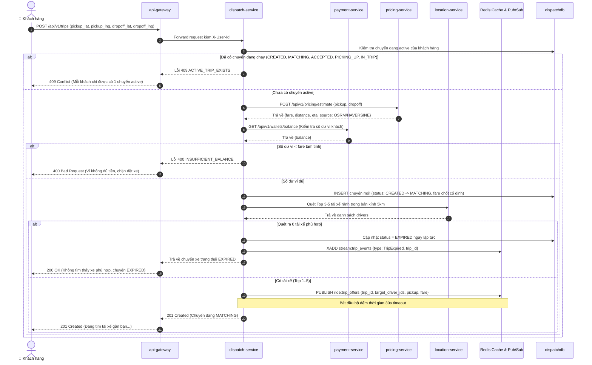
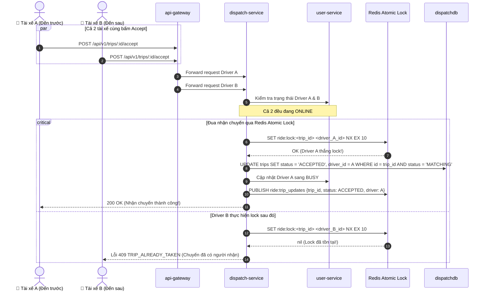

# PHÂN HỆ ĐẶT XE & GHÉP CHUYẾN - USE CASE ĐẶC TẢ

> **Mã tài liệu:** `UC-14` đến `UC-19`  
> **Dịch vụ chịu trách nhiệm:** `pricing-service`, `dispatch-service`, `payment-service`, `location-service`  
> **Tài liệu tham chiếu:** [SRS v1.4 (Mục 3.3, 3.4)](../01-srs/srs.md), [quyet-dinh.md](../00-brainstorm/quyet-dinh.md)

---

## 1. SƠ ĐỒ TUẦN TỰ ĐẶT XE & TRANH CUỐC (SEQUENCE DIAGRAMS)

### 1.1. Luồng Đặt xe, Kiểm tra ví & Khởi tạo chuyến

### 1.2. Luồng Tranh chấp nhận chuyến cạnh tranh (Redis Atomic Lock)

---

## 2. CHI TIẾT TỪNG USE CASE

### UC-14: Ước tính cước phí & khoảng cách (OSRM Fallback Haversine)
* **FR liên quan:** `FR-11`, `FR-12`
* **Actor:** Khách hàng (Customer).
* **Tiền điều kiện:** Cung cấp tọa độ điểm đón và điểm trả hợp lệ.
* **Luồng chính:**
  1. Khách hàng gửi tọa độ đón `(pickup_lat, pickup_lng)` và trả `(dropoff_lat, dropoff_lng)`.
  2. `pricing-service` gửi request HTTP tới OSRM Public API với timeout tối đa **400 ms** để lấy khoảng cách đường bộ và thời gian di chuyển.
  3. Lấy hệ số nhân nhu cầu hiện tại (`surge_multiplier`) và bảng giá (`BaseFare`, `PricePerKm`).
  4. Tính tổng cước phí theo công thức:
     $$\text{TotalFare} = (\text{BaseFare} + \text{Distance} \times \text{PricePerKm}) \times \text{SurgeMultiplier}$$
  5. Trả về kết quả chi tiết kèm nguồn tính khoảng cách là `OSRM`.
* **Luồng ngoại lệ (Fallback cốt lõi):**
  - *OSRM Public API bị timeout (> 400ms) hoặc mất mạng ngoài:* `pricing-service` ngay lập tức chuyển hướng sang công thức tính toán toán học nội bộ:
    $$\text{Distance} = \text{Haversine}(\text{Pickup}, \text{Dropoff}) \times 1.35$$
    Thời gian dự kiến $\text{ETA} = \frac{\text{Distance}}{30\text{ km/h}} \times 60 \text{ (phút)}$. Nguồn tính khoảng cách được đánh dấu là `HAVERSINE`. Request hoàn thành trong $< 1\text{ ms}$, không trả lỗi cho khách hàng.
* **Hậu điều kiện:** Giá cước được tính toán chính xác để hiển thị cho khách hàng tham khảo hoặc làm căn cứ tạo chuyến.
* **Dữ liệu demo cần thấy trên Postman:**
  - `distance` (km), `eta` (phút), `source` (`OSRM` hoặc `HAVERSINE`), `surge_multiplier`, `base_fare`, `price_per_km`, `total_fare` (VNĐ).

---

### UC-15: Tính toán hệ số nhu cầu Surge Pricing
* **FR liên quan:** `FR-13`
* **Actor:** Hệ thống (`pricing-service`).
* **Tiền điều kiện:** Có yêu cầu tính cước từ người dùng hoặc hệ thống.
* **Luồng chính:**
  1. `pricing-service` đánh giá mật độ nhu cầu tại khu vực:
     - Số lượng yêu cầu đặt xe gần đây (`Demand`).
     - Số lượng tài xế rảnh trong khu vực (`Supply`).
  2. Nếu tỷ lệ $Demand / Supply \le 1.0$: Hệ số $\text{SurgeMultiplier} = 1.0$ (Bình thường).
  3. Nếu thiếu hụt tài xế ($Demand / Supply > 1.2$): Tự động nâng hệ số lên $1.2$ đến tối đa $1.5$.
* **Hậu điều kiện:** Hệ số surge được áp dụng vào công thức tính cước chuyến xe.

---

### UC-16: Quản lý bảng giá cước (Admin)
* **FR liên quan:** `FR-31`
* **Actor:** Quản trị viên (Admin).
* **Tiền điều kiện:** Đã đăng nhập với quyền `ADMIN`.
* **Luồng chính:**
  1. Admin gửi request xem bảng giá cước hiện tại (`GET /api/v1/pricing/config`).
  2. `pricing-service` trả về các tham số hiện hành: `BaseFare`, `PricePerKm`, ngưỡng kích hoạt surge.
  3. Admin gửi request cập nhật (`PUT /api/v1/pricing/config`): truyền giá trị mới.
  4. `pricing-service` ghi nhận dữ liệu vào `pricingdb` và cập nhật cache Redis.
  5. **Quy tắc hiệu lực:** Bảng giá mới **chỉ áp dụng cho các chuyến xe tạo mới sau thời điểm cập nhật**; các chuyến xe đã tạo trước đó giữ nguyên giá đã chốt.
* **Hậu điều kiện:** Bảng giá toàn hệ thống được cập nhật thành công.
* **Dữ liệu demo cần thấy trên Postman:** Cấu hình mới gồm `base_fare`, `price_per_km`, `surge_threshold`, thời gian cập nhật `updated_at`.

---

### UC-17: Đặt xe, kiểm tra ví & Chặn đa chuyến
* **FR liên quan:** `FR-15`, `FR-16`
* **Actor:** Khách hàng (Customer).
* **Tiền điều kiện:** Đã đăng nhập tài khoản khách hàng.
* **Luồng chính:**
  1. Khách hàng gửi tọa độ đón và trả để đặt xe (`POST /api/v1/trips`).
  2. `dispatch-service` kiểm tra xem khách hàng có chuyến nào đang hoạt động (`CREATED`, `MATCHING`, `ACCEPTED`, `PICKING_UP`, `IN_TRIP`) hay không.
  3. Nếu chưa có chuyến active: Gọi `pricing-service` lấy giá cước chốt (`fare`).
  4. Gọi `payment-service` kiểm tra số dư ví của khách.
  5. Nếu số dư $\ge \text{fare}$:
     - Tạo bản ghi chuyến xe trong `dispatchdb` với trạng thái `CREATED` $\rightarrow$ `MATCHING`.
     - **Giá cước chốt được lưu cố định vào bản ghi chuyến và là giá thanh toán cuối cùng**, tuyệt đối không tính toán lại khi kết thúc chuyến.
  6. Gọi tiếp sang use case phát sóng tìm tài xế (UC-18).
* **Luồng ngoại lệ:**
  - *Khách hàng đã có một chuyến khác đang hoạt động:* Bị chặn ngay lập tức với mã lỗi `ACTIVE_TRIP_EXISTS` (HTTP 409).
  - *Số dư ví không đủ chi trả giá cước tạm tính:* Bị chặn với mã lỗi `INSUFFICIENT_BALANCE` (HTTP 400). Chuyến xe không được tạo.
* **Hậu điều kiện:** Chuyến xe được khởi tạo ở trạng thái `MATCHING`, giá cước được khóa cố định.
* **Dữ liệu demo cần thấy trên Postman:** `trip_id`, trạng thái `MATCHING`, `fare`, `pickup_address`, `dropoff_address`.

---

### UC-18: Broadcast đề nghị nhận chuyến cho tài xế
* **FR liên quan:** `FR-17`
* **Actor:** Hệ thống (`dispatch-service` $\rightarrow$ `location-service` $\rightarrow$ `ws-gateway`).
* **Tiền điều kiện:** Chuyến xe vừa được tạo thành công ở trạng thái `MATCHING`.
* **Luồng chính:**
  1. `dispatch-service` gọi `location-service` tìm Top 3–5 tài xế rảnh gần nhất trong bán kính 5km (UC-12).
  2. **Trường hợp 1 (Có tài xế phù hợp):**
     - `dispatch-service` phát thông báo mời chuyến vào Redis Pub/Sub kênh `ride:trip_offers` chứa: `trip_id`, danh sách `driver_id` mục tiêu, tọa độ đón, giá cước tài xế nhận ($85\%$).
     - `ws-gateway` lắng nghe và đẩy thông báo xuống ứng dụng WebSocket của Top 3–5 tài xế này.
     - Khởi động timer đếm ngược 30 giây cho chuyến xe.
  3. **Trường hợp 2 (Quét ra 0 tài xế):**
     - Chuyến xe lập tức chuyển sang trạng thái `EXPIRED` mà không cần chờ hết 30 giây (kích hoạt UC-22).
* **Hậu điều kiện:** Các tài xế mục tiêu nhận được thông báo mời cuốc qua WebSocket.

---

### UC-19: Nhận chuyến cạnh tranh (Redis Atomic Lock)
* **FR liên quan:** `FR-18`
* **Actor:** Tài xế (Driver).
* **Tiền điều kiện:** Tài xế nhận được đề nghị cuốc xe và chuyến đang ở trạng thái `MATCHING`.
* **Luồng chính:**
  1. Tài xế bấm nhận cuốc (`POST /api/v1/trips/:id/accept`).
  2. `dispatch-service` kiểm tra điều kiện tài xế:
     - Phải đang ở trạng thái làm việc `ONLINE`.
  3. Thực hiện khóa nguyên tử phân tán trên Redis:
     - Lệnh: `SET ride:lock:<trip_id> <driver_id> NX EX 10`.
  4. Nếu lệnh trả về `OK` (Tài xế giành chiến thắng khóa):
     - `dispatch-service` cập nhật ngay lập tức bản ghi chuyến xe trong `dispatchdb`: chuyển `status = 'ACCEPTED'`, gán `driver_id = <driver_id>`.
     - Gọi `user-service` chuyển trạng thái tài xế sang `BUSY`.
     - Phát event qua Redis Pub/Sub thông báo chuyến đã được nhận (UC-13).
     - Trả về thông tin chuyến xe cho tài xế thắng cuộc.
* **Luồng ngoại lệ:**
  - *Tài xế bấm nhận nhưng đang ở trạng thái `BUSY` hoặc `OFFLINE`:* Bị từ chối với mã lỗi `DRIVER_NOT_AVAILABLE` (HTTP 400).
  - *Tài xế bấm nhận nhưng đã có tài xế khác nhanh tay nhận trước (Redis lock thất bại):* Trả về mã lỗi `TRIP_ALREADY_TAKEN` (HTTP 409).
  - *Chuyến xe đã hết giờ (`EXPIRED`) hoặc khách đã hủy (`CANCELLED`):* Trả về mã lỗi `INVALID_TRIP_STATUS` (HTTP 400).
* **Hậu điều kiện:** Đúng duy nhất 1 tài xế nhận được chuyến; tài xế chuyển sang `BUSY`; chuyến xe bước vào giai đoạn đón khách.
* **Dữ liệu demo cần thấy trên Postman:** `trip_id`, trạng thái mới `ACCEPTED`, `driver_id` đã được gán.
