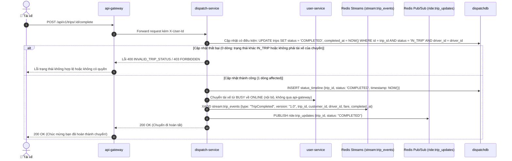

# PHÂN HỆ TIẾN TRÌNH CHUYẾN ĐI & HỦY CHUYẾN - USE CASE ĐẶC TẢ

> **Mã tài liệu:** `UC-20` đến `UC-23`  
> **Dịch vụ chịu trách nhiệm:** `dispatch-service`  
> **Tài liệu tham chiếu:** [SRS v1.5 (Mục 3.4, Mục 4)](../01-srs/srs.md), [quyet-dinh.md](../00-brainstorm/quyet-dinh.md)  
> **Phiên bản:** 1.1

---

## 1. SƠ ĐỒ TUẦN TỰ HOÀN THÀNH CHUYẾN ĐI (SEQUENCE DIAGRAM)

---

## 2. CHI TIẾT TỪNG USE CASE

### UC-20: Cập nhật tiến trình chuyến đi (Trip State Progression)
* **FR liên quan:** `FR-19`
* **Actor:** Tài xế (Driver).
* **Tiền điều kiện:** Chuyến xe đã được tài xế nhận (`ACCEPTED`) và tài xế đang thực hiện cuốc xe.
* **Luồng chính (Cập nhật có điều kiện theo trạng thái nguồn hợp lệ):**
  1. Tài xế di chuyển tới điểm đón và bấm cập nhật đón khách: `ACCEPTED` $\rightarrow$ `PICKING_UP` (`POST /api/v1/trips/:id/picking-up`).
     - Hệ thống thực hiện cập nhật có điều kiện: `UPDATE trips SET status = 'PICKING_UP' WHERE id = trip_id AND status = 'ACCEPTED' AND driver_id = driver_id`.
     - Ghi nhận trạng thái `PICKING_UP` và lưu mốc thời gian vào bảng lịch sử `status_timeline`. Phát thông báo qua WebSocket cho khách hàng (`ride:trip_updates`).
  2. Khi đón được khách lên xe, tài xế bấm bắt đầu chở khách: `PICKING_UP` $\rightarrow$ `IN_TRIP` (`POST /api/v1/trips/:id/start-trip`).
     - Hệ thống thực hiện cập nhật có điều kiện: `UPDATE trips SET status = 'IN_TRIP' WHERE id = trip_id AND status = 'PICKING_UP' AND driver_id = driver_id`.
     - Cập nhật trạng thái `IN_TRIP`, lưu mốc thời gian vào `status_timeline`. Phát thông báo qua WebSocket (`ride:trip_updates`).
  3. Khi tới điểm trả, tài xế bấm hoàn thành cuốc xe: `IN_TRIP` $\rightarrow$ `COMPLETED` (`POST /api/v1/trips/:id/complete`).
     - Hệ thống thực hiện cập nhật có điều kiện: `UPDATE trips SET status = 'COMPLETED', completed_at = NOW() WHERE id = trip_id AND status = 'IN_TRIP' AND driver_id = driver_id`.
     - Ghi mốc thời gian hoàn thành vào `status_timeline`.
     - Gọi `user-service` đưa tài xế từ `BUSY` quay trở lại trạng thái `ONLINE` (nội bộ, không qua api-gateway) để tiếp tục đón khách mới.
     - Phát sự kiện `TripCompleted` vào **Redis Streams** (`stream:trip_events`) mang theo đầy đủ thông tin: `trip_id`, `customer_id`, `driver_id`, giá cước đã chốt (`fare`).
     - Phát event qua Redis Pub/Sub (`ride:trip_updates`) để `ws-gateway` đẩy thông báo hoàn tất xuống cho cả khách hàng và tài xế (dừng stream GPS theo UC-31).
* **Luồng ngoại lệ:**
  - *Chuyển trạng thái không thỏa mãn điều kiện nguồn hợp lệ (nhảy cóc, trạng thái chuyến đã kết thúc hoặc sai thứ tự):* Khi lệnh cập nhật DB trả về 0 dòng affected, hệ thống từ chối với mã lỗi `INVALID_TRIP_STATUS` (HTTP 400).
  - *Tài xế khác không phải người nhận chuyến cố tình cập nhật:* Bị từ chối với lỗi `FORBIDDEN` (HTTP 403).
* **Hậu điều kiện:** Máy trạng thái chuyến xe được tuân thủ nghiêm ngặt; sự kiện `TripCompleted` sẵn sàng cho hệ thống thanh toán và phân tích xử lý tiếp.
* **Dữ liệu demo cần thấy trên Postman:** `trip_id`, trạng thái hiện tại (`PICKING_UP`, `IN_TRIP`, `COMPLETED`), thời gian cập nhật.

---

### UC-21: Hủy chuyến xe hợp lệ
* **FR liên quan:** `FR-20`, `FR-25`
* **Actor:** Khách hàng (Customer), Tài xế (Driver).
* **Tiền điều kiện:** Chuyến xe đang ở một trong các trạng thái có thể hủy hợp lệ.
* **Luồng chính (Cập nhật có điều kiện theo trạng thái nguồn hợp lệ):**
  1. Người dùng gửi yêu cầu hủy chuyến (`POST /api/v1/trips/:id/cancel`).
  2. `dispatch-service` xác định vai trò người gọi và thực thi cập nhật có điều kiện:
     - **Nếu là Khách hàng:** Cập nhật có điều kiện `UPDATE trips SET status = 'CANCELLED' WHERE id = trip_id AND customer_id = user_id AND status IN ('MATCHING', 'ACCEPTED')`.
     - **Nếu là Tài xế:** Cập nhật có điều kiện `UPDATE trips SET status = 'CANCELLED' WHERE id = trip_id AND driver_id = user_id AND status IN ('ACCEPTED', 'PICKING_UP')`.
  3. Nếu cập nhật thành công (1 dòng affected):
     - Ghi nhận mốc thời gian hủy vào `status_timeline`.
     - Nếu chuyến đã có tài xế gán vào (`ACCEPTED` hoặc `PICKING_UP`): Gọi `user-service` đưa tài xế từ `BUSY` quay trở lại `ONLINE` (nội bộ, không qua api-gateway).
     - Giải phóng khóa tài xế nếu có.
     - **Chính sách không phạt (FR-25):** Không trừ bất kỳ khoản phí phạt nào từ ví của khách hàng hay tài xế.
     - Phát sự kiện `TripCancelled` vào Redis Streams (`stream:trip_events`) và Redis Pub/Sub (`ride:trip_updates`).
     - Trả về thông báo hủy chuyến thành công.
* **Luồng ngoại lệ (Cố tình hủy sai trạng thái / Không thỏa điều kiện nguồn):**
  - *Cập nhật DB trả về 0 dòng affected (ví dụ: Khách hàng cố tình hủy khi `PICKING_UP`, hoặc Khách/Tài xế hủy khi xe đang chạy `IN_TRIP`, hoặc chuyến đã `COMPLETED`/`EXPIRED`):* Bị từ chối với mã lỗi `INVALID_TRIP_STATUS` (HTTP 400).
  - *Người gọi không phải là khách hàng hoặc tài xế của chuyến:* Trả về mã lỗi `FORBIDDEN` (HTTP 403).
* **Hậu điều kiện:** Chuyến xe kết thúc ở trạng thái `CANCELLED`; tài xế (nếu có) được giải phóng sang `ONLINE`; không phát sinh trừ tiền ví.
* **Dữ liệu demo cần thấy trên Postman:** `trip_id`, trạng thái `CANCELLED`; xem `cancelled_by` và thời gian hủy qua `GET /api/v1/trips/:id`.

---

### UC-22: Xử lý hết giờ tìm xe / Không có tài xế (Trip Expired)
* **FR liên quan:** `FR-17`, `FR-21`
* **Actor:** Hệ thống (`dispatch-service`).
* **Tiền điều kiện:** Chuyến xe đang ở trạng thái `MATCHING`.
* **Luồng chính:**
  - **Trường hợp A (Quét ra 0 tài xế ngay lúc đặt xe - UC-17/UC-18):**
    1. Khi khách vừa tạo chuyến, `location-service` trả danh sách ứng viên, `user-service` lọc `ONLINE`; còn 0 tài xế thì chuyển `EXPIRED` ngay.
    2. `dispatch-service` cập nhật có điều kiện `UPDATE trips SET status = 'EXPIRED' WHERE id = trip_id AND status = 'MATCHING'` ngay lập tức mà không cần chờ hết hạn 30 giây.
  - **Trường hợp B (Quá hạn 30 giây do không có tài xế nhận - Tiến trình quét nền định kỳ):**
    1. Tiến trình quét nền định kỳ của `dispatch-service` quét các chuyến xe đang ở trạng thái `MATCHING` mà thời hạn tìm xe đã quá hạn (thời hạn tìm xe 30 giây đã được lưu bền vững vào bản ghi chuyến ở UC-17). Tiến trình này chạy độc lập theo chu kỳ và chạy quét ngay khi service khởi động; do đó việc restart service hoặc rolling update hệ thống sẽ không làm chuyến xe bị kẹt ở trạng thái `MATCHING`.
    2. `dispatch-service` thực thi cập nhật có điều kiện: `UPDATE trips SET status = 'EXPIRED' WHERE id = trip_id AND status = 'MATCHING'`.
  - **Hành động chung:**
    3. Ghi mốc thời gian hết giờ vào `status_timeline`.
    4. Xóa các đề nghị mời cuốc liên quan.
    5. Phát sự kiện `TripExpired` vào Redis Streams (`stream:trip_events`) để `ai-service` ghi nhận thống kê tỷ lệ hết giờ.
    6. Phát thông báo qua Redis Pub/Sub (`ride:trip_updates`) để đẩy xuống WebSocket của khách hàng thông báo không tìm thấy tài xế.
* **Hậu điều kiện:** Chuyến xe kết thúc ở trạng thái `EXPIRED`; khách hàng được giải phóng để có thể tạo chuyến mới.
* **Dữ liệu demo cần thấy trên Postman/WS:** `trip_id`, trạng thái `EXPIRED`, lý do hết hạn (`NO_DRIVERS_AVAILABLE` hoặc `TIMEOUT_30S`).

---

### UC-23: Xem chuyến hiện tại & Chi tiết lịch sử chuyến
* **FR liên quan:** `FR-36`
* **Actor:** Khách hàng, Tài xế.
* **Tiền điều kiện:** Người dùng đã đăng nhập.
* **Luồng chính:**
  - **Kịch bản 1: Xem chuyến đang hoạt động (`GET /api/v1/trips/current`):**
    1. Client gửi request tra cứu chuyến xe hiện tại.
    2. `dispatch-service` tìm chuyến xe thuộc sở hữu của người dùng có trạng thái thuộc tập: `CREATED`, `MATCHING`, `ACCEPTED`, `PICKING_UP`, `IN_TRIP`.
    3. Nếu có: Trả về thông tin chuyến xe đang chạy kèm trạng thái hiện tại.
    4. Nếu không có: Trả về `data: null`.
  - **Kịch bản 2: Xem chi tiết một chuyến xe (`GET /api/v1/trips/:id`):**
    1. Client gửi request kèm mã `trip_id`.
    2. `dispatch-service` kiểm tra quyền: Chuyến xe phải thuộc về `customer_id` hoặc `driver_id` của người gọi (endpoint này chỉ dành cho Khách hàng và Tài xế của chính chuyến xe; Admin xem danh sách và chi tiết chuyến qua `/api/v1/admin/trips` ở UC-29).
    3. Trả về toàn bộ thông tin chi tiết của chuyến xe cùng mảng **`status_timeline`** gồm danh sách các trạng thái mà chuyến đã đi qua kèm mốc thời gian chính xác từng giây.
* **Luồng ngoại lệ:**
  - *Xem chuyến không thuộc quyền sở hữu của mình:* Trả về lỗi `FORBIDDEN` (HTTP 403).
  - *Mã chuyến không tồn tại:* Trả về lỗi `TRIP_NOT_FOUND` (HTTP 404).
* **Hậu điều kiện:** Thông tin chuyến xe và lịch sử diễn biến được hiển thị đầy đủ và minh bạch.
* **Dữ liệu demo cần thấy trên Postman:**
  - Thông tin chuyến: `id`, `status`, `fare`, `pickup_address`, `dropoff_address`.
  - Mảng lịch sử `status_timeline`:
    `[{status: "CREATED", time: "..."}, {status: "MATCHING", time: "..."}, {status: "ACCEPTED", time: "..."}, {status: "PICKING_UP", time: "..."}, {status: "IN_TRIP", time: "..."}, {status: "COMPLETED", time: "..."}]`.
