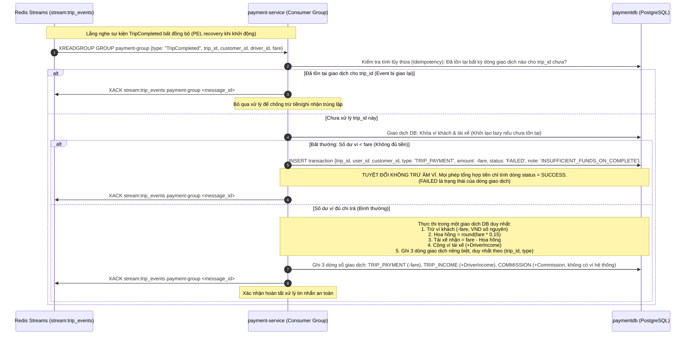

# PHÂN HỆ VÍ & THANH TOÁN - USE CASE ĐẶC TẢ

> **Mã tài liệu:** `UC-24` đến `UC-26`  
> **Dịch vụ chịu trách nhiệm:** `payment-service`  
> **Tài liệu tham chiếu:** [SRS v1.5 (Mục 3.5)](../01-srs/srs.md), [quyet-dinh.md](../00-brainstorm/quyet-dinh.md)  
> **Phiên bản:** 1.1

---

## 1. SƠ ĐỒ TUẦN TỰ THANH TOÁN TỰ ĐỘNG QUA REDIS STREAMS (SEQUENCE DIAGRAM)

---

## 2. CHI TIẾT TỪNG USE CASE

### UC-24: Xem số dư ví & Lịch sử giao dịch
* **FR liên quan:** `FR-22`
* **Actor:** Khách hàng (Customer), Tài xế (Driver).
* **Tiền điều kiện:** Người dùng đã đăng nhập tài khoản (`CUSTOMER` hoặc `DRIVER`). Tài khoản `ADMIN` không có ví trong hệ thống.
* **Luồng chính:**
  1. Người dùng gửi request tra cứu ví cá nhân (`GET /api/v1/wallets/me`).
  2. `payment-service` kiểm tra bản ghi ví của người dùng trong `paymentdb` dựa trên header `X-User-Id`.
  3. **Khởi tạo ví kiểu lazy và nguyên tử:** Nếu người dùng chưa từng có bản ghi ví, `payment-service` tự động tạo mới bản ghi ví một cách nguyên tử (duy nhất theo `user_id`) với số dư ban đầu là **0 VND**.
  4. Trả về thông tin: ID ví, số dư khả dụng (`balance`), đơn vị tiền tệ (`VND`).
  5. Người dùng gửi request xem lịch sử giao dịch (`GET /api/v1/wallets/transactions`).
  6. `payment-service` truy vấn bảng `transactions` và trả về danh sách các dòng giao dịch của người dùng:
     - **Dòng trừ tiền khách:** Loại giao dịch `TRIP_PAYMENT`, số tiền âm `(-fare)`, mã `trip_id`, trạng thái `SUCCESS` hoặc `FAILED`.
     - **Dòng thu nhập tài xế:** Loại giao dịch `TRIP_INCOME`, số tiền dương `(+DriverIncome)`, mã `trip_id`, trạng thái `SUCCESS`.
     - **Dòng nạp tiền:** Loại giao dịch `TOPUP`, số tiền nạp, trạng thái `SUCCESS`.
* **Luồng ngoại lệ:**
  - *Tài khoản Admin gọi API ví:* Hệ thống từ chối vì Admin không tham gia giao dịch ví.
* **Hậu điều kiện:** Số dư và chi tiết lịch sử từng dòng giao dịch được hiển thị minh bạch.
* **Dữ liệu demo cần thấy trên Postman:**
  - Thông tin ví: `wallet_id`, `balance` (số nguyên VND).
  - Danh sách giao dịch: Mỗi dòng gồm `id`, `trip_id`, `amount`, `type` (`TRIP_PAYMENT`/`TRIP_INCOME`/`TOPUP`), `status` (`SUCCESS`/`FAILED`), thời gian `created_at` (dòng `COMMISSION` thuộc hệ thống nên không hiện trong API của khách hay tài xế; kiểm chứng bằng cách truy vấn trực tiếp DB `paymentdb` hoặc trường `total_commission` trong báo cáo ở UC-28).

---

### UC-25: Nạp tiền vào ví ảo (Top-up API Demo)
* **FR liên quan:** `FR-23`
* **Actor:** Khách hàng, Tài xế.
* **Tiền điều kiện:** Đã đăng nhập tài khoản (`CUSTOMER` hoặc `DRIVER`).
* **Luồng chính:**
  1. Người dùng gửi yêu cầu nạp tiền (`POST /api/v1/wallets/top-up`) với số tiền mong muốn nạp (số nguyên VND, ví dụ: 100,000 VNĐ).
  2. `payment-service` kiểm tra số tiền nạp hợp lệ ($> 0$).
  3. Mở database transaction trong `paymentdb`:
     - Khởi tạo ví lazy nếu chưa tồn tại (số dư ban đầu 0).
     - Cộng số tiền nạp vào số dư ví của người dùng: `balance = balance + amount`.
     - Chèn một bản ghi giao dịch mới vào bảng `transactions`: loại `TOPUP`, trạng thái `SUCCESS`, số tiền `+amount`.
  4. Trả về thông tin số dư ví mới cập nhật.
* **Luồng ngoại lệ:**
  - *Số tiền nạp không hợp lệ ($\le 0$ hoặc không phải số nguyên):* Trả về mã lỗi `VALIDATION_ERROR` (HTTP 400).
* **Hậu điều kiện:** Số dư ví của người dùng tăng lên ngay lập tức, phục vụ kịch bản demo đặt xe qua Postman mà không cần cổng thanh toán ngoài.
* **Dữ liệu demo cần thấy trên Postman:** `wallet_id`, `added_amount`, số dư mới `new_balance`.

---

### UC-26: Thanh toán tự động & Trích khấu hoa hồng (Event-Driven Payment)
* **FR liên quan:** `FR-24`, `FR-25`
* **Actor:** Hệ thống (`payment-service` Worker).
* **Tiền điều kiện:** `dispatch-service` đã phát sự kiện `TripCompleted` vào Redis Streams (`stream:trip_events`).
* **Luồng chính:**
  1. Worker của `payment-service` lắng nghe stream `stream:trip_events` thông qua Consumer Group `payment-group`.
     - **Xử lý tin nhắn treo khi khởi động lại:** Khi service khởi động lại, consumer ưu tiên đọc và xử lý dứt điểm các tin nhắn đang treo chưa được xác nhận (nằm trong Pending Entries List - PEL) trước khi chuyển sang đọc tin nhắn mới.
     - **Quản lý kích thước stream:** Stream Redis được thiết lập giới hạn độ dài xấp xỉ nhằm tối ưu bộ nhớ RAM VPS.
  2. Nhận bản tin sự kiện `TripCompleted` mang theo: `trip_id`, `customer_id`, `driver_id`, giá cước chốt `fare` (số nguyên VND).
  3. **Kiểm tra tính lũy thừa (Idempotency):**
     - Truy vấn bảng `transactions` kiểm tra theo mọi dòng giao dịch đã có của `trip_id` bất kể trạng thái (`SUCCESS` hay `FAILED`).
     - Nếu đã tồn tại (do bản tin Redis bị gửi lặp lại): Gửi `XACK` ngay lập tức và bỏ qua xử lý để tránh ghi nhận trùng lặp.
  4. **Thực thi trong một giao dịch DB duy nhất:**
     - Mở transaction DB, khóa hàng ví khách hàng và ví tài xế (nếu ví tài xế chưa có thì tạo lazy với số dư 0).
     - **Tính toán số tiền (số nguyên VND):**
       - Hoa hồng hệ thống: $\text{Commission} = \text{round}(\text{fare} \times 0.15)$.
       - Thu nhập tài xế nhận: $\text{DriverIncome} = \text{fare} - \text{Commission}$.
     - Kiểm tra số dư ví khách hàng:
       - **Trường hợp đủ tiền ($\text{balance} \ge \text{fare}$):**
         - Trừ ví khách: `balance = balance - fare`.
         - Cộng ví tài xế: `balance = balance + DriverIncome`.
         - Ghi nhận 3 dòng sổ giao dịch riêng biệt, **ràng buộc duy nhất theo cặp `(trip_id, loại dòng giao dịch)`**:
           1. Dòng trừ tiền khách: `{user_id: customer_id, trip_id, type: 'TRIP_PAYMENT', amount: -fare, status: 'SUCCESS'}`.
           2. Dòng thu nhập tài xế: `{user_id: driver_id, trip_id, type: 'TRIP_INCOME', amount: +DriverIncome, status: 'SUCCESS'}`.
           3. Dòng hoa hồng hệ thống: `{trip_id, type: 'COMMISSION', amount: +Commission, status: 'SUCCESS'}` (hoa hồng chỉ là một dòng sổ giao dịch loại COMMISSION để thống kê doanh thu, hệ thống không duy trì ví ảo riêng).
         - Commit giao dịch DB.
         - Gửi lệnh `XACK` xác nhận hoàn tất tin nhắn tới Redis Streams.
* **Luồng ngoại lệ (Trường hợp bất thường thiếu tiền):**
  - *Số dư ví khách hàng $< \text{fare}$ lúc trừ:*
    - **Quy tắc cốt lõi:** Hệ thống **tuyệt đối không bao giờ để số dư ví bị âm**.
    - Không thực hiện trừ tiền ví khách và không cộng tiền cho tài xế.
    - Ghi nhận 1 bản ghi giao dịch với loại `TRIP_PAYMENT` và trạng thái `FAILED`: `{trip_id, user_id: customer_id, type: 'TRIP_PAYMENT', amount: -fare, status: 'FAILED', note: 'INSUFFICIENT_FUNDS_ON_COMPLETE'}` (khớp quy ước dòng `TRIP_PAYMENT` luôn mang số âm). Mọi phép tổng hợp tiền chỉ tính dòng `status = 'SUCCESS'`. Lưu ý: `FAILED` là trạng thái của dòng giao dịch trong DB để theo dõi nội bộ. Nhận lại event thì bỏ qua và `XACK`, không ghi trùng.
    - Ghi log nghiêm trọng mức `ERROR` để người quản trị xử lý can thiệp thủ công (tình huống bất thường vì UC-17 đã kiểm tra số dư lúc đặt xe).
    - Commit bản ghi thất bại và gửi lệnh `XACK` để tránh consumer bị treo vòng lặp vô tận.
* **Hậu điều kiện:** Tiền cước được thanh toán đầy đủ; hoa hồng 15% được khấu trừ chuẩn xác; 3 dòng giao dịch được ghi nhận nguyên tử trong 1 transaction DB duy nhất.
* **Dữ liệu demo cần thấy trên Postman/DB:**
  - Khách hàng xem lịch sử giao dịch thấy dòng `TRIP_PAYMENT` (`status: 'SUCCESS'`); Tài xế thấy dòng `TRIP_INCOME` (`status: 'SUCCESS'`).
  - Dòng `COMMISSION` (+Commission, trạng thái `SUCCESS`) thuộc hệ thống nên không xuất hiện trong API của khách hay tài xế; kiểm chứng bằng cách truy vấn trực tiếp DB `paymentdb` hoặc qua trường `total_commission` trong báo cáo quản trị (UC-28).
