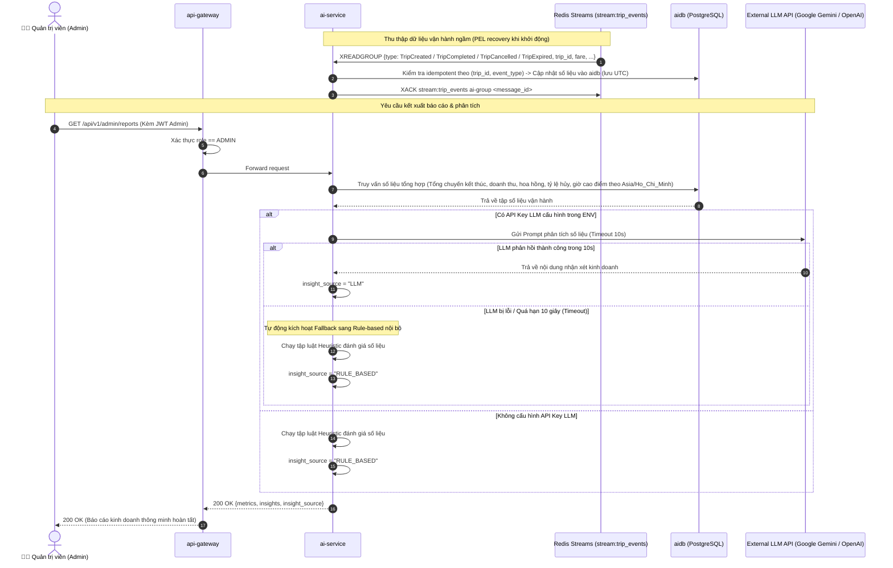

# PHÂN HỆ PHÂN TÍCH & BÁO CÁO AI - USE CASE ĐẶC TẢ

> **Mã tài liệu:** `UC-27` đến `UC-28`  
> **Dịch vụ chịu trách nhiệm:** `ai-service`  
> **Tài liệu tham chiếu:** [SRS v1.5 (Mục 3.6)](../01-srs/srs.md)  
> **Phiên bản:** 1.1

---

## 1. SƠ ĐỒ TUẦN TỰ THU THẬP SỐ LIỆU & BÁO CÁO AI CÓ FALLBACK (SEQUENCE DIAGRAM)

---

## 2. CHI TIẾT TỪNG USE CASE

### UC-27: Thu thập số liệu vận hành bất đồng bộ (Streams Consumer)
* **FR liên quan:** `FR-27`
* **Actor:** Hệ thống (`ai-service` Worker).
* **Tiền điều kiện:** Các microservice khác phát sự kiện vòng đời chuyến đi vào Redis Streams (`stream:trip_events`).
* **Luồng chính:**
  1. Worker của `ai-service` tham gia Consumer Group `ai-group` lắng nghe stream `stream:trip_events`.
     - **Xử lý tin nhắn treo khi khởi động lại:** Khi service khởi động, consumer ưu tiên đọc và xử lý dứt điểm các tin nhắn đang treo chưa được xác nhận (trong Pending Entries List - PEL) trước khi đọc tin nhắn mới.
     - **Giới hạn kích thước stream:** Stream Redis được thiết lập giới hạn độ dài xấp xỉ để tiết kiệm bộ nhớ RAM trên VPS.
  2. Tiếp nhận các loại sự kiện vòng đời chuyến xe:
     - `TripCreated`: Ghi nhận có yêu cầu đặt xe mới.
     - `TripCompleted`: Ghi nhận chuyến hoàn thành, cộng dồn doanh thu, cộng dồn hoa hồng 15%.
     - `TripCancelled`: Ghi nhận chuyến bị hủy.
     - `TripExpired`: Ghi nhận chuyến bị hết giờ tìm tài xế.
  3. **Xử lý Idempotency:**
     - Kiểm tra tính lũy thừa trong `aidb` theo cặp khóa **`(trip_id, loại event)`**.
     - Nếu cặp `(trip_id, loại event)` đã được ghi nhận trước đó (do Redis Stream giao lại tin nhắn): Bỏ qua tính toán và gửi lệnh `XACK` ngay lập tức để không tính trùng số liệu.
  4. Cập nhật và tổng hợp dữ liệu vào các bảng thống kê trong `aidb`:
     - Lưu trữ mốc thời gian sự kiện theo chuẩn **UTC**.
     - Phân loại số chuyến theo các trạng thái kết thúc: `COMPLETED`, `CANCELLED`, `EXPIRED`. Tổng số chuyến đã kết thúc:
       $$\text{EndedTrips} = \text{COMPLETED} + \text{CANCELLED} + \text{EXPIRED}$$
     - Tổng doanh thu (`total_revenue`) và tổng hoa hồng thu được (`total_commission`).
     - **Tính toán tỷ lệ trên mẫu số chuyến đã kết thúc:**
       - Tỷ lệ hủy chuyến: $\text{CancellationRate} = \frac{\text{Cancelled}}{\text{EndedTrips}} \times 100\%$.
       - Tỷ lệ hết giờ: $\text{ExpirationRate} = \frac{\text{Expired}}{\text{EndedTrips}} \times 100\%$.
     - Thống kê tần suất theo từng giờ trong ngày để xác định khung giờ cao điểm (`peak_hours`), quy đổi và hiển thị theo múi giờ Việt Nam **`Asia/Ho_Chi_Minh` (UTC+7)**.
  5. Gửi `XACK` xác nhận đã xử lý tin nhắn tới Redis Streams.
* **Hậu điều kiện:** Dữ liệu thống kê vận hành toàn hệ thống luôn được tích lũy đầy đủ và sẵn sàng để lập báo cáo.

---

### UC-28: Sinh nhận xét vận hành (AI / Heuristic Rule Fallback)
* **FR liên quan:** `FR-28`
* **Actor:** Quản trị viên (Admin).
* **Tiền điều kiện:** Đã đăng nhập bằng tài khoản có vai trò `ADMIN`.
* **Luồng chính:**
  1. Admin gửi request xem báo cáo vận hành (`GET /api/v1/admin/reports`). Có thể kèm tham số khoảng thời gian `start_time`, `end_time` để lọc số liệu.
  2. `api-gateway` kiểm tra quyền `ADMIN`. Nếu không phải Admin $\rightarrow$ Trả về lỗi `FORBIDDEN` (HTTP 403).
  3. `ai-service` trích xuất các chỉ số vận hành tổng hợp từ `aidb` (giờ cao điểm hiển thị theo múi giờ `Asia/Ho_Chi_Minh`).
  4. **Quy trình sinh nhận xét:**
     - **Trường hợp A (Có cấu hình LLM API Key):** Gọi API mô hình ngôn ngữ lớn (Gemini hoặc OpenAI) với timeout giới hạn **10 giây**. Nếu LLM phản hồi thành công, lấy nội dung nhận xét của LLM và gán trường `insight_source = "LLM"`.
     - **Trường hợp B (Không có LLM Key HOẶC LLM bị lỗi/timeout quá 10s):** Hệ thống kích hoạt ngay cơ chế **Fallback sang Heuristic Rule-based** nội bộ:
       - Phân tích số liệu qua các luật kinh doanh định sẵn:
         - Nếu tỷ lệ hủy $> 20\%$: *"Tỷ lệ hủy chuyến đang ở mức cao. Cần kiểm tra lại thời gian tiếp cận của tài xế."*
         - Nếu tỷ lệ hết hạn $> 15\%$: *"Tỷ lệ chuyến hết giờ cao. Khu vực đang thiếu tài xế trầm trọng."*
         - Xác định khung giờ có số chuyến cao nhất: *"Khung giờ cao điểm nhất là [17h - 19h]. Đề xuất tăng hệ số surge để thu hút tài xế bật Online."*
       - Gán trường `insight_source = "RULE_BASED"`.
       - **Đảm bảo không bao giờ trả lỗi 500 cho Admin.**
  5. Trả về toàn bộ số liệu thống kê kèm nhận xét đánh giá cho Admin.
* **Hậu điều kiện:** Admin nắm bắt được toàn cảnh tình hình vận hành kinh doanh kèm nhận xét sắc bén.
* **Dữ liệu demo cần thấy trên Postman:**
  - `total_trips`, `completed_trips`, `cancelled_trips`, `expired_trips`.
  - `total_revenue` (VNĐ), `total_commission` (VNĐ).
  - `cancellation_rate` (%), `expiration_rate` (%).
  - `peak_hours` (ví dụ: `["08:00-09:00", "17:00-19:00"]`, múi giờ `Asia/Ho_Chi_Minh`).
  - `insights` (Nội dung văn bản nhận xét phân tích).
  - **`insight_source`** (`LLM` hoặc `RULE_BASED`).
