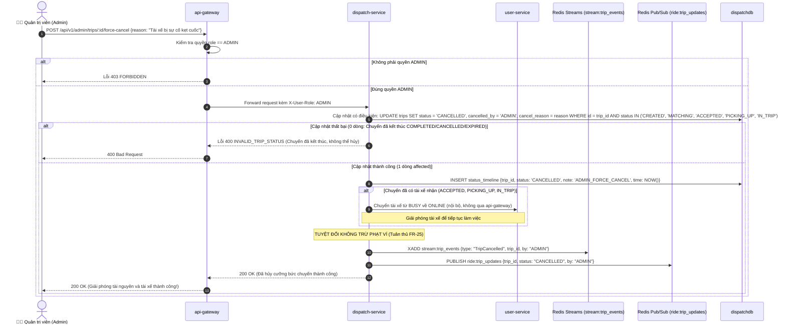

# PHÂN HỆ QUẢN TRỊ ADMIN - USE CASE ĐẶC TẢ

> **Mã tài liệu:** `UC-29` đến `UC-30`  
> **Dịch vụ chịu trách nhiệm:** `api-gateway`, `dispatch-service`, `user-service`, `location-service`, `ai-service`  
> **Tài liệu tham chiếu:** [SRS v1.5 (Mục 3.7)](../01-srs/srs.md)  
> **Phiên bản:** 1.1

---

## 1. SƠ ĐỒ TUẦN TỰ ADMIN HỦY CƯỠNG BỨC CHUYẾN KẸT (SEQUENCE DIAGRAM)

---

## 2. CHI TIẾT TỪNG USE CASE

### UC-29: Xem dữ liệu vận hành tổng thể (Read-Only)
* **FR liên quan:** `FR-32`
* **Actor:** Quản trị viên (Admin).
* **Tiền điều kiện:** Đã đăng nhập bằng tài khoản Quản trị viên (role `ADMIN`).
* **Quy tắc kiến trúc:** Tuân thủ triệt để nguyên tắc **Database-per-Service**. Mọi đường dẫn quản trị của Admin đều nằm dưới `/api/v1/admin/*`. Admin xem dữ liệu chỉ đọc thông qua các endpoint do chính service sở hữu dữ liệu cung cấp, chuyển tiếp an toàn qua `api-gateway`:
* **Luồng chính:**
  1. **Xem danh sách người dùng (`GET /api/v1/admin/users`):**
     - `api-gateway` chuyển tiếp tới `user-service`.
     - `user-service` truy vấn `userdb` và trả về danh sách khách hàng và tài xế (kèm phân trang, lọc theo role, trạng thái `ONLINE`/`OFFLINE`/`BUSY`).
  2. **Xem danh sách chuyến đi toàn hệ thống (`GET /api/v1/admin/trips`):**
     - `api-gateway` chuyển tiếp tới `dispatch-service`.
     - `dispatch-service` truy vấn `dispatchdb` và trả về danh sách toàn bộ chuyến đi kèm trạng thái hiện tại (`MATCHING`, `IN_TRIP`, `COMPLETED`, `CANCELLED`, `EXPIRED`).
  3. **Xem báo cáo vận hành kinh doanh (`GET /api/v1/admin/reports`):**
     - `api-gateway` chuyển tiếp tới `ai-service`.
     - Chi tiết luồng tổng hợp số liệu và sinh nhận xét (AI/Heuristic) được mô tả đầy đủ tại UC-28.
  4. **Xem danh sách tài xế đang hoạt động và vị trí GPS mới nhất (`GET /api/v1/admin/drivers/active`):**
     - `api-gateway` chuyển tiếp tới `location-service`.
     - Định nghĩa **"tài xế đang hoạt động"** tại use case này: Là các tài xế có cập nhật tín hiệu GPS mới nhất trong vòng **15 giây** gần nhất (`driver:last_seen`).
     - `location-service` truy vấn Redis GEO và trả về danh sách gồm `driver_id`, tọa độ GPS mới nhất `(latitude, longitude)`, và mốc thời gian nhận tín hiệu (loại bỏ trường khoảng cách vì đây là danh sách giám sát không gian toàn khu vực).
     - *Lưu ý:* Để theo dõi trạng thái làm việc (`ONLINE`/`OFFLINE`/`BUSY`), Admin xem tại danh sách người dùng (mục 1) do `user-service` quản lý.
* **Luồng ngoại lệ:**
  - *Người dùng không có quyền ADMIN gọi các API này:* Bị từ chối ngay tại Gateway với mã lỗi `FORBIDDEN` (HTTP 403).
* **Hậu điều kiện:** Toàn bộ thông tin giám sát được hiển thị đầy đủ cho Admin ở chế độ chỉ đọc mà không vi phạm nguyên tắc cô lập dữ liệu giữa các microservice.
* **Dữ liệu demo cần thấy trên Postman:** Dữ liệu danh sách chuẩn xác từ từng service con với mã trạng thái HTTP 200.

---

### UC-30: Admin hủy cưỡng bức chuyến kẹt (Admin Force-Cancel)
* **FR liên quan:** `FR-37`
* **Actor:** Quản trị viên (Admin).
* **Tiền điều kiện:** Đã đăng nhập với quyền `ADMIN`.
* **Ý nghĩa nghiệp vụ:** Đây là **hành động Ghi (Write Action) duy nhất** mà Admin được phép can thiệp vào nghiệp vụ vận hành chuyến đi, nhằm xử lý sự cố kẹt cuốc (ví dụ: tài xế mất sóng không thể bấm hoàn thành, hoặc hai bên tranh chấp không di chuyển).
* **Luồng chính (Cập nhật có điều kiện theo trạng thái chưa kết thúc):**
  1. Admin gửi yêu cầu hủy cưỡng bức (`POST /api/v1/admin/trips/:id/force-cancel`) kèm lý do hủy (`reason`).
  2. `api-gateway` xác thực vai trò `ADMIN` và forward request sang `dispatch-service`.
  3. `dispatch-service` thực thi cập nhật có điều kiện trong `dispatchdb`:
     `UPDATE trips SET status = 'CANCELLED', cancelled_by = 'ADMIN', cancel_reason = reason WHERE id = trip_id AND status IN ('CREATED', 'MATCHING', 'ACCEPTED', 'PICKING_UP', 'IN_TRIP')`.
  4. Nếu cập nhật thành công (1 dòng affected):
     - Chèn một dòng lịch sử vào bảng `status_timeline`: `{status: 'CANCELLED', note: 'ADMIN_FORCE_CANCEL', time: NOW()}`.
     - Nếu chuyến xe đã có tài xế được gán (ở các trạng thái `ACCEPTED`, `PICKING_UP`, `IN_TRIP`):
       `dispatch-service` gọi sang `user-service` giải phóng tài xế từ `BUSY` quay trở lại trạng thái `ONLINE` (nội bộ, không qua api-gateway) để tiếp tục đón khách.
     - **Chính sách không phạt (FR-25):** Hoàn toàn không trừ bất kỳ phí phạt nào từ ví của khách hàng hay tài xế.
     - Phát thông điệp sự kiện `TripCancelled` vào Redis Streams (`stream:trip_events`) và Redis Pub/Sub (`ride:trip_updates`).
     - Trả về thông báo hủy cưỡng bức thành công cho Admin.
* **Luồng ngoại lệ:**
  - *Chuyến xe đã kết thúc trước đó (`COMPLETED`, `CANCELLED`, `EXPIRED`):* Lệnh cập nhật DB trả về 0 dòng affected, hệ thống từ chối hủy cưỡng bức với mã lỗi `INVALID_TRIP_STATUS` (HTTP 400 - Chuyến đã kết thúc, không thể hủy).
  - *Người gọi không phải là Admin:* Bị từ chối với lỗi `FORBIDDEN` (HTTP 403).
  - *Mã chuyến không tồn tại:* Trả về lỗi `TRIP_NOT_FOUND` (HTTP 404).
* **Hậu điều kiện:** Chuyến xe kẹt được giải phóng về trạng thái `CANCELLED`; tài xế được đưa về `ONLINE`; không gây sai lệch số dư ví; sự kiện hủy được ghi nhận đầy đủ vào hệ thống thống kê.
* **Dữ liệu demo cần thấy trên Postman:** `trip_id`, trạng thái mới `CANCELLED`, `cancelled_by: "ADMIN"`, thông báo xác nhận tài xế đã quay lại `ONLINE`.
