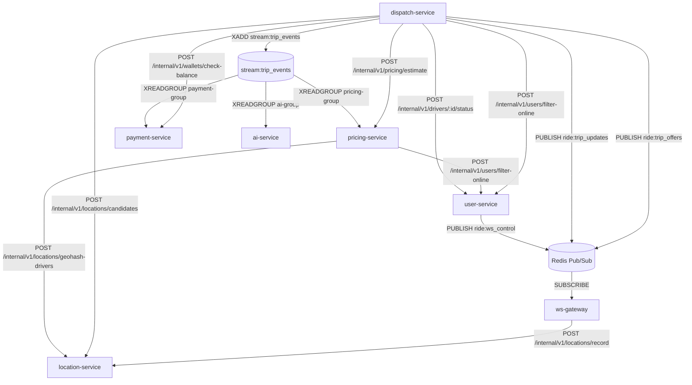

# HỢP ĐỒNG GIAO TIẾP LIÊN SERVICE (INTER-SERVICE CONTRACT)

> **Mã tài liệu:** `LLD-00` | **Phiên bản:** 1.2  
> **Tài liệu căn cứ:** [AGENTS.md](../../AGENTS.md), [SRS v1.5](../01-srs/srs.md), [Use Cases v1.1](../02-use-cases/00-use-case-tong-quat.md), [Quyết định chốt](../00-brainstorm/quyet-dinh.md)  
> **Nguyên tắc cốt lõi:** Văn bản duy nhất chuẩn hóa giao tiếp liên microservice; cấm vi phạm ranh giới Database-per-Service.

---

## 1. BẢNG API NỘI BỘ (HTTP/REST INTERNAL APIS)

| STT | Người gọi → Người nhận | Chức năng | Method & Path | Trường Request | Trường Response | Mã lỗi |
| :-: | :--- | :--- | :--- | :--- | :--- | :--- |
| 1 | `ws-gateway` → `location-service` | Ghi tọa độ tài xế (`drivers:geo` & `driver:last_seen`) | `POST /internal/v1/locations/record` | `driver_id`, `latitude`, `longitude` | `success` | `VALIDATION_ERROR` (400) |
| 2 | `dispatch-service` → `pricing-service` | Lấy báo giá ước tính và khoảng cách chốt | `POST /internal/v1/pricing/estimate` | `pickup_lat`, `pickup_lng`, `dropoff_lat`, `dropoff_lng` | `fare`, `distance_m`, `eta_seconds`, `surge_multiplier` | `VALIDATION_ERROR` (400) |
| 3 | `dispatch-service` → `payment-service` | Kiểm tra số dư ví khách trước khi tạo chuyến (dispatch tự trả `INSUFFICIENT_BALANCE` (400) ở API công khai khi `sufficient = false`) | `POST /internal/v1/wallets/check-balance` | `user_id`, `required_amount` | `sufficient`, `balance` | `VALIDATION_ERROR` (400) |
| 4 | `dispatch-service` → `location-service` | Quét ứng viên tài xế có GPS ≤ 15s trong bán kính R | `POST /internal/v1/locations/candidates` | `pickup_lat`, `pickup_lng`, `radius_km` | `candidates: [{driver_id, distance_m}]` | `VALIDATION_ERROR` (400) |
| 5 | `pricing-service` → `location-service` | Lấy ID tài xế có GPS ≤ 15s trong ô Geohash 5 (tính Supply) | `POST /internal/v1/locations/geohash-drivers` | `geohash5` | `driver_ids: []` | `VALIDATION_ERROR` (400) |
| 6 | `dispatch-service` / `pricing-service` → `user-service` | Lọc danh sách tài xế ONLINE hàng loạt | `POST /internal/v1/users/filter-online` | `driver_ids: []` | `online_driver_ids: []` | `VALIDATION_ERROR` (400) |
| 7 | `dispatch-service` → `user-service` | Chuyển trạng thái tài xế có điều kiện (`ONLINE→BUSY` & `BUSY→ONLINE`) | `POST /internal/v1/drivers/:id/status` | Path: `id`; Body: `from_status`, `to_status` | `driver_id`, `status` | `VALIDATION_ERROR` (400), `DRIVER_NOT_AVAILABLE` (400) |

---

## 2. BẢNG TÀI NGUYÊN REDIS (KEYS, PUB/SUB, STREAMS)

| Tên Key / Channel / Stream | Phân loại | Service ghi | Service đọc | TTL | Nội dung / Cấu trúc dữ liệu |
| :--- | :--- | :--- | :--- | :--- | :--- |
| `blacklist:<jti>` | String | `user-service` | `api-gateway`, `ws-gateway` | `exp - now` | Chuỗi `"revoked"` (thu hồi Access Token khi đăng xuất) |
| `refresh:<token>` | String | `user-service` | `user-service` | 7 ngày (`604800s`) | Chuỗi `user_id` (quản lý Refresh Token nguyên tử, xoay vòng) |
| `drivers:geo` | GEO (ZSET) | `location-service` | `location-service` | Không TTL | Member: `driver_id`, Coordinates: `(longitude, latitude)` |
| `driver:last_seen:<driver_id>` | String | `location-service` | `location-service` | 30 giây | Timestamp Unix UTC (xác định tín hiệu tài xế còn mới ≤ 15s) |
| `ride:lock:<trip_id>` | String | `dispatch-service` | `dispatch-service` | 10 giây | `driver_id` (Distributed Lock tranh cuốc `SET NX EX 10`, release bằng Lua) |
| `trip:link:<driver_id>` | String | `dispatch-service` | `ws-gateway` | 3 giờ | JSON `{"trip_id": string, "customer_id": string}` (stream GPS FR-38) |
| `demand:geo:<geohash5>` | ZSET | `pricing-service` | `pricing-service` | 5 phút (`300s`) | Score: Unix Timestamp UTC, Member: `trip_id` (đếm Demand cửa sổ trượt 5p) |
| `ride:trip_offers` | Pub/Sub | `dispatch-service` | `ws-gateway` | N/A | Bản tin mời cuốc: `{trip_id, targets: [{driver_id, distance_m}], pickup_lat, pickup_lng, fare, driver_fare, expire_at}` (`driver_fare = fare - commission`, chỉ để hiển thị). ws-gateway đẩy cho mỗi tài xế chỉ distance_m của chính tài xế đó (tra trong targets), không đẩy cả danh sách. |
| `ride:trip_updates` | Pub/Sub | `dispatch-service` | `ws-gateway` | N/A | Bản tin tiến trình: `{trip_id, customer_id, driver_id, status, updated_at}` (driver_id = null khi bị hủy/hết hạn trước ACCEPTED; dispatch KHÔNG phát ride:trip_updates lúc MATCHING do khách nhận trạng thái ban đầu từ response 201; ws-gateway bỏ qua bước đẩy cho tài xế nếu driver_id null, vẫn đẩy cho khách). |
| `ride:ws_control` | Pub/Sub | `user-service` | `ws-gateway` | N/A | Bản tin điều khiển kết nối: `{"action": "DISCONNECT", "user_id": string}` |
| `stream:trip_events` | Stream | `dispatch-service` | Consumer Groups | `MAXLEN ~ 5000` | Stream vòng đời chuyến. Consumer Groups: `payment-group`, `ai-group`, `pricing-group` |

---

## 3. BẢN TIN SỰ KIỆN TRONG STREAM:TRIP_EVENTS

Mọi sự kiện trong `stream:trip_events` đều có trường `type` tương ứng với tên sự kiện (`TripCreated` | `TripCompleted` | `TripCancelled` | `TripExpired`), trường phiên bản `version: "1.0"` và thời gian chuẩn UTC (RFC 3339 / ISO 8601). Tuyệt đối **không** gửi trường hoa hồng trong `TripCompleted` và **không** gửi trường bên hủy (`cancelled_by`) trong `TripCancelled`.

| Tên sự kiện | Trường bắt buộc | Service phát | Consumer Group tiếp nhận | Mục đích nghiệp vụ |
| :--- | :--- | :--- | :--- | :--- |
| `TripCreated` | `type`, `version`, `trip_id`, `customer_id`, `pickup_geohash5`, `created_at` | `dispatch-service` | `pricing-group`, `ai-group` | Tích lũy Demand tính Surge Pricing (`pricing`); thống kê số chuyến tạo (`ai`). |
| `TripCompleted` | `type`, `version`, `trip_id`, `customer_id`, `driver_id`, `fare`, `completed_at` | `dispatch-service` | `payment-group`, `ai-group` | Khấu trừ ví khách, cộng ví tài xế (`payment`); ghi nhận doanh thu & hoa hồng (`ai`). |
| `TripCancelled` | `type`, `version`, `trip_id`, `cancelled_at` | `dispatch-service` | `ai-group` | Ghi nhận thống kê tỷ lệ hủy chuyến toàn hệ thống. |
| `TripExpired` | `type`, `version`, `trip_id`, `reason`, `expired_at` *(reason: `NO_DRIVERS_AVAILABLE` \| `TIMEOUT_30S`)* | `dispatch-service` | `ai-group` | Ghi nhận thống kê tỷ lệ hết giờ tìm xe toàn hệ thống. |

*Ghi chú: pickup_geohash5 do dispatch tính từ tọa độ điểm đón bằng geohash chuẩn độ dài 5 (pricing dùng cùng chuẩn khi tính Supply).*

---

## 4. QUY ƯỚC CHUNG TOÀN HỆ THỐNG

- **Định dạng dữ liệu JSON:** Cấu trúc thống nhất `{"success": bool, "data": ..., "error": {"code": string, "message": string}}`.
- **Phân chia đường dẫn:** API công khai qua gateway có tiền tố `/api/v1/*`; API giao tiếp nội bộ có tiền tố `/internal/v1/*`.
- **Bảo mật Header:** `api-gateway` xóa sạch header `X-User-*` từ client; giải mã JWT hợp lệ rồi gắn `X-User-Id` và `X-User-Role` chuyển tiếp vào nội bộ.
- **Payload JWT Claims:** Gồm đúng 4 trường: `user_id` (UUID/string), `role` (`CUSTOMER` | `DRIVER` | `ADMIN`), `exp` (int64 epoch), `jti` (UUID).
- **Đơn vị tiền tệ & thời gian:** Tiền tệ là số nguyên VND (`int64`, không dùng số thực). Thời gian là chuỗi ISO 8601 UTC (`YYYY-MM-DDTHH:MM:SSZ`).
- **Dải tọa độ DUY NHẤT toàn hệ thống:** Vĩ độ thuộc `[-85.05112878, 85.05112878]` (chuẩn Mercator của Redis GEO), kinh độ thuộc `[-180, 180]`. Mọi service bắt buộc validate theo dải này và tham chiếu về đây, không tự khai riêng.
- **Quy tắc ánh xạ lỗi service phụ cho dispatch:** Khi gọi service phụ thuộc: nếu `pricing-service` trả 400 `VALIDATION_ERROR` thì `dispatch-service` trả lại `VALIDATION_ERROR` cho client; nếu nhận HTTP 400 từ `location-service`, `user-service`, hoặc `payment-service` nghĩa là dispatch gửi sai request nội bộ $\rightarrow$ log `ERROR` và trả 503 `SERVICE_UNAVAILABLE`; mọi lỗi mạng, timeout hoặc 5xx từ service phụ $\rightarrow$ trả 503 `SERVICE_UNAVAILABLE`.
- **Danh mục mã lỗi nghiệp vụ chuẩn:** Gồm 16 mã lỗi chuẩn toàn hệ thống (14 mã lỗi từ Use Case tổng quát, bổ sung mã `NOT_FOUND` (HTTP 404) và `SERVICE_UNAVAILABLE` (HTTP 503)):
  - `400`: `VALIDATION_ERROR`, `INSUFFICIENT_BALANCE`, `DRIVER_NOT_AVAILABLE`, `DRIVER_BUSY`, `DRIVER_CANNOT_LOGOUT`, `INVALID_TRIP_STATUS`.
  - `401`: `UNAUTHORIZED`, `INVALID_REFRESH_TOKEN`.
  - `403`: `FORBIDDEN`, `NOT_OFFERED`.
  - `404`: `TRIP_NOT_FOUND`, `NOT_FOUND` (dùng cho route không tồn tại và đường dẫn `/internal/*` từ Internet).
  - `409`: `USER_ALREADY_EXISTS`, `ACTIVE_TRIP_EXISTS`, `TRIP_ALREADY_TAKEN`.
  - `503`: `SERVICE_UNAVAILABLE` (api-gateway hoặc ws-gateway lỗi Redis (ws-gateway: từ chối bắt tay WebSocket bằng HTTP 503, không nâng cấp kết nối), hoặc ws-gateway từ chối bắt tay do vượt MAX_CONNECTIONS, hoặc service gọi đồng bộ (dispatch) không nhận được phản hồi từ service phụ thuộc (pricing, payment, location, user)).
- **Quy tắc lỗi hạ tầng:** Lỗi DB/Redis của chính service ngoài các luồng đã định nghĩa trả 503 `SERVICE_UNAVAILABLE`.
- **Công thức tính hoa hồng cố định:** Hoa hồng không truyền trong event; payment-service và ai-service tự tính độc lập từ `fare` chốt khi hoàn thành. `COMMISSION_RATE` do payment-service, ai-service và dispatch-service đọc (dispatch chỉ để hiển thị driver_fare). `COMMISSION_RATE` là số nguyên phần trăm (mặc định 15). Phép tính thực hiện hoàn toàn trên số nguyên với cơ chế làm tròn nửa lên:
  $$\text{commission} = \frac{\text{fare} \times \text{COMMISSION\_RATE} + 50}{100} \quad (\text{chia lấy phần nguyên})$$
  $$\text{DriverIncome} = \text{fare} - \text{commission}$$

---

## 5. CÁC ĐIỂM KỸ THUẬT ĐÃ CHỐT

- **(a) Phân vùng endpoint nội bộ:** Toàn bộ API `/internal/v1/*` chỉ bind và lắng nghe trong mạng Docker `backend-net`; `api-gateway` tuyệt đối không route các đường dẫn này ra ngoài Internet.
- **(b) Liên kết stream GPS FR-38:** Lưu tại Redis key `trip:link:<driver_id> = {"trip_id": string, "customer_id": string}` với TTL 3 giờ làm lưới an toàn. `dispatch-service` ghi key khi chuyển `ACCEPTED`, và xóa `DEL` ở MỌI nhánh kết thúc (`COMPLETED`, `CANCELLED`, Admin force-cancel). `ws-gateway` chỉ tra key này khi nhận gói tin GPS từ tài xế để chuyển tiếp cho khách.
- **(c) Danh sách tài xế được mời:** Top 3–5 tài xế được mời cuốc được lưu bền vững cùng bản ghi chuyến xe trong `dispatchdb` làm căn cứ thẩm quyền khi nhận chuyến.
- **(d) Tiến trình quét chuyến quá hạn:** Chạy ngầm tại `dispatch-service` định kỳ mỗi 2 giây và chạy quét ngay 1 lần lúc service khởi động để giải phóng các chuyến kẹt.
- **(e) Phạm vi địa lý Demand/Supply:** Chỉ tính toán trong phạm vi duy nhất 1 ô Geohash độ dài 5 ký tự (khoảng 4.9 km × 4.9 km), không quét thêm 8 ô lân cận.
- **(f) Tài xế BUSY mồ côi (Orphaned BUSY Driver):** Trường hợp hy hữu `dispatch-service` sập nguồn giữa lúc đổi tài xế `BUSY` và update `ACCEPTED` chuyến, tài xế kẹt `BUSY` sẽ reset thủ công trạng thái tài xế về ONLINE trong userdb, ghi vào mục vận hành.
- **(g) Giới hạn bộ nhớ và phiên bản Redis:** Redis `maxmemory 50mb`, `mem_limit` container Redis là 60M, `maxmemory-policy noeviction`. Persistence: `appendonly yes`, `appendfsync everysec`, named volume cho thư mục data (lý do: restart/recreate Redis không được làm mất stream chưa xử lý, refresh token, blacklist). Yêu cầu Redis >= 6.2 (cần cho `GEOSEARCH` và `GETDEL`), ví dụ dùng image `redis:7-alpine`.
- **(h) Giới hạn Connection Pool & Bộ nhớ Go:**
  - Container PostgreSQL dùng chung cấu hình `max_connections = 50`, `shared_buffers=32MB`, `work_mem=2MB`, `maintenance_work_mem=16MB`; cân nhắc `mem_limit` Postgres 200 MB (ngân sách 850 MB sát, bắt buộc đo `docker stats` với 100 tài xế ảo).
  - Connection Pool từng service Go: `user-service` (MaxOpen: 5, MaxIdle: 2), `dispatch-service` (MaxOpen: 10, MaxIdle: 3), `pricing-service` (MaxOpen: 5, MaxIdle: 2), `payment-service` (MaxOpen: 10, MaxIdle: 3), `ai-service` (MaxOpen: 5, MaxIdle: 2). (Tổng: 35 connections ≤ 50).
  - RAM toàn hệ thống $\le 850\text{ MB}$. Đề xuất `mem_limit` mỗi Go service từ 25 – 40 MB; cấu hình `GOMEMLIMIT` tương ứng ở mức 85%–90% `mem_limit` (22MiB – 35MiB) để kích hoạt GC sớm chống OOM.
- **(i) Giải phóng Distributed Lock an toàn:** Thu hồi `ride:lock:<trip_id>` bắt buộc dùng Lua Script kiểm tra giá trị khớp `driver_id` (compare-and-delete), chỉ xóa lock do chính mình sở hữu.
- **(j) Fallback hệ số Surge Pricing:** Khi `pricing-service` không lấy được dữ liệu Supply hoặc Demand (do lỗi kết nối `location-service` hoặc `user-service`), hệ thống tự động gán `surge_multiplier = 1.0` thay vì trả lỗi cho khách hàng.
- **(k) HTTP client nội bộ:** Mọi service gọi REST nội bộ dùng 1 `http.Client` singleton dùng chung, `Transport` đặt `MaxIdleConns 100` và `MaxIdleConnsPerHost 50` (lớn hơn mặc định của Go), luôn đọc hết Body (`io.Copy(io.Discard, res.Body)`) rồi mới `res.Body.Close()`.
- **(l) Tạo schema:** Dùng `AutoMigrate` cho bảng/cột, sau đó chạy raw SQL (`CREATE ... IF NOT EXISTS`) cho: partial unique index `idx_trips_active_customer`, `idx_transactions_trip_type`; index thường `idx_trips_matching_timeout` (KHÔNG phải UNIQUE), `idx_trips_driver_active`; CHECK `balance >= 0` (`wallets`); CHECK `driver_status` và `role` (`users`).
- **(m) Quy tắc consumer Redis Streams:** Áp dụng cho `payment-service`, `pricing-service`, `ai-service`: mỗi chu kỳ (2–5 giây) đọc PEL ĐÚNG 1 lượt `XREADGROUP ... 0 COUNT <PEL_BATCH_COUNT>`, KHÔNG lặp "cho tới khi hết". Đếm số lần giao bằng `XPENDING` (delivery count); nếu khi code kiểm chứng thấy đọc lại PEL không tăng count thì dùng bộ đếm RAM `map[msg_id]int`, dọn khi `XACK`. Vượt `MAX_DELIVERY_ATTEMPTS` thì log `ERROR` rồi `XACK`. Lỗi unique violation (`23505`) coi là duplicate $\rightarrow$ `XACK`.
- **(n) Khởi động:** Mỗi service retry kết nối Postgres/Redis tối đa ~10 lần, cách nhau ~3 giây rồi mới thoát.

---

## 6. DANH SÁCH BIẾN MÔI TRƯỜNG DÙNG CHUNG (SHARED ENVIRONMENT VARIABLES)

| Tên biến ENV | Giá trị mặc định | Service đọc biến | Mục đích & Quy ước sử dụng |
| :--- | :--- | :--- | :--- |
| `JWT_SECRET` | `secret-key-ride-hailing-devops` | `api-gateway`, `user-service`, `ws-gateway` | Khóa bí mật dùng chung để ký và xác thực tính toàn vẹn của JWT. |
| `ACCESS_TOKEN_EXPIRY` | `3600` | `user-service` | Thời hạn sống của Access Token tính bằng giây (mặc định 1 giờ). |
| `REFRESH_TOKEN_EXPIRY` | `604800` | `user-service` | Thời hạn sống của Refresh Token tính bằng giây (mặc định 7 ngày). |
| `COMMISSION_RATE` | `15` | `payment-service`, `ai-service`, `dispatch-service` | Tỷ lệ hoa hồng (%) dạng số nguyên; truyền từ cùng 1 biến `.env` qua Docker Compose (dispatch chỉ để hiển thị driver_fare). |
| `DEFAULT_BASE_FARE` | `10000` | `pricing-service` | Giá cước mở cửa cơ sở (VND). |
| `DEFAULT_PRICE_PER_KM`| `12000` | `pricing-service` | Đơn giá cước di chuyển mỗi km (VND). |
| `SURGE_THRESHOLD` | `1.0` | `pricing-service` | Ngưỡng kích hoạt hệ số biến động giá $T$. |
| `OSRM_BASE_URL` | `https://router.project-osrm.org` | `pricing-service` | URL dịch vụ định tuyến OSRM công cộng (Fallback Haversine nếu lỗi). |
| `OSRM_TIMEOUT_MS` | `400` | `pricing-service` | Timeout tối đa khi gọi định tuyến OSRM (ms). |
| `LLM_API_KEY` | `""` | `ai-service` | Khóa API dịch vụ trí tuệ nhân tạo (nếu rỗng tự động chạy Heuristic Rule). |
| `LLM_API_URL` | `https://generativelanguage.googleapis.com/v1beta` | `ai-service` | URL gốc của Google Gemini API. |
| `LLM_MODEL` | `gemini-3.5-flash-lite` | `ai-service` | Tên model Gemini (nhà cung cấp là Google Gemini; tên model có thể đổi qua ENV mà không sửa code). |
| `LLM_TIMEOUT_SECONDS` | `10` | `ai-service` | Thời gian chờ tối đa khi gọi LLM ngoại vi trước khi Fallback sang Rule. |
| `ADMIN_EMAIL` | `admin@ridehailing.local` | `user-service` | Email tài khoản quản trị viên khởi tạo tự động lúc start container (UC-07). |
| `ADMIN_PASSWORD` | `Admin@123456` | `user-service` | Mật khẩu tài khoản quản trị viên khởi tạo ban đầu. |
| `REDIS_ADDR` | `redis:6379` | Toàn bộ 8 services | Địa chỉ kết nối Redis container trong mạng Docker. |
| `REDIS_PASSWORD` | `redis_secret_pass` | Toàn bộ 8 services | Mật khẩu xác thực kết nối Redis. |
| `MAX_DELIVERY_ATTEMPTS` | `5` | `payment-service`, `pricing-service`, `ai-service` | Số lần thử xử lý tối đa cho message trong PEL trước khi log ERROR và XACK bỏ qua. |
| `PEL_BATCH_COUNT` | `10` | `payment-service`, `pricing-service`, `ai-service` | Số lượng message tối đa đọc từ PEL trong mỗi chu kỳ kiểm tra (COUNT). |

*Ghi chú: JWT_SECRET, REDIS_PASSWORD, ADMIN_EMAIL, ADMIN_PASSWORD mặc định chỉ là giá trị demo, phải ghi đè trong .env, không commit; trong docker-compose dùng dạng ${JWT_SECRET:?} (và REDIS_PASSWORD, ADMIN_PASSWORD) để fail-fast khi quên đặt, không dùng giá trị mặc định demo trên VPS. Nhà cung cấp LLM là Google Gemini; tên model có thể đổi qua ENV mà không sửa code.*
