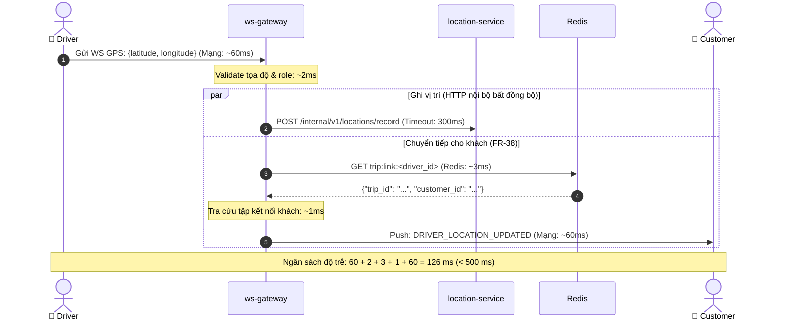

# THIẾT KẾ CHI TIẾT CỔNG WEBSOCKET (WS-GATEWAY LLD)

> **Mã tài liệu:** `LLD-WS` | **Service:** `ws-gateway` | **Database:** Không có DB  
> **Tài liệu tham chiếu:** [AGENTS.md](../../AGENTS.md), [SRS v1.5](../01-srs/srs.md), [Hợp đồng liên service](../03-lld/00-hop-dong-lien-service.md), [UC-01 (UC-09)](../02-use-cases/uc-01-tai-khoan.md), [UC-02 (toàn bộ)](../02-use-cases/uc-02-dinh-vi.md)

---

## 1. TRÁCH NHIỆM

- Quản lý kết nối hai chiều WebSocket persistent giữa Client (Khách hàng/Tài xế) và backend hệ thống.
- Xác thực kết nối tại bước bắt tay (Handshake) bằng JWT và kiểm tra danh sách đen (`blacklist:<jti>`).
- Tiếp nhận tọa độ GPS từ tài xế, chuyển tiếp lưu vào `location-service` và điều hướng trực tiếp cho khách (FR-38).
- Lắng nghe sự kiện từ Redis Pub/Sub để đẩy tức thời thông báo đổi trạng thái chuyến, mời cuốc và ngắt phiên.

---

## 2. BẢNG DB

`ws-gateway` **không có DB** quan hệ hay bộ nhớ lưu trữ bền vững. Toàn bộ session kết nối được duy trì trong bộ nhớ RAM (`in-memory map`) của tiến trình và đọc dữ liệu tạm thời từ Redis theo Hợp đồng LLD-00.

---

## 3. API & SỰ KIỆN WEBSOCKET

### 3.1. Endpoint HTTP & WebSocket Handshake
| Method & Path | Tầng | Actor | Header / Params | Response Data | Mã lỗi / Từ chối |
| :--- | :-: | :--- | :--- | :--- | :--- |
| `GET /ws/` | 1 | `CUSTOMER` `DRIVER` | Header: `Authorization: Bearer <jwt>` `Upgrade: websocket` | HTTP 101 Switching Protocols | 401 `UNAUTHORIZED` (token sai/hết hạn/blacklist/sai thuật toán ký) 403 `FORBIDDEN` (role ADMIN không được kết nối WS) 503 `SERVICE_UNAVAILABLE` (vượt MAX_CONNECTIONS hoặc lỗi Redis, fail-closed) |
| `GET /health` *(do LLD đặt)* | 1 | Tất cả | *(None)* | `{"status": "ok"}` | *(None)* |

### 3.2. Bảng Sự kiện WebSocket (Frames trao đổi)
| Tên sự kiện | Hướng | Đối tượng | Trường dữ liệu | Mục đích nghiệp vụ |
| :--- | :--- | :--- | :--- | :--- |
| *(GPS Raw)* | Client $\rightarrow$ WS | `DRIVER` | `latitude` (float, B), `longitude` (float, B) | Tài xế gửi vị trí định kỳ 3–5s. |
| `DRIVER_LOCATION_UPDATED` | WS $\rightarrow$ Client | `CUSTOMER` | `event` ("DRIVER_LOCATION_UPDATED"), `latitude` (float), `longitude` (float), `driver_id` (uuid), `trip_id` (uuid), `timestamp` (iso8601) | Khách theo dõi tài xế của chuyến (FR-38). |
| `TRIP_STATUS_UPDATED` | WS $\rightarrow$ Client | `CUSTOMER` `DRIVER` | `event` ("TRIP_STATUS_UPDATED"), `trip_id` (uuid), `status` (string), `updated_at` (iso8601) | Cập nhật tiến trình chuyến đi (UC-13). |
| `TRIP_OFFERED` *(do LLD đặt)* | WS $\rightarrow$ Client | `DRIVER` | `event` ("TRIP_OFFERED"), `trip_id` (uuid), `pickup_lat` (float), `pickup_lng` (float), `fare` (int), `driver_fare` (int), `distance_m` (int), `expire_at` (iso8601) | Mời tài xế nhận chuyến (khoảng cách riêng từng tài xế). |

### 3.3. Bảng Mã Đóng & Từ chối Kết nối
| Tình huống | Mã đóng / HTTP | Cơ chế & Lý do |
| :--- | :--- | :--- |
| Token sai / hết hạn / thu hồi / sai thuật toán | HTTP 401 | Từ chối ngay lúc handshake; nếu WS đã mở thì không ngắt khi token hết hạn. |
| Redis sập lúc tra cứu blacklist | HTTP 503 | Fail-closed lúc handshake: từ chối bắt tay, không nâng cấp kết nối để bảo vệ an ninh. |
| Role ADMIN kết nối WS | HTTP 403 | Token hợp lệ nhưng role ADMIN $\rightarrow$ WebSocket chỉ phục vụ CUSTOMER và DRIVER. |
| Vượt ngưỡng MAX_CONNECTIONS | HTTP 503 | Số kết nối đồng thời active vượt quá `MAX_CONNECTIONS` $\rightarrow$ từ chối bắt tay bảo vệ RAM. |
| Đăng xuất chủ động | Close 1000 | Nhận `ride:ws_control` (`action: DISCONNECT`) $\rightarrow$ đóng toàn bộ kết nối của người dùng. |
| Client quá tải / nghẽn mạng | Close 1008 | Buffer channel của client bị đầy (`SLOW_CLIENT`) $\rightarrow$ chủ động ngắt kết nối. |
| Mất Heartbeat (Ping/Pong) | Close 1001 | Client không phản hồi Pong sau `PONG_WAIT_SECONDS` $\rightarrow$ giải phóng tài nguyên. |

---

## 4. LUỒNG XỬ LÝ TỪNG BƯỚC

### 4.1. Handshake & Quản lý Session
1. **Trích xuất token:** Trích xuất Bearer token từ header `Authorization` (từ chối query string).
2. **Xác thực chữ ký & Blacklist:** Xác thực chữ ký JWT với ràng buộc thuật toán: **chỉ chấp nhận thuật toán `HS256`**, từ chối dứt khoát thuật toán `none` và các thuật toán khác; giải mã bằng `JWT_SECRET`. Kiểm tra `exp` và kiểm tra `GET blacklist:<jti>`. Nếu token lỗi $\rightarrow$ trả HTTP 401 `UNAUTHORIZED`; nếu Redis lỗi $\rightarrow$ trả HTTP 503 `SERVICE_UNAVAILABLE` (fail-closed).
3. **Kiểm tra phân quyền:** Sau khi token hợp lệ, kiểm tra vai trò: nếu `role == 'ADMIN'` $\rightarrow$ từ chối trả HTTP 403 `FORBIDDEN`.
4. **Kiểm tra số lượng kết nối:** Kiểm tra tổng số kết nối active hiện tại: nếu số kết nối active $\ge$ `MAX_CONNECTIONS` $\rightarrow$ từ chối trả HTTP 503 `SERVICE_UNAVAILABLE`.
5. **Nâng cấp kết nối & Khởi tạo Session:** Nâng cấp HTTP 101. Khởi tạo session kết nối `{user_id, role, conn, send_chan}`. Quản lý cấu trúc `sessions` dưới dạng `map[user_id]map[*Session]struct{}` (map `user_id` tới một tập các kết nối, bảo vệ bằng `sync.RWMutex`, hỗ trợ 1 user mở đồng thời nhiều tab/thiết bị). Thêm session mới vào tập kết nối của `user_id`. Khởi chạy 2 goroutine `readPump` và `writePump` (khi kết nối đóng, tự dọn session khỏi tập kết nối của `user_id`, nếu tập rỗng thì xóa key `user_id`).

### 4.2. Nhận GPS & Chuyển tiếp Thời gian thực (FR-38, UC-31)
- Lọc quyền: Handler GPS kiểm tra `role == 'DRIVER'` từ session kết nối; client khác gửi thì lập tức bỏ qua.
- Gọi nội bộ ghi vị trí bất đồng bộ: Dùng `user_id` của session làm `driver_id`, khởi chạy goroutine gọi `POST /internal/v1/locations/record` sang `location-service` với timeout cấu hình bởi ENV `LOCATION_TIMEOUT_MS` (mặc định 300 ms), không làm chặn đường chuyển tiếp GPS cho khách; nếu gặp lỗi mạng hoặc timeout chỉ log ERROR.
- Tra cứu liên kết: Đọc Redis `GET trip:link:<driver_id>` (với `driver_id` là `user_id` của session). Nếu key tồn tại, trích xuất `customer_id` và `trip_id`.
- Chuyển tiếp: Tra map `sessions[customer_id]`, đẩy frame `DRIVER_LOCATION_UPDATED` (với `timestamp` định dạng ISO 8601 UTC) vào `send_chan` của mọi kết nối thuộc khách hàng.

### 4.3. Phân phối Bản tin từ Redis Pub/Sub
- `ride:ws_control`: Parse `{"action": "DISCONNECT", "user_id": "..."}`. Tìm tập kết nối của `user_id` trong map `sessions`, gửi Close 1000 tới tất cả kết nối trong tập và xóa key `user_id` khỏi map.
- `ride:trip_updates`: Parse `{trip_id, customer_id, driver_id, status, updated_at}`. Đẩy frame `TRIP_STATUS_UPDATED` tới toàn bộ kết nối trong tập của `customer_id`; nếu `driver_id != null` thì đẩy thêm tới toàn bộ kết nối trong tập của `driver_id` (nếu null thì bỏ qua).
- `ride:trip_offers`: Parse `{trip_id, targets: [{driver_id, distance_m}], ...}`. Với mỗi tài xế trong `targets`, lấy đúng `distance_m` của tài xế đó tạo frame `TRIP_OFFERED` đẩy riêng cho toàn bộ kết nối trong tập của tài xế tương ứng (không đẩy mảng `targets`).

---

## 5. XỬ LÝ NGOẠI LỆ (EXCEPTION HANDLING)

| Tình huống ngoại lệ | Ngữ cảnh phát sinh | Hành vi xử lý |
| :--- | :--- | :--- |
| Client gửi frame rác | Gửi frame không phải JSON hoặc sai tọa độ | Log WARN, bỏ qua frame, không làm sập kết nối. |
| Client nghẽn mạng (Slow Client)| `send_chan` bị đầy khi đẩy tin xuống | Đóng kết nối Close 1008 (`SLOW_CLIENT`), thu hồi session. |
| Location-service sập | Lỗi kết nối HTTP khi ghi nhận tọa độ | Log ERROR, tiếp tục thực hiện luồng tra `trip:link` chuyển tiếp cho khách. |
| Khách mất mạng lúc nhận GPS | Khách ngắt kết nối WS khi tài xế đang stream | Bỏ qua việc đẩy frame cho khách, không báo lỗi cho tài xế. |

### 5.1. Hạn chế đã biết
- **Đóng kết nối khi Rolling Update:** Khi restart container `ws-gateway`, toàn bộ kết nối WebSocket bị ngắt (Close 1001). Đây là đặc tính tự nhiên của WebSocket Gateway 1 instance; client tự động reconnect lại qua Nginx sau vài giây.
- **Mất bản tin Pub/Sub khi đứt kết nối Redis:** Các bản tin Pub/Sub phát trong lúc `ws-gateway` mất kết nối Redis sẽ bị thất lạc (đặc tính at-most-once của Pub/Sub), đây là đánh đổi chấp nhận được cho đồ án; `ws-gateway` tự động subscribe lại các kênh ngay sau khi kết nối lại Redis thành công.

---

## 6. SỰ KIỆN & KHÓA REDIS

### 6.1. Dữ liệu Redis đọc
- `blacklist:<jti>`: Tra cứu lúc handshake. Nếu key tồn tại $\rightarrow$ từ chối kết nối (HTTP 401).
- `trip:link:<driver_id>`: String, TTL 3h. Đọc thông tin `{trip_id, customer_id}` để điều hướng tọa độ FR-38.

### 6.2. Kênh Redis Pub/Sub đăng ký (SUBSCRIBE)
- `ride:ws_control`: Nhận lệnh cưỡng chế ngắt kết nối khi tài khoản đăng xuất.
- `ride:trip_updates`: Nhận biến động trạng thái chuyến đi để thông báo cho khách và tài xế.
- `ride:trip_offers`: Nhận danh sách mời cuốc xe Top 3–5 từ `dispatch-service` để phân phối tới từng tài xế.

---

## 7. CẤU HÌNH (ENV) VÀ TÀI NGUYÊN

### 7.1. Bảng biến môi trường
| Tên biến ENV | Mặc định | Ý nghĩa & Mục đích sử dụng |
| :--- | :--- | :--- |
| `PORT` | `8081` | Cổng HTTP/WS của `ws-gateway` (Nginx map vào 127.0.0.1:8081). |
| `REDIS_ADDR` | `redis:6379` | Địa chỉ Redis container. |
| `REDIS_PASSWORD` | `redis_secret_pass` | Mật khẩu Redis container (demo, ghi đè trong .env). |
| `JWT_SECRET` | `secret-key-ride-hailing-devops` | Khóa bí mật giải mã và kiểm tra chữ ký HMAC-SHA256 của JWT. |
| `LOCATION_SERVICE_URL` | `http://location-service:8002` | Base URL gọi nội bộ `location-service`. |
| `LOCATION_TIMEOUT_MS` | `300` | Thời gian chờ tối đa khi gọi nội bộ ghi GPS sang `location-service` (ms). |
| `PING_INTERVAL_SECONDS`| `30` | Chu kỳ gửi Ping kiểm tra kết nối tới client (giây). |
| `PONG_WAIT_SECONDS` | `60` | Thời gian tối đa chờ phản hồi Pong trước khi ngắt kết nối (giây). |
| `CLIENT_BUFFER_SIZE` | `64` | Kích thước hàng đợi `send_chan` cho mỗi kết nối (chống nghẽn). |
| `MAX_CONNECTIONS` | `300` | Giới hạn số lượng kết nối đồng thời tối đa bảo vệ tài nguyên RAM (vượt ngưỡng trả 503). |

### 7.2. Quản lý Session, Tài nguyên & Khởi động
- **Ràng buộc bộ nhớ VPS 1GB:** `mem_limit` Docker đề xuất: 30 MB; `GOMEMLIMIT = 26MiB` (chống OOM).
- **Thứ tự khởi động (Startup Sequence):**
  1. Kết nối Redis, ping kiểm tra `PONG`.
  2. Khởi chạy goroutine đăng ký lắng nghe 3 kênh Redis Pub/Sub: `ride:ws_control`, `ride:trip_updates`, `ride:trip_offers`.
  3. Khởi động HTTP web server lắng nghe trên cổng `8081` tiếp nhận handshake `/ws/` và endpoint `/health`.
